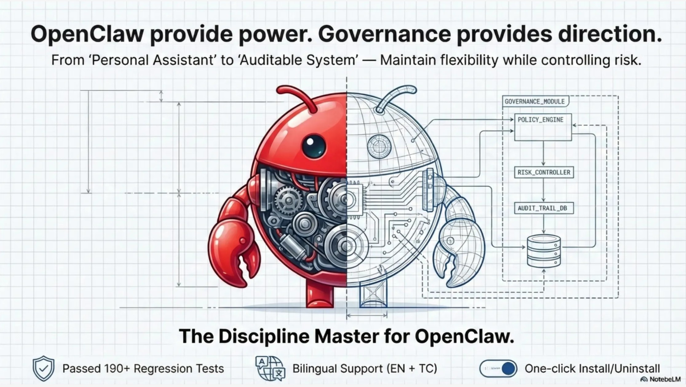
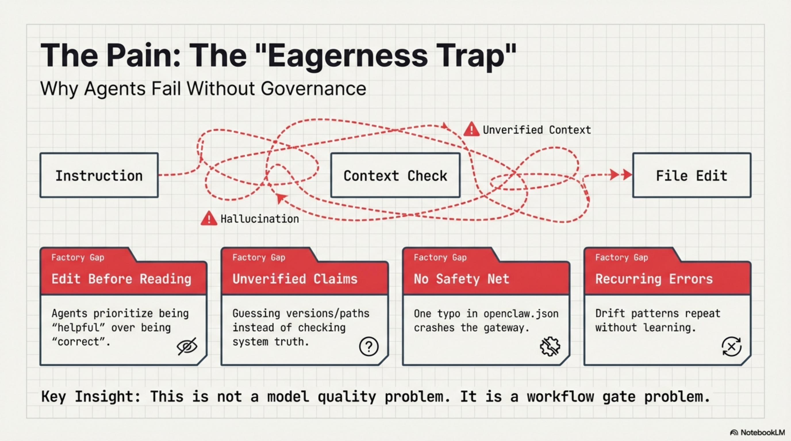
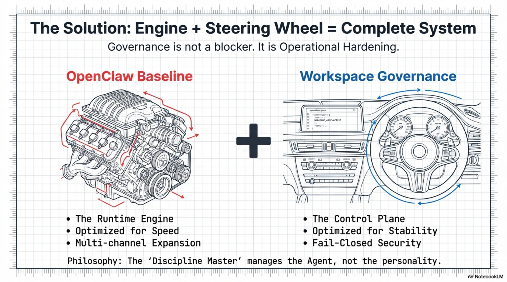
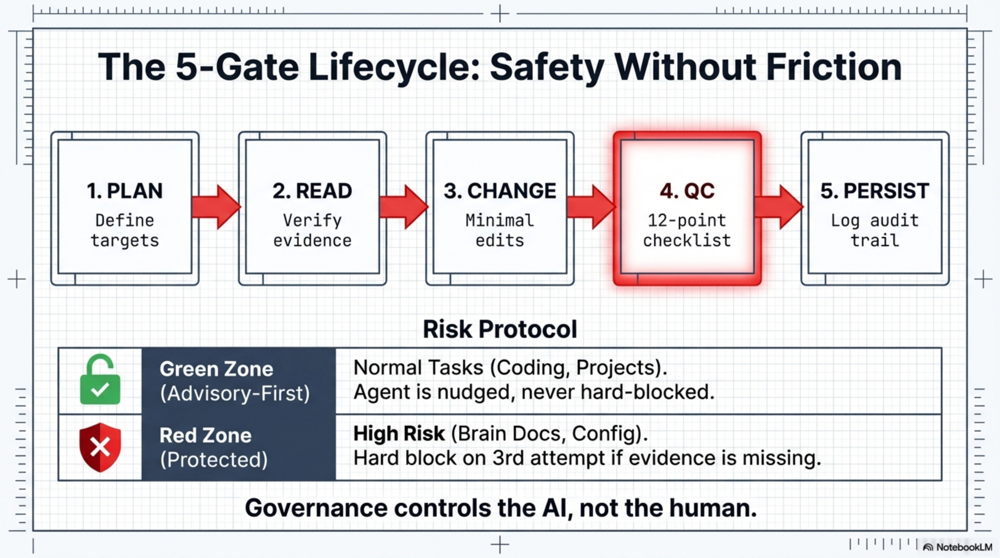
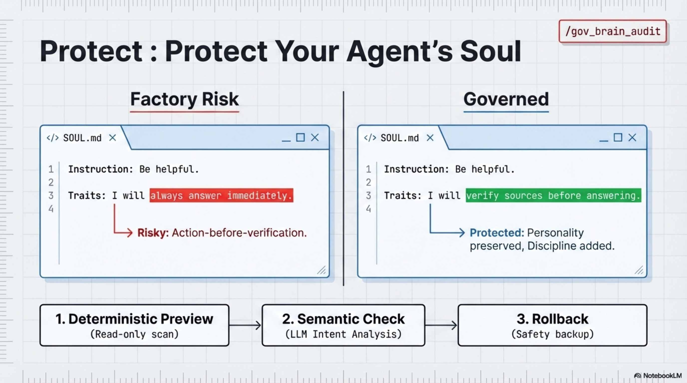
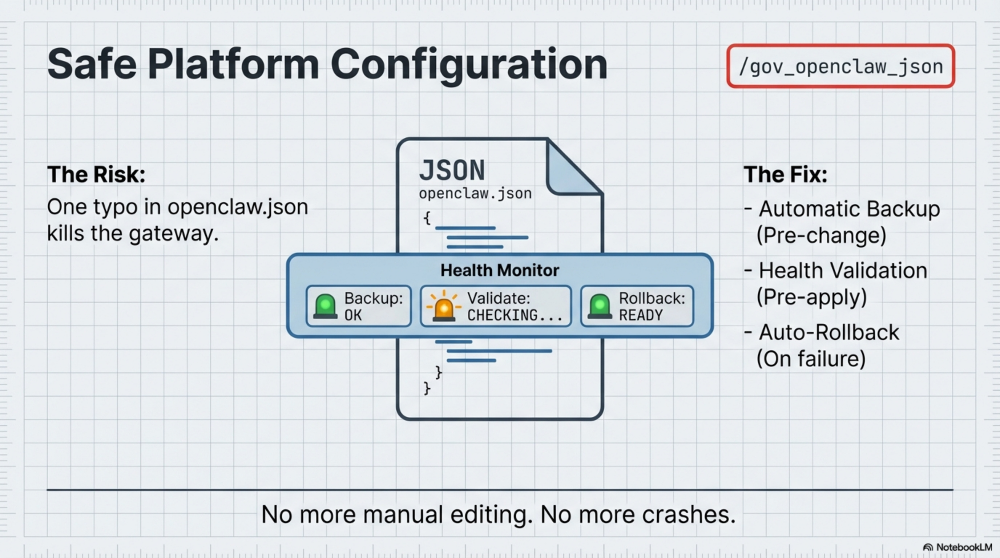
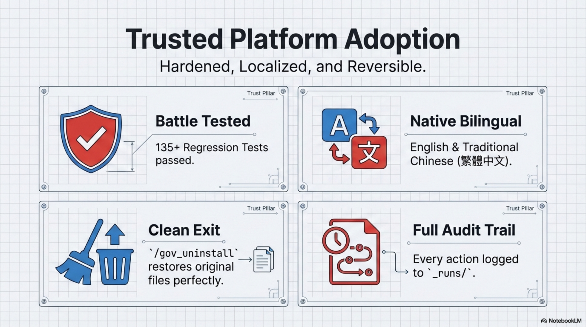
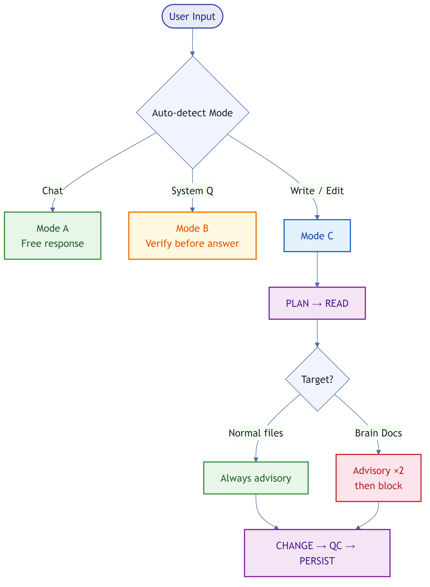

TASK: BOOTSTRAP_WORKSPACE_GOVERNANCE (ONE-SHOT, INTEGRATE-LEGACY, FAIL-CLOSED, REV6)

GOAL
Create the workspace governance control plane, without assuming any prior context:
- Enforce a stable folder structure
- Install governance SSOT documents in `_control/`
- Ensure run artifacts land in `_runs/` (distinct from `memory/`)
- Introduce `_control/ACTIVE_GUARDS.md` as the Operational Guard Register (LOG; non-SSOT) to enforce a repeat-failure learning loop.
- Ship a re-entrant Migration kit under `prompts/governance/` for post-bootstrap upgrades (PATCH-only; safe on active workspaces).
- Add optional startup read-only audit entrypoint `BOOT.md` for the boot-md hook (reports drift; does not write).
- Ship `prompts/governance/APPLY_UPGRADE_FROM_BOOT.md` as a guided apply runner for BOOT upgrade menu approvals (operator-approved; triggers Migration).
- Ship `skills/gov_openclaw_json/SKILL.md` as the dedicated Mode C entrypoint for platform control-plane changes (backup/validate/rollback evidence required).
- Ship `skills/gov_brain_audit/SKILL.md` as the conservative Brain Docs auditor (single entry; read-only preview by default; approval-based apply/rollback).

SCOPE (Hard)
- This task is BOOTSTRAP-ONLY: it is designed for NEW workspaces only.
- If `_control/` already exists AND contains `_control/GOVERNANCE_BOOTSTRAP.md`, STOP and run the Migration kit instead:
  `prompts/governance/WORKSPACE_GOVERNANCE_MIGRATION.md`.

NON-GOALS (hard)
- Do NOT redesign or restructure existing `projects/` or `skills/`.
- Do NOT delete any existing file; use backup + archive only.
- Do NOT create additional "parallel governance systems".

AUTHORIZED ACTIONS (explicit permission granted)
A) Create/ensure canonical folders (non-destructive):
   `_control/`, `_runs/`, `docs/`, `projects/`, `skills/`, `prompts/`, `prompts/governance/`, `archive/`
   Also allow: `memory/`, `canvas/` if already present (do not relocate or delete).

B) Governance + control-plane SSOT initialization (ONLY the listed files):
   For each of the following files, if it exists:
   - BACKUP the existing file to `archive/_bootstrap_backup_<ts>/...` (preserve exactly),
   - then OVERWRITE it with the canonical payload below, EXCEPT where noted.
   Files:
   - `AGENTS.md`                         (overwrite; short)
   - `_control/GOVERNANCE_BOOTSTRAP.md`  (overwrite; SSOT)
   - `_control/PRESETS.md`              (overwrite; SSOT)
   - `_control/REGRESSION_CHECK.md`     (overwrite; SSOT)
   - `_control/WORKSPACE_INDEX.md`      (overwrite; navigation hub)
   - `_control/DECISIONS.md`            (overwrite; seed template)
   - `_control/LESSONS.md`              (overwrite; seed template; LOG)
   - `_control/RULES.md`                (overwrite; pointer-only)
   - `_control/ACTIVE_GUARDS.md`        (create/overwrite only on NEW workspaces; LOG; operational guard register)
   - `BOOT.md`                          (optional; create if missing; read-only startup audit for boot-md hook)
   - `prompts/governance/WORKSPACE_GOVERNANCE_MIGRATION.md` (create/overwrite; migration kit prompt)
   - `prompts/governance/APPLY_UPGRADE_FROM_BOOT.md`        (create/overwrite; guided apply runner for BOOT upgrade menu approvals)
   - `skills/gov_migrate/SKILL.md`       (create if missing; if exists and differs from canonical, STOP and report conflict; provides `/gov_migrate`)
   - `skills/gov_audit/SKILL.md`         (create if missing; if exists and differs from canonical, STOP and report conflict; provides `/gov_audit`)
   - `skills/gov_apply/SKILL.md`         (create if missing; if exists and differs from canonical, STOP and report conflict; provides `/gov_apply <NN>`)
   - `skills/gov_openclaw_json/SKILL.md` (create if missing; if exists and differs from canonical, STOP and report conflict; provides `/gov_openclaw_json`)
   - `skills/gov_brain_audit/SKILL.md`   (create if missing; if exists and differs from canonical, STOP and report conflict; provides `/gov_brain_audit`)

C) README policy:
   - If `README.md` does NOT exist, create it using payload below.
   - If it exists, do NOT overwrite.

D) Any other file/folder not mentioned above:
   - DO NOT overwrite/move/delete. Non-destructive.

TARGET STRUCTURE (must exist after run)
.
- AGENTS.md
- README.md                      (optional)
- BOOT.md                        (optional; startup read-only audit; for boot-md hook)
- _control/
  - GOVERNANCE_BOOTSTRAP.md
  - PRESETS.md
  - REGRESSION_CHECK.md
  - WORKSPACE_INDEX.md
  - ACTIVE_GUARDS.md             (LOG; operational guard register; required after install)
  - DECISIONS.md
  - LESSONS.md
  - RULES.md
- _runs/
- docs/
  - AGENT_PLAYBOOK.md            (pointer; authorized to overwrite)
  - AGENT_PLAYBOOK_legacy_<ts>.md (only if old AGENTS existed)
- projects/
- skills/
- prompts/
  - governance/
    - WORKSPACE_GOVERNANCE_MIGRATION.md
    - APPLY_UPGRADE_FROM_BOOT.md
- memory/
- canvas/
- .openclaw/                     (optional; OpenClaw internal; e.g., .openclaw/extensions/)
- .git/                          (optional; VCS metadata)
- .gitignore                     (optional)
- archive/
  - _bootstrap_backup_<ts>/
    - _control/ (backups only)
HARD ORDER (NO SKIP)
1) PLAN GATE
   - Declare `<ts>` in sortable format: YYYYMMDD_HHMMSS.
   - List every file you will write/overwrite and every backup path.

2) PROBE GATE
   - Determine workspace root (folder containing `AGENTS.md`).
   - Bootstrap-only safety check (Hard):
     - If `_control/` exists AND `_control/GOVERNANCE_BOOTSTRAP.md` exists, STOP and output Blocked Report:
       "Workspace already initialized; DO NOT re-run bootstrap. Run Migration instead: `prompts/governance/WORKSPACE_GOVERNANCE_MIGRATION.md`."
     - If `_runs/` exists and is non-empty, treat as initialized and STOP (same Blocked Report as above).
   - Check existence of required folders/files for bootstrap execution.
   - Detect tool capability (read/write/edit/move/copy/exec).
   - If any required capability is missing, STOP and output Blocked Report with exact missing capability and which step cannot proceed.

3) CHANGE GATE (execute in this exact order)
   3.1 Ensure folders exist (non-destructive):
       - MUST create: `_control/`, `_runs/`, `docs/`, `projects/`, `skills/`, `prompts/`, `prompts/governance/`, `archive/`, and `archive/_bootstrap_backup_<ts>/` (subfolders as needed).
       - If `memory/` exists, keep it; do NOT delete or relocate it.
       - If `canvas/` exists, keep it; do NOT delete or relocate it.
       - Never overwrite/move/delete anything under `projects/` or `skills/`.
       - Do NOT create/modify `.openclaw/` or `.git/` as part of this bootstrap task.
   3.2 If root `AGENTS.md` exists: back it up to `archive/_bootstrap_backup_<ts>/AGENTS_legacy.md` then overwrite with canonical `AGENTS.md` payload.
       If root `AGENTS.md` does NOT exist: write canonical `AGENTS.md` payload to root.
   3.3 For each file listed in Authorized Action B (including optional `BOOT.md` and the migration kit prompt):
       - If it exists: back up into `archive/_bootstrap_backup_<ts>/...` preserving relative path.
       - Overwrite with canonical payload (as specified).
   3.4 Write/overwrite `docs/AGENT_PLAYBOOK.md` pointer payload (authorized).
   3.5 `README.md`:
       - If missing: create using payload.
       - If present: leave unchanged.
   3.6 Update `_control/WORKSPACE_INDEX.md` to include links to `ACTIVE_GUARDS.md`, `LESSONS.md`, `BOOT.md`, and the migration kit under `prompts/governance/`.

4) QC GATE
   - Execute `_control/REGRESSION_CHECK.md` EXACTLY 12 items in order.
   - ALWAYS report as 12/12. Do NOT reduce denominator.
   - Additional hard checks (Fail-Closed):
     - Confirm `_control/ACTIVE_GUARDS.md` exists and is linked from `_control/WORKSPACE_INDEX.md`.
     - Confirm `prompts/governance/WORKSPACE_GOVERNANCE_MIGRATION.md` exists and is linked from `_control/WORKSPACE_INDEX.md`.
     - If `BOOT.md` exists: confirm it declares READ-ONLY and does not instruct file writes.
   - If any check fails, STOP and output Blocked/Remediation.

5) PERSIST GATE
   - Write a run report under `_runs/` named `bootstrap_governance_<ts>.md` with:
     - Files written/overwritten (paths)
     - Backup paths created
     - QC results 12/12 with PASS/FAIL per item
     - A short tree view of the root + `_control/` + `prompts/governance/`

========================
CANONICAL FILE PAYLOADS
========================

<<BEGIN FILE: AGENTS.md>>
# Workspace Agent Loader ->Governance Router
> This file is intentionally short to avoid context truncation.
> Governance SSOT: `_control/GOVERNANCE_BOOTSTRAP.md`
> Presets SSOT: `_control/PRESETS.md`
> QC SSOT: `_control/REGRESSION_CHECK.md`
> Operational playbook (non-SSOT): `docs/AGENT_PLAYBOOK.md`

<!-- AUTOGEN:BEGIN AGENTS_CORE_v1 -->
## Non-negotiable rules
PERSISTENCE Trigger (Hard):
- Any request implying ANY filesystem persistence (create/write/edit/update/move/delete) is a governance task, including code, scripts, configs, prompts, docs, tests, and assets.
- Best practice: follow PLAN→READ→CHANGE→QC→PERSIST internally.
- "Test/demo" tasks are NOT exemptions if they write files.
- Natural-language coding tasks (for example: build, implement, fix, refactor) are Mode C by default whenever they imply file changes.

PLAN-first rule (Best Practice):
- Best practice: plan your changes before writing. Do not show PLAN GATE headers to users — plan internally.
- If a request starts as read-only but later requires a change, switch to Mode C internally (plan-first).

No-Write Guardrail (Best Practice):
- Follow PLAN→READ→CHANGE→QC→PERSIST internally before writing. Do not ask users for gate tokens.
- Runtime gate (plugin hooks) provides advisory warnings for normal writes and hard blocks only for high-risk governance targets.

Gate tokens (Advisory):
- WG_PLAN_GATE_OK / WG_READ_GATE_OK are internal signals. AI emits them in its own output — users never type them.
- After /gov_* returns PASS, proceed directly with the user's task.
- Governance governs AI Agent behavior, not humans. Users use natural language.

Evidence modes (Hard):
- Mode A (Conversation): casual interaction; no persistence and no system claims.
- Mode B (Verified Answer): factual answer required, no writes.
  - Mode B2 (OpenClaw system topics): MUST verify using relevant local skill docs + official docs at `https://docs.openclaw.ai` before answering. For latest/version-sensitive claims, MUST also verify official releases at `https://github.com/openclaw/openclaw/releases`.
  - Mode B3 (Date/time topics): MUST verify runtime current time context first (session status), then answer with explicit absolute date when relevant.
  - Brain Docs read-only checks: when answering about `USER.md`, `IDENTITY.md`, `TOOLS.md`, `SOUL.md`, `MEMORY.md`, `HEARTBEAT.md`, or `memory/*.md`, MUST read the exact target files first and cite them in run-report evidence.
- Mode C (Governance change): any write/update/save/persist operation; follow PLAN→READ→CHANGE→QC→PERSIST internally.
  - Any coding/development task that creates or modifies files under the workspace is Mode C, even if the operator does not invoke a `/gov_*` command.
  - Any create/update to Brain Docs (`USER.md`, `IDENTITY.md`, `TOOLS.md`, `SOUL.md`, `MEMORY.md`, `HEARTBEAT.md`, `memory/*.md`) is Mode C and must include explicit read evidence before write.
  - Platform control-plane changes (for example `~/.openclaw/openclaw.json`) MUST route through `gov_openclaw_json` (or `/skill gov_openclaw_json`) as execution entrypoint.
- If it is unclear whether the task will write files, classify as Mode C (Fail-Closed).
- If verification cannot be completed, do not guess; report uncertainty and required next check.

Workspace boundary (Hard):
- Any deliverable/evidence write/edit MUST target paths inside the workspace root (the folder containing `AGENTS.md`).
- Do NOT place deliverables or evidence under system temporary locations (e.g., `/tmp/`). Use temp dirs only for throwaway scratch and never for completion claims.
- If `projects/` exists, default persistent coding deliverables go under `projects/<project-name>/`.
- If `skills/` exists, default skill/plugin installs (tool-managed) go under `skills/<skill-name>/`.
- If `prompts/` exists, default reusable prompt assets/templates go under `prompts/<topic>/`.
- If `memory/` exists, persisted session summaries/memory entries (when enabled) go under `memory/` (do not mix with `_runs/`).
- If `canvas/` exists, tool-managed canvas artifacts may live under `canvas/` (do not treat as deliverables/evidence unless explicitly promoted into `projects/` or `_runs/` with links).
- `.openclaw/` (workspace-local) and `.git/` (and `.gitignore`) are allowed as workspace internal metadata; never use them as deliverables/evidence targets.
- Treat workspace path as runtime-resolved `<workspace-root>`; do NOT hardcode home paths such as `~/.openclaw/workspace/...`.

Learning loop (Hard):
- If a failure repeats, do NOT invent a parallel governance system.
- Record the guardrail as a Guard entry in `_control/ACTIVE_GUARDS.md` (LOG; create if missing, then append) and a matching Lesson in `_control/LESSONS.md` with a recurrence test.

BOOT+APPLY shortcut (Hard):
- If the operator message is exactly a two-digit upgrade item number (e.g., `01`) AND the current chat history contains the latest `BOOT UPGRADE MENU (BOOT+APPLY v1)` output: treat it as explicit authorization to execute `prompts/governance/APPLY_UPGRADE_FROM_BOOT.md`.
- If the menu is missing or ambiguous: STOP and request the operator to paste the latest BOOT menu.
- Otherwise: do NOT guess; proceed as a normal request.

Platform Channel (Control Plane) exception (Hard):
- Allowed scope (minimal allowlist): `~/.openclaw/openclaw.json` (global OpenClaw config) and `~/.openclaw/extensions/` (only if plugins/extensions are explicitly used).
- Allowed operations (minimal): OpenClaw config changes and tool-managed skills operations only.
- Guardrail: Platform changes are NEVER deliverables/evidence targets; they MUST be audited in a workspace run report with:
  - workspace-local backup created first under `archive/_platform_backup_<ts>/...`,
  - before/after excerpts of the changed keys/sections,
  - rollback instructions (restore from backup) if apply/validation fails.
- Any Platform change is a governance task: PLAN ->READ ->CHANGE ->QC ->PERSIST still applies, with the stricter Platform backup/evidence requirements above.
- Direct config patching without the `gov_openclaw_json` entrypoint is non-compliant and must be blocked/re-scoped.

Official Flow Compatibility SOP (Anti-Self-Lock, Hard):
- For every governance task, you MUST run this compatibility pre-check before deciding to block:
  1) Does the request belong to OpenClaw system operation flow (`openclaw ...`, including plugin-added or future commands)?
  2) Does the request belong to governance lifecycle operations (`gov_help`, `gov_setup quick/check/install/upgrade`, `gov_migrate`, `gov_audit`, `gov_openclaw_json`, `gov_brain_audit`, `gov_uninstall quick/check/uninstall`)?
  3) If command is plugin-added/custom and unknown to local rules, route to runtime policy self-service (`runtimeGatePolicy`) instead of dead-end blocking.
- If yes, default action is ALLOW/ROUTE (not generic BLOCK) unless a hard safety prerequisite fails.
- If blocked due governance prerequisite (for example trust allowlist not aligned), message MUST explicitly say "governance safety block, not OpenClaw system error" and include copy-paste unblock commands.
- For any allowlist remediation, preserve existing trusted IDs; never replace `plugins.allow` with governance ID only.

Completion claim threshold (Hard):
- Do NOT claim completion unless QC passes 12/12 and evidence is shown (paths + before/after excerpts when applicable).
- If required files/anchors are missing or ambiguous: FAIL-CLOSED and output a Blocked Report.

## Mandatory start of every governance task (READ GATE)
Before making any change, you MUST read:
1) `_control/GOVERNANCE_BOOTSTRAP.md`
2) `_control/PRESETS.md`
3) `_control/WORKSPACE_INDEX.md`
4) `_control/REGRESSION_CHECK.md`
5) `_control/ACTIVE_GUARDS.md` (LOG)
6) `_control/LESSONS.md` (if present; LOG)
7) Brain Docs set (read if present; mandatory when task touches user profile/timezone/memory persistence):
   - `USER.md`
   - `IDENTITY.md`
   - `TOOLS.md`
   - `SOUL.md`
   - `MEMORY.md`
   - `HEARTBEAT.md`
   - `memory/YYYY-MM-DD.md` (today + yesterday), if `memory/` exists
   - If task target includes Brain Docs paths, list exact read paths in run report `FILES_READ` before any write.
8) The target file(s) to be modified (including Platform control-plane targets such as `~/.openclaw/openclaw.json` when applicable)
9) If task includes OpenClaw system claims (commands/config/plugins/skills/hooks/path defaults):
   - relevant local skill docs (from `skills/`)
   - official docs evidence from `https://docs.openclaw.ai`
   - for latest/version-sensitive claims, official releases evidence from `https://github.com/openclaw/openclaw/releases`
   - Mandatory compatibility pre-check (anti-self-lock):
     - classify whether intent is official OpenClaw flow and/or governance lifecycle flow
     - do not output generic platform-error wording for governance policy blocks
     - if a block is required, include copy-paste unblock commands
10) If task includes date/time-sensitive claims:
   - verify runtime current time context first (session status), then use explicit absolute dates in conclusions

## Mandatory end of every governance task
- Run QC using `_control/REGRESSION_CHECK.md` (12 items; fixed denominator; pass/fail).
- Write a run report under `_runs/` and update `_control/WORKSPACE_INDEX.md` if any file was created/moved.
- Run report must include `FILES_READ` and `TARGET_FILES_TO_CHANGE` (exact paths; `none` allowed only for read-only runs).
- If task touched official OpenClaw flows or governance lifecycle operations, run report must include compatibility pre-check verdict and any unblock commands issued.
<!-- AUTOGEN:END AGENTS_CORE_v1 -->
<<END FILE>>

<<BEGIN FILE: README.md>>
# OpenClaw WORKSPACE_GOVERNANCE

> Keep OpenClaw fast for daily work, but remove the high-cost failures: unclear changes, risky upgrades, and hard recovery.
> WORKSPACE_GOVERNANCE provides a stable operating model for long-running OpenClaw workspaces.

[繁體中文版](./README.zh-HK.md)

[](https://docs.openclaw.ai/) [](#install) [](#quick-start)

ClawHub installer page:
- https://clawhub.ai/Adamchanadam/openclaw-workspace-governance-installer

---

## 🎬 Video Introduction

> **See it in action** — watch a 2-minute overview before reading the docs.

[](https://youtu.be/zIXT8MiL4WY)

▶️ [Watch: Discipline Master for OpenClaw (Workspace Governance Plugin)](https://youtu.be/zIXT8MiL4WY)

---

## 📋 Release Notes Board (Latest 3)

| Version | Published (UTC) | Key Changes | Practical Impact |
| --- | --- | --- | --- |
| `v0.1.66` | 2026-03-02 | Cron read/write split + heartbeat write governance: `openclaw cron add/update/remove/pause/resume` now triggers Mode C write protection; `openclaw cron list/ls/show/status` remains bypass; heartbeat config writes require Mode C; official doc URLs injected as route hints. Regression 190→197/197 | Cron write commands and heartbeat config changes no longer bypass governance gates; agent reads official docs before modifying schedules or heartbeat config |
| `v0.1.65` | 2026-02-28 | Governance gap fixes G1+G2+G3: `gov_setup` now seeds `_control/ACTIVE_GUARDS.md` on install/upgrade if absent; bootstrap payload removes "(if present)" qualifier so guards register is always created; quiet-turn directive injects error correction protocol + session guard reminder once per session. Regression 182→187/187 | Active guards register is guaranteed to exist after install; AI receives error correction protocol and is reminded to load guards on first idle turn each session |
| `v0.1.64` | 2026-02-27 | Pre-publish machine guard: `check_release_consistency.mjs` now enforces README release notes table contains current version — prevents publishing without documentation update. AGENTS.md §7b updated with mechanism. Regression 183/183 | Publishing with stale README release notes is now impossible; consistency check catches the gap before commit |

Source: GitHub Releases (`Adamchanadam/OpenClaw-WORKSPACE-GOVERNANCE`)

---

## 🎯 Hero

If you run OpenClaw every day, the biggest risk is usually not model capability. The real risk is operational drift: you cannot quickly tell what changed, what to run next, and whether upgrade actions are safe. WORKSPACE_GOVERNANCE turns that uncertainty into a repeatable path.

[Install](#install) | [Quick Start](#quick-start)

## 💡 Why This Matters

Without governance, common pain accumulates quickly:
1. Changes happen before verification — mistakes spread across multiple files before anyone notices.
2. After a plugin update, you still do not know the next correct command or whether the update is complete.
3. When something goes wrong, there is no clear record of what changed or how to roll back safely.
4. Team handovers lose context — the next person cannot tell what was done, what passed, or what still needs checking.

What you get immediately:
1. Every change follows a fixed safety flow: plan first, read evidence, make the change, verify, then persist.
2. One command to get started: `/gov_setup quick` handles check, install/upgrade, migration, and audit automatically.
3. Platform config changes come with automatic backup, validation, and rollback — no more risky manual edits.
4. Run reports and audit evidence make handovers and team accountability straightforward.

## ✅ Feature Maturity (No-Misleading Contract)

GA (production-ready):
1. `/gov_help` — see all commands and recommended entry points at a glance
2. `/gov_setup quick|check|install|upgrade` — deploy, upgrade, or verify governance in one step
3. `/gov_migrate` — align workspace behavior to the latest governance rules after install or upgrade
4. `/gov_audit` — verify 12 integrity checks and catch drift before declaring completion
5. `/gov_uninstall quick|check|uninstall` — clean removal with backup and restore evidence
6. `/gov_openclaw_json` — safely edit platform config (`openclaw.json`) with backup, validation, and rollback
7. `/gov_brain_audit` — review and harden Brain Docs quality with preview-first approval and rollback
8. `/gov_boot_audit` — scan for recurring issues and generate upgrade proposals (read-only diagnostic)

Experimental:
1. `/gov_apply <NN>` — apply a single BOOT upgrade proposal with explicit human approval (controlled testing only, covered by automated regression).
2. After applying, always close with `/gov_migrate` and `/gov_audit`.

## ✅ Verified Scenarios

The plugin ships with an automated regression suite covering the full operator lifecycle. Below is a summary of what is verified on every release:

| Scenario | What is verified |
|---|---|
| **Workspace setup & upgrade** | Fresh install, upgrade from previous version, version detection, skip when already current |
| **Content preservation** | Existing Brain Docs, `openclaw.json`, and custom rules survive install/upgrade unchanged |
| **Migration accuracy** | All governance rules and markers are correctly applied; conflicts and partial states are detected and reported |
| **Audit completeness** | All 12 integrity checks run; drift, missing markers, and config mismatches are caught |
| **Safe config editing** | `openclaw.json` edits go through backup → validate → apply → confirm; invalid edits are rejected and rolled back |
| **Brain Docs protection** | Risky edits to Brain Docs (AGENTS.md, SOUL.md, etc.) are flagged before write; rollback available on request |
| **Recovery from failures** | Corrupted config, failed backup, and partial migration are handled gracefully without silent data loss |
| **Full operator lifecycle** | End-to-end: setup → migrate → audit → edit → re-audit → uninstall with cleanup evidence |

## 🖼️ Visual Walkthrough (ref_doc)









<a id="install"></a>
## 🚀 60-Second Start

### Fastest Operator Entry (Recommended)
In OpenClaw TUI:
```text
/gov_help
/gov_setup quick
```
`/gov_setup quick` auto-runs:
`check -> (install|upgrade|skip) -> migrate -> audit`
and returns one clear next step when blocked.

### Shared Allowlist Quick Fix
Use this only when a command reports `Error: not in allowlist`.

```text
openclaw config get plugins.allow
openclaw configure
# In plugins.allow, append openclaw-workspace-governance and keep all existing trusted IDs.
openclaw plugins enable openclaw-workspace-governance
openclaw gateway restart
```
Keep your existing trusted IDs when editing the allowlist array.

### New Install Path (Copy-Paste)
1. In host terminal:
```text
openclaw plugins install @adamchanadam/openclaw-workspace-governance@latest
openclaw gateway restart
```
2. Trust model check (required):
Some OpenClaw builds do not auto-append new plugins into `plugins.allow` during install.
If `openclaw plugins info openclaw-workspace-governance` shows `Error: not in allowlist`, run **Shared Allowlist Quick Fix** first.
3. In OpenClaw TUI chat:
```text
/gov_setup quick
```
4. If the reply says trust/allowlist is not ready (for example `plugins.allow is empty` or asks to align `openclaw.json`), run:
```text
/gov_openclaw_json
/gov_setup quick
```
5. For strict/manual chain (or if operator requests step-by-step), continue:
```text
/gov_setup install
prompts/governance/OpenClaw_INIT_BOOTSTRAP_WORKSPACE_GOVERNANCE.md
# if this was an already-active workspace before first governance install:
/gov_migrate
/gov_audit
```

### Existing Install Upgrade Path (Copy-Paste)
1. In host terminal:
```text
openclaw plugins update openclaw-workspace-governance
openclaw gateway restart
```
2. If plugin becomes disabled with `Error: not in allowlist`, run **Shared Allowlist Quick Fix** first.
3. In OpenClaw TUI chat:
```text
/gov_setup quick
```
4. If the reply says trust/allowlist is not ready, run:
```text
/gov_openclaw_json
/gov_setup quick
```
5. For strict/manual chain (or if operator requests step-by-step), continue:
```text
/gov_setup upgrade
/gov_migrate
/gov_audit
```

### Clean Uninstall Path (Copy-Paste)
Do not uninstall plugin package first. Run workspace cleanup first.

1. Ensure plugin is allowed and loaded (otherwise `/gov_uninstall` cannot run):
```text
openclaw plugins info openclaw-workspace-governance
```
If it shows `Error: not in allowlist`, run **Shared Allowlist Quick Fix** first.
2. In OpenClaw TUI chat:
```text
/gov_uninstall quick
# optional strict verification:
/gov_uninstall check
```
Expected:
- Quick run: `PASS` or `CLEAN`
- Optional strict verify after quick: `CLEAN`

3. Then remove plugin package:
```text
openclaw plugins disable openclaw-workspace-governance
openclaw plugins uninstall openclaw-workspace-governance
openclaw gateway restart
```
The uninstall runner creates backup at `archive/_gov_uninstall_backup_<ts>/...` and run report `_runs/gov_uninstall_<ts>.md`.
If Brain Docs autofix backups exist (`archive/_brain_docs_autofix_<ts>/...`), `/gov_uninstall` will report and restore them with explicit strategy evidence.

If you already uninstalled plugin package first:
1. Reinstall plugin package to re-enable `/gov_uninstall`
2. Run `/gov_uninstall check` -> `/gov_uninstall uninstall` -> `/gov_uninstall check`
3. Then disable/uninstall package again if needed

<a id="quick-start"></a>
## 🧭 Command Chooser

| If your goal is... | Run this first | Then run | Detailed user value |
| --- | --- | --- | --- |
| List all governance commands in one shot | `/gov_help` | choose one quick/manual entry | Gives users a zero-memory command menu in-session |
| One-click governance deployment/upgrade/audit | `/gov_setup quick` | follow returned next step only if blocked | Runs check/install-or-upgrade/migrate/audit automatically with deterministic evidence |
| Avoid wrong first steps before any change (manual) | `/gov_setup check` | follow returned next action | Converts uncertainty into a concrete action path, so new users do not branch into wrong install/upgrade sequences |
| First governance deployment in this workspace | `/gov_setup install` | `/gov_migrate` -> `/gov_audit` | Installs governance package files, then deterministically reconciles missing baseline `_control` files during migration |
| Upgrade existing governance workspace | `/gov_setup upgrade` | `/gov_migrate` -> `/gov_audit` | Updates package files, aligns workspace policy, and confirms readiness after change |
| One-click workspace cleanup before package removal | `/gov_uninstall quick` | optional `/gov_uninstall check` | Cleans governance artifacts with backup+restore evidence while reducing operator step count |
| Clear platform trust warning before governance deployment | `/gov_openclaw_json` | `/gov_setup check` | Prevents setup from failing later due to trust misalignment and gives operators one deterministic trust-fix route |
| Safely change OpenClaw control-plane config | `/gov_openclaw_json` | `/gov_audit` | Replaces risky direct editing with backup/validate/rollback evidence for recoverable platform operations |
| Improve Brain Docs quality with minimal risk | `/gov_brain_audit` | approve findings -> `/gov_audit` | Detects high-risk wording, preserves persona intent, and only applies approved patches with rollback support |
| Clear all governance gates when repeatedly blocked | `/gov_brain_audit force-accept` | continue your task | Escape hatch: clears all gates with audit trail when legitimate work is blocked by governance gates |
| Scan for recurring issues and get upgrade proposals | `/gov_boot_audit` | review proposals -> `/gov_apply <NN>` (Experimental) | Read-only scan identifies repeat problems and generates numbered proposals you can review before deciding to apply |
| Apply one BOOT proposal item (Experimental) | `/gov_apply <NN>` | `/gov_migrate` -> `/gov_audit` | Executes only one human-approved item in controlled UAT; do not treat as unattended GA automation |

## 🧠 Core Capability: `/gov_brain_audit` for Brain Docs Performance

`/gov_brain_audit` is not only a wording checker. It improves the operating quality of the OpenClaw agent by making Brain Docs more consistent, evidence-driven, and less self-contradictory.

Practical optimization effects:
1. Reduces "act first, verify later" wording that can trigger unstable write behavior.
2. Reduces unsupported certainty statements that create false-complete responses.
3. Improves consistency between run-report evidence expectations and Brain Docs guidance.
4. Keeps persona direction while applying minimal, reviewable changes.

Important:
`F001`, `F003`, etc. are dynamic finding IDs produced by your current preview result.
They are examples, not fixed codes. Always copy IDs from the latest preview output.

Execution pattern:
```text
/gov_brain_audit
/gov_brain_audit APPROVE: <PASTE_IDS_FROM_PREVIEW>
/gov_brain_audit ROLLBACK
```

## ⚙️ How Your Requests Are Handled

Governance automatically adapts to what you are asking for:

1. Questions and planning (no file changes)
   You ask for strategy, explanation, or planning. The AI responds with advice only — no files are touched.

2. Verified answers (no file changes)
   You ask about versions, system status, or dates. The AI verifies official sources first, then responds with evidence.

3. File changes (full governance protection)
   You ask to write, update, or save files. The AI follows the full safety flow: plan first, read evidence, make the minimum change, verify quality, then persist with a run report. Close with `/gov_migrate` and `/gov_audit` when needed.

### Governance Flow Overview

<p align="center">
  
</p>

## ⚡ Runtime Gate Behavior (Transparent)

When you ask AI to write or modify files, the governance runtime gate activates automatically. Here is exactly how it works:

### Write Protection Flow

| Step | What Happens | User Action |
|------|-------------|-------------|
| Normal writes (skills/, projects/, code) | **Transparent** — write proceeds normally (governance logs internally, you see nothing) | None — you won't see anything; write just works |
| High-risk writes (governance infra, Brain Docs) 1st-2nd | **Transparent** — write proceeds normally (logged internally) | None — AI receives coaching feedback automatically on the next turn |
| High-risk writes 3rd+ without evidence | **Hard block** — write is stopped | AI receives coaching feedback automatically; you can also say: "Please include your plan and files read" |
| 3+ consecutive blocks on same gate | **Escape hint** appears automatically in block message | Use `/gov_brain_audit force-accept` to clear all gates (with audit trail) |
| After running `/gov_setup`, `/gov_migrate`, `/gov_audit` | **Advisory nudge** only (not a hard block) | Optionally run `/gov_brain_audit` for a health-check preview |

### Risk Classification

| Risk Level | Targets | Runtime Behavior |
|-----------|---------|-----------------|
| **High-risk** | Brain Docs (`AGENTS.md`, `SOUL.md`, `USER.md`, `IDENTITY.md`, `TOOLS.md`, `MEMORY.md`, `HEARTBEAT.md`), `openclaw.json`, `_control/*`, `prompts/governance/*` | Transparent 1st-2nd (AI coached on next turn), **hard block** on 3rd+ |
| **Normal** | Everything else (`skills/`, `projects/`, `_runs/`, source code, configs, docs, etc.) | **Always transparent** (never hard-blocked, governance logs internally) |

All writes (both risk levels) follow the full Mode C governance flow internally: PLAN→READ→CHANGE→QC→PERSIST. The risk level only determines whether the runtime gate can hard-block a write attempt.

### Escape Hatch

If you are blocked 3+ times by the same governance gate and cannot proceed:
```text
/gov_brain_audit force-accept
```
This clears all governance gates for the current session. An audit trail is written to `_runs/`. Governance protection is reduced — proceed with caution.

### Governance Command Bypass

All governance write commands (`/gov_setup install`, `/gov_migrate`, `/gov_apply`, etc.) automatically bypass the write gate for 8 minutes. You do not need to provide PLAN/READ evidence when running governance commands.

### System Command Read/Write Split

Cron and heartbeat commands are split by read vs. write intent:

| Command | Classification | Mode C |
|---------|---------------|--------|
| `openclaw cron list/ls/show/status/run/runs` | Read | Bypass (no governance gate) |
| `openclaw cron add/update/remove/delete/pause/resume` | Write | Required — PLAN→READ→CHANGE→QC→PERSIST |
| `openclaw cron` (bare, no subcommand) | Read | Bypass |
| `openclaw gateway heartbeat` config changes | Write | Required |

Before modifying cron jobs, read the official docs: https://docs.openclaw.ai/automation/cron-jobs
Before modifying heartbeat config, read the official docs: https://docs.openclaw.ai/gateway/heartbeat

### Brain Audit Timing

- Per-turn reset: blocked-writes counter resets when prompt gap exceeds 30 seconds
- Advisory feedback: after writes without evidence, AI receives coaching guidance on the next turn — no user action needed

### Scanner Tolerance

If governance scanners reject LLM-generated run reports due to format differences, configure `scannerTolerance` in `openclaw.json`:

| Setting | Behavior |
|---------|----------|
| `strict` | Exact machine format only (e.g., `files_read:`) |
| `tolerant` (default) | Accepts markdown headers, bullets, format variations |
| `lenient` | Fuzzy keyword matching for lower-capability LLMs |

Affects: `/gov_audit`, `/gov_brain_audit preview`, `/gov_boot_audit scan`.

## 🔒 Security Default

1. Governance commands (`/gov_*`) only activate when you explicitly request them. They never run on their own.
2. The lightweight runtime write-protection gate is always active but fully transparent for normal operations — you will not see any prompts or blocks during everyday work.
3. Your normal OpenClaw workflow is unaffected. Governance adds protection without changing how you already use OpenClaw.

## ❓ FAQ (Decision-Oriented, New-User Focus)

1. I do not use slash commands. What is the safest first message to AI?
Copy-paste this natural-language request:
```text
Please run governance readiness check for this workspace (read-only), then tell me exactly what to run next.
```
If slash fallback is needed: `/gov_setup quick`

2. I ran official commands like `openclaw onboard` or `openclaw configure`, then governance looks blocked. What should I ask AI to do?
Copy-paste:
```text
I just ran official OpenClaw setup/config commands. Please re-check governance readiness, align trust allowlist in openclaw.json if needed, then tell me the exact next step.
```
If slash fallback is needed:
```text
/gov_openclaw_json
/gov_setup quick
```

3. I installed plugin, but workspace governance files are still missing. What should I ask?
Copy-paste:
```text
Please check governance status for this workspace and deploy missing governance files safely, then run audit.
```
If slash fallback is needed:
```text
/gov_setup check
/gov_setup install
/gov_migrate
/gov_audit
```

4. I already updated plugin, but behavior still looks old. What should I ask AI to do?
Copy-paste:
```text
Please run governance upgrade flow for this workspace: check, upgrade, migrate, then audit.
```
If slash fallback is needed:
```text
/gov_setup check
/gov_setup upgrade
/gov_migrate
/gov_audit
```

5. I got `Blocked by WORKSPACE_GOVERNANCE runtime gate...`. Is this a crash?
Usually no. Normal file writes (skills, projects, code) are always advisory and never hard-blocked. Hard blocks only apply to high-risk governance targets (Brain Docs, `_control/`, governance prompts, `openclaw.json`). Ask AI to include its plan and list of files read:
```text
Please include your plan and files read, then proceed.
```
If you are blocked 3+ times and cannot proceed, use the escape hatch:
```text
/gov_brain_audit force-accept
```
Official `openclaw ...` system commands are allow-by-default and should not be blocked by this runtime gate.

6. I only want to edit `openclaw.json`, not workspace docs. What should I type?
Copy-paste:
```text
Please modify only OpenClaw control-plane config (openclaw.json) with backup and validation, then report result.
```
If slash fallback is needed:
```text
/gov_openclaw_json
/gov_audit
```

7. Slash routing is unstable in my session. Can I stay natural-language only?
Yes. Use requests like:
```text
Use gov_setup in check mode, return status and next action only.
```
or:
```text
Run full governance upgrade flow for this workspace and show each step result.
```

8. I am giving a coding task in natural language. How do I avoid governance blocks?
Just describe your task naturally. The AI follows governance best practices internally. For example:
```text
Please create/update the file as needed.
```

9. How do I ask AI to optimize Brain Docs quality, not just rewrite text?
Copy-paste:
```text
Run gov_brain_audit in preview mode, show high-risk findings with rationale, then wait for my approval before applying any patch.
```
Approval and rollback fallback:
`<PASTE_IDS_FROM_PREVIEW>` means IDs from your current preview output (for example `F002,F005`).
```text
/gov_brain_audit APPROVE: <PASTE_IDS_FROM_PREVIEW>
/gov_brain_audit ROLLBACK
```

10. How do teams standardize handover after natural-language tasks?
Use one closeout request at the end:
```text
Please finish this task with governance closeout: migrate if needed, run audit, and summarize evidence for handover.
```

## 📚 Deep Docs Links

1. Operations Handbook (EN): [`WORKSPACE_GOVERNANCE_README.en.md`](./WORKSPACE_GOVERNANCE_README.en.md)
2. Positioning and Value Narrative (EN): [`VALUE_POSITIONING_AND_FACTORY_GAP.en.md`](./VALUE_POSITIONING_AND_FACTORY_GAP.en.md)
3. 中文操作手冊: [`WORKSPACE_GOVERNANCE_README.md`](./WORKSPACE_GOVERNANCE_README.md)
4. 中文定位文件: [`VALUE_POSITIONING_AND_FACTORY_GAP.md`](./VALUE_POSITIONING_AND_FACTORY_GAP.md)

Official references:
1. https://docs.openclaw.ai/tools/skills
2. https://docs.openclaw.ai/tools/clawhub
3. https://docs.openclaw.ai/plugins
4. https://docs.openclaw.ai/cli/plugins
5. https://docs.openclaw.ai/cli/skills
6. https://github.com/openclaw/openclaw/releases

<<END FILE>>

<<BEGIN FILE: BOOT.md>>
# BOOT.md ->Startup Audit (Read-only)
> Trigger: boot-md hook runs this file on gateway start (after channels start). See OpenClaw hooks docs.
> If the task sends a message, use the message tool and then reply with NO_REPLY.
> Hard rule: READ-ONLY. Do NOT write/edit/move/delete any file. Do NOT make Platform changes.
> Goal: detect drift + generate a decision-grade upgrade menu (operator-approved apply only).

## Startup Audit Checklist (Read-only)
1) Identify workspace root (folder containing `AGENTS.md`).
2) Read:
   - `_control/WORKSPACE_INDEX.md`
   - `_control/GOVERNANCE_BOOTSTRAP.md`
   - `_control/PRESETS.md`
   - `_control/REGRESSION_CHECK.md`
   - `_control/ACTIVE_GUARDS.md`
   - `_control/LESSONS.md` (if present)
   - `USER.md` (timezone)
3) Quick integrity checks (no edits):
   - Confirm required folders exist: `_control/`, `_runs/`, `docs/`, `projects/`, `prompts/`, `archive/`
   - Confirm SSOT pointers exist in `AGENTS.md` and `_control/WORKSPACE_INDEX.md`
   - Confirm governance lifecycle is present: PLAN ->READ ->CHANGE ->QC ->PERSIST
   - Confirm QC rule: fixed 12/12 denominator
4) Recent failure surface (no edits):
   - If `_runs/` exists: inspect the latest 5 run reports (filename + status line + timestamp when inferable from filename).
   - If `_control/ACTIVE_GUARDS.md` exists: inspect the latest 10 entries (timestamps + Guard IDs only).
   - Active-blocker rule (hard):
     - A historical `BLOCKED` run is an active blocker only when there is NO newer PASS for the same flow family in the inspected window.
     - Flow-family examples: `gov_setup_upgrade_*`, `migrate_governance_*`, `gov_audit_*`.
     - For canonical-mismatch migration history: if a newer migration PASS exists, treat the old blocked run as resolved history (informational only), not an active blocker.
5) Detect recurrence triggers (no edits):
   - Trigger type A (QC recurrence): same QC item FAIL appears ->3 times within the latest 5 run reports.
   - Trigger type B (Guard recurrence): same Guard ID appears ->3 times within the latest 10 guard entries.
6) Status rule:
   - `FAIL`: required folders/anchors missing.
   - `WARN`: active blocker exists OR recurrence trigger exists.
   - `OK`: no active blocker and no recurrence trigger (resolved history may still be listed as info).
7) Output:
   - `BOOT AUDIT REPORT` (status + drift + next action)
   - Optional: `BOOT UPGRADE MENU (BOOT+APPLY v1)` with numbered items (operator can approve by replying with the item number).

## Output format
- Provide plain text only. If you send a message, use the message tool and then reply with NO_REPLY.
- Keep the combined output under 40 lines by enforcing:
  - Max 3 upgrade items
  - Each upgrade item max 4 lines
- Use the branded output template below (match `formatCommandOutput` style exactly):

### Template (no upgrade menu):
```
🐾 OpenClaw Governance · BOOT AUDIT
─────────────────────────────────

✅  STATUS
OK

  • No active drift or blockers detected.
  • Resolved history: <count> past run(s) inspected, all resolved.

─────────────────────────────────
👉 Continue normal workflow.

  /gov_setup check
```

### Template (with upgrade menu):
```
🐾 OpenClaw Governance · BOOT AUDIT
─────────────────────────────────

⚠️  STATUS
WARN

  • Active: QC#3 FAIL recurrence (3× in last 5 runs)
  • Resolved: migration blocker cleared at 2026-02-24

─────────────────────────────────
BOOT UPGRADE MENU (BOOT+APPLY v1)
To apply: reply with 01/02/03 or run /gov_apply <NN>.

  01) Elevate QC#3 (INDEX UPDATED)
      Trigger: 3× FAIL in last 5 runs
      Action: Add Guard + Lesson

  02) Elevate Guard#007 (Rule Clarity)
      Trigger: 3× in last 10 guard entries
      Action: Escalation + migration review

─────────────────────────────────
👉 Reply with item number to approve, or continue normal workflow.

  /gov_apply 01
```

### Status prefix rules:
- ✅ OK: no active blocker, no recurrence trigger
- ⚠️ WARN: active blocker exists OR recurrence trigger exists
- ❌ FAIL: required folders/anchors missing

### Hard format rules:
- Branded header line: `🐾 OpenClaw Governance · BOOT AUDIT` (always first line)
- `─────────────────────────────────` dividers between sections
- `  •` bullet prefix for status items (not `- `)
- `👉` prefix on recommended next action
- Indented commands with 2 spaces (no `COMMAND TO COPY` label)
- Upgrade menu items indented with 2 spaces, sub-fields indented with 6 spaces
<<END FILE>>


<<BEGIN FILE: BOOTSTRAP.md>>
# BOOTSTRAP.md ->First-run Seed (one-shot)
> Fresh workspace bootstrapping. No prior memory is assumed.
> When finished, this file should be deleted (bootstrap script no longer needed).

## Phase A ->Identity + User (required)
1) Start a short, human conversation (do not interrogate):
   - Confirm the assistant name / vibe / signature emoji.
   - Confirm the user name, preferred form of address, and timezone.
2) Update:
   - `IDENTITY.md` (assistant name + vibe + emoji)
   - `USER.md` (user name + preferred address + timezone + notes)
3) Open `SOUL.md` together and record:
   - What matters, boundaries, and preferences (write to `SOUL.md`)

## Phase B ->Governance kit seed (required)
1) Identify workspace root (folder containing `AGENTS.md`).
2) Safety check (Fail-Closed):
   - If `_control/` exists AND `_control/GOVERNANCE_BOOTSTRAP.md` exists, do NOT run bootstrap.
     Instead, run: `prompts/governance/WORKSPACE_GOVERNANCE_MIGRATION.md`.
3) Ensure the governance SSOT prompt file exists:
   - `prompts/governance/OpenClaw_INIT_BOOTSTRAP_WORKSPACE_GOVERNANCE.md`
   - If missing: STOP and output Blocked Report with remediation: "Copy the Governance kit files into the workspace before first run."
4) Execute the governance SSOT prompt file exactly (no skipped gates):
   - Run `TASK: BOOTSTRAP_WORKSPACE_GOVERNANCE (ONE-SHOT, INTEGRATE-LEGACY, FAIL-CLOSED, REV6)`
5) After completion:
   - Confirm `_control/`, `_runs/`, `docs/`, `projects/`, `prompts/governance/`, and `archive/` exist.
   - Confirm `_control/WORKSPACE_INDEX.md` links Active Guards + Lessons + Boot audit + Migration kit + Boot+Apply runner + governance entrypoints (TUI: `/gov_migrate`, `/gov_audit`, `/gov_apply <NN>`, `/gov_openclaw_json`, `/gov_brain_audit`; invoke slash command as a standalone message; fallback: `/skill <name> [input]`).
   - Confirm `prompts/governance/APPLY_UPGRADE_FROM_BOOT.md` exists.
   - Write a run report under `_runs/` if not already created by the task.

## Phase C ->Clean up (required)
- Delete this `BOOTSTRAP.md` file after successful bootstrap.
<<END FILE>>

<<BEGIN FILE: docs/AGENT_PLAYBOOK.md>>
# Agent Playbook (Operational, non-SSOT)
- Read `_control/WORKSPACE_INDEX.md` first.
- For governance tasks, follow PLAN ->READ ->CHANGE ->QC ->PERSIST.
- Keep `_runs/` for run reports; keep `_control/` small and stable.
<<END FILE>>

<<BEGIN FILE: prompts/governance/APPLY_UPGRADE_FROM_BOOT.md>>
TASK: APPLY_UPGRADE_FROM_BOOT_MENU (BOOT+APPLY v1, GUIDED, FAIL-CLOSED)

GOAL
Turn a BOOT-generated upgrade suggestion into a verified governance improvement:
- Operator approves an upgrade by replying with its item number (e.g., `01`)
- The agent applies the upgrade via governance gates (PLAN -> READ -> CHANGE -> QC -> PERSIST)
- The agent then runs the Migration kit to keep the workspace baseline aligned
- The agent records measurable before/after evidence so upgrade effectiveness can be validated

RUNTIME MODES (Hard)
- Mode A (Conversation): casual chat only; no persistence and no system claims.
- Mode B (Verified Answer): no writes, but factual answer required.
  - Mode B2 (OpenClaw system topics): MUST verify against local skill docs and `https://docs.openclaw.ai` before answering.
    - If the claim is latest/version-sensitive, MUST also verify official releases at `https://github.com/openclaw/openclaw/releases`.
  - Mode B3 (Date/time topics): MUST verify runtime current time context first (session status), then answer using absolute dates when relevant.
  - Brain Docs read-only checks: when answering about `USER.md`, `IDENTITY.md`, `TOOLS.md`, `SOUL.md`, `MEMORY.md`, `HEARTBEAT.md`, or `memory/*.md`, MUST read the exact target files first and cite them in run-report evidence.
- Mode C (Governance change): any write/update/save/persist operation; MUST run PLAN → READ → CHANGE → QC → PERSIST.
  - Any coding/development task that creates or modifies workspace files is Mode C, even when requested in natural language without `/gov_*` commands.
  - Any create/update to Brain Docs (`USER.md`, `IDENTITY.md`, `TOOLS.md`, `SOUL.md`, `MEMORY.md`, `HEARTBEAT.md`, `memory/*.md`) is Mode C and must include explicit read evidence before write.
  - Platform control-plane changes (for example `~/.openclaw/openclaw.json`) MUST be routed through `gov_openclaw_json` (or `/skill gov_openclaw_json`) as the execution entrypoint.
  - If it is unclear whether writes will occur, classify as Mode C (Fail-Closed).

PATH COMPATIBILITY CONTRACT (Hard)
- Resolve and use runtime `<workspace-root>`.
- Do NOT assume `~/.openclaw/workspace` as a fixed path.

INPUT CONTRACT (Hard)
- Expected operator message: a two-digit upgrade item number: `01` / `02` / `03`
- The current chat history MUST contain the latest `BOOT UPGRADE MENU (BOOT+APPLY v1)` output.
  - If the menu is missing or ambiguous: STOP and request the operator to paste the latest BOOT menu.

SCOPE (Hard)
- This is a GOVERNANCE TASK (persistence implied). Follow `_control/GOVERNANCE_BOOTSTRAP.md`.
- Do NOT make Platform changes.
- Do NOT modify any file outside the workspace root.

- Allowed writes for this task (APPLY phase only):
  - `_control/ACTIVE_GUARDS.md` (only append a log entry; do not rewrite existing entries)
  - `_control/LESSONS.md` (only append if explicitly required by the selected upgrade type; do not rewrite existing entries)
  - `_control/WORKSPACE_INDEX.md` (append one short run-report link only)
  - `_runs/` (new apply run report)
  - `archive/_apply_backup_<ts>/...` (backups, if used)

- Baseline alignment (Migration kit):
  - This task MUST invoke `prompts/governance/WORKSPACE_GOVERNANCE_MIGRATION.md` as a sub-workflow after APPLY.
  - When invoked, allowed writes are EXACTLY those authorized by that workflow SSOT (Ref). Do not widen scope here.
  - If there is any scope conflict/ambiguity, FAIL-CLOSED and request operator confirmation.

DETERMINISTIC UPGRADE TYPES (Supported)
A) QC recurrence elevation
- Menu item title pattern: `Elevate QC#<n> (...)`
- Implementation: append a Guard + Lesson that hardens behavior around the recurring QC failure.

B) Guard recurrence escalation
- Menu item title pattern: `Elevate Guard#<id> (...)`
- Implementation: append a Lesson that records the recurrence and requires a governance-level review (no auto-SSOT rewrite).

If the menu item does not match A or B: STOP (fail-closed).

---

PLAN GATE (Output first)
1) Confirm selected item number and parse:
   - upgrade_type: QC#<n> OR Guard#<id>
   - trigger counts/window from the menu
2) List files to read (exact paths) and files to write (exact paths).
3) Risk note: append-only LOG updates + keeping WORKSPACE_INDEX short.
4) QC plan: run `_control/REGRESSION_CHECK.md` 12/12 and report PASS/FAIL.

---

READ GATE (Required reads)
- `_control/GOVERNANCE_BOOTSTRAP.md`
- `_control/PRESETS.md`
- `_control/WORKSPACE_INDEX.md`
- `_control/REGRESSION_CHECK.md`
- `_control/ACTIVE_GUARDS.md` (must exist; if missing, STOP and request running Bootstrap/Migration)
- `_control/LESSONS.md` (must exist; if missing, STOP and request running Bootstrap/Migration)
- Latest 5 run reports under `_runs/` (filenames from BOOT report; read only the specific reports referenced by the menu trigger)
- If the selected BOOT item touches OpenClaw system behavior:
  - Read relevant local skill docs (`skills/*/SKILL.md`) first.
  - Verify commands/config claims against `https://docs.openclaw.ai` and list source URLs in the run report.
  - For latest/version-sensitive claims, also verify official releases at `https://github.com/openclaw/openclaw/releases` and list source URLs in the run report.
- If reasoning involves date/time:
  - Verify runtime current time context first (session status).
  - Record absolute date/time in the run report.

Also read (from chat history):
- The full `BOOT UPGRADE MENU (BOOT+APPLY v1)` block to extract the selected item text.

---

CHANGE GATE (Apply upgrade)
1) Allocate next Guard ID
- Parse existing `### Guard #NNN:` entries in `_control/ACTIVE_GUARDS.md`
- Next Guard ID = max(NNN) + 1
- Use zero-padded 3 digits: `#003`, `#014`, etc.

2) Apply by upgrade type

A) QC recurrence elevation (QC#<n>)
- Append to `_control/ACTIVE_GUARDS.md`:
  - `### Guard #<next>: QC#<n> Recurrence Elevation`
  - Trigger reason: cite the menu trigger counts/window
  - Guard content (Hard):
    - Before any completion claim: explicitly re-check QC item #<n> and show evidence in the run report.
    - If QC item #<n> is FAIL at QC GATE: STOP and output Blocked/Remediation (no completion claim).
  - Verification: state what evidence must appear in the run report for QC#<n>.

- Append to `_control/LESSONS.md`:
  - Date: (today; timezone per USER.md if present)
  - Symptom: QC#<n> recurring FAIL
  - Root cause: repeated omission of QC item #<n> in gate execution
  - Fix applied: Guard #<next> added + apply protocol enforced
  - Guard ID: Guard #<next>
  - Recurrence Test (stateless):
    - Prompt: "Apply a governance change that creates a new file under `_runs/`. Show the updated `_control/WORKSPACE_INDEX.md` link and show QC 12/12 with item #<n> PASS."
    - PASS: evidence includes the specific QC item #<n> PASS and the required artifact/link; otherwise FAIL.
  - Prevention: reference `_control/GOVERNANCE_BOOTSTRAP.md` (no duplicate rule text)

B) Guard recurrence escalation (Guard#<id>)
- Read the existing Guard entry block for Guard#<id> from `_control/ACTIVE_GUARDS.md` (read-only).
- Append to `_control/LESSONS.md`:
  - Date: (today; timezone per USER.md if present)
  - Symptom: Guard#<id> repeated >= 3 times
  - Root cause: underlying rule not yet promoted/clarified enough for consistent execution
  - Fix applied: escalation recorded; migration alignment executed
  - Guard ID: Guard#<id>
  - Recurrence Test (stateless):
    - Prompt: "In a fresh session, restate Guard#<id> in one line, then apply it to a small example decision; show PASS/FAIL criteria."
    - PASS: restatement matches the guard text intent and the example obeys it; otherwise FAIL.
  - Prevention: schedule a follow-up governance upgrade (do not auto-edit SSOT here)

3) Update `_control/WORKSPACE_INDEX.md` (keep short)
- Append exactly one bullet link under an appropriate short section (or create `## Recent Runs (manual)` at end if missing):
  - Link to this run report file name.

4) Run Migration kit (baseline alignment)
- Execute: `prompts/governance/WORKSPACE_GOVERNANCE_MIGRATION.md`
- If Migration produces any FAIL in QC 12/12: STOP and report Blocked/Remediation (do not claim completion).

5) Effectiveness validation (required)
- Before completion claim, compare pre/post indicators for the selected upgrade item:
  - recurrence count window from BOOT trigger
  - related QC item status (if QC-type upgrade)
  - related Guard/Lesson recurrence marker (if Guard-type upgrade)
- If no measurable improvement signal can be shown, mark outcome as `PARTIAL` and keep follow-up actions mandatory.

---

QC GATE (Must be 12/12)
- Execute `_control/REGRESSION_CHECK.md` and report all 12 items.
- Special focus:
  - Item #3 INDEX UPDATED must PASS (this run report is linked)
  - Item #10 LESSONS LOOP must PASS (Lesson added; Guard added when applicable)
  - Item #12 completion language must be respected

---

PERSIST GATE
- Write one run report under `_runs/`:
  - Filename: `<timestamp>_apply_upgrade_from_boot_v1.md`
  - Include: plan, reads, changes (before/after excerpts), QC 12/12, effectiveness validation, and follow-ups
  - Follow-ups MUST include `operator next action`:
    - Send slash command as a standalone message: `/gov_audit`
    - Fallback if slash command is unavailable or name-collided: `/skill gov_audit`
- Ensure `_control/WORKSPACE_INDEX.md` includes the link to the run report.

<<END FILE>>

<<BEGIN FILE: prompts/governance/WORKSPACE_GOVERNANCE_MIGRATION.md>>
TASK: MIGRATION_WORKSPACE_GOVERNANCE (REENTRANT, PATCH-ONLY, FAIL-CLOSED, REV6)

GOAL
Apply the latest governance hardening to an ALREADY-RUNNING workspace without destructive overwrites:
- Patch core governance invariants via AUTOGEN blocks (deterministic, one-match).
- Preserve LOG documents and existing workspace-specific content.
- Enforce the Official Flow Compatibility SOP (anti-self-lock): governance must not falsely block official OpenClaw daily flows or governance lifecycle flows.
- Ensure the learning loop is enforced via `_control/ACTIVE_GUARDS.md` + `_control/LESSONS.md`.
- Ensure `BOOT.md` exists for startup read-only audit (boot-md hook).
- Ensure `prompts/governance/APPLY_UPGRADE_FROM_BOOT.md` exists (guided runner for BOOT upgrade menu approvals).
- Ensure governance command entrypoints exist as user-invocable skills:
  - `gov_migrate` / `gov_audit` / `gov_apply <NN>` / `gov_openclaw_json` / `gov_brain_audit` (backed by `skills/gov_migrate/`, `skills/gov_audit/`, `skills/gov_apply/`, `skills/gov_openclaw_json/`, `skills/gov_brain_audit/`).
  - Slash commands should be invoked as standalone command messages.
  - If slash command is unavailable or name-collided, use `/skill <name> [input]` fallback.

MIGRATION BLOCKER HANDLING (Hard)
- Historical mismatch records in `_runs/` are evidence, not pre-run blockers.
- Pre-patch canonical mismatch is expected on drifted workspaces and MUST NOT cause early STOP.
- Canonical equality check is a POST-CHANGE QC check only.
- CHANGE first, then canonical equality at QC.
- Required order for mismatch handling:
  1) run CHANGE GATE deterministic patch first,
  2) run QC canonical equality,
  3) if mismatch -> run one deterministic repair pass,
  4) re-run equality once,
  5) only then, if still mismatch, fail-closed as BLOCKED.
- Any response that blocks before CHANGE due only to existing mismatch history is non-compliant.

RUNTIME MODES (Hard)
- Mode A (Conversation): casual or stylistic chat; no persistence, no system claims.
- Mode B (Verified Answer): no writes, but factual answer required.
  - Mode B1 (General facts): verify evidence before answering.
  - Mode B2 (OpenClaw system topics): MUST read relevant local skills/docs AND verify using official docs at `https://docs.openclaw.ai` before answering.
    - If the claim is latest/version-sensitive, MUST also verify official releases at `https://github.com/openclaw/openclaw/releases`.
  - Mode B3 (Date/time topics): MUST verify current time context first (use runtime session status), then answer with explicit absolute date when relevant.
  - Brain Docs read-only checks: when answering about `USER.md`, `IDENTITY.md`, `TOOLS.md`, `SOUL.md`, `MEMORY.md`, `HEARTBEAT.md`, or `memory/*.md`, MUST read the exact target files first and cite them in run-report evidence.
- Mode C (Governance change): any write/update/save/persist operation; MUST run PLAN → READ → CHANGE → QC → PERSIST.
  - Any coding/development task that creates or modifies workspace files is Mode C, even when requested in natural language without `/gov_*` commands.
  - Any create/update to Brain Docs (`USER.md`, `IDENTITY.md`, `TOOLS.md`, `SOUL.md`, `MEMORY.md`, `HEARTBEAT.md`, `memory/*.md`) is Mode C and must include explicit read evidence before write.
  - Platform control-plane changes (for example `~/.openclaw/openclaw.json`) MUST be routed through `gov_openclaw_json` (or `/skill gov_openclaw_json`) as the execution entrypoint.
  - If it is unclear whether writes will occur, classify as Mode C (Fail-Closed).

PATH COMPATIBILITY CONTRACT (Hard)
- Treat workspace root as runtime-resolved `<workspace-root>`.
- Do NOT hardcode home-based paths such as `~/.openclaw/workspace/...` in logic or evidence claims.
- Official defaults are allowed in documentation examples only, with explicit note that deployments may override them.

NON-GOALS (hard)
- Do NOT re-run the one-shot bootstrap procedure.
- Do NOT overwrite `README.md` if it exists.
- Do NOT overwrite user-owned content under `projects/`, `skills/`, or existing SSOT docs under `docs/` other than explicitly listed targets.

CANONICAL SOURCE (hard)
- Canonical source file (must exist):
  - `prompts/governance/OpenClaw_INIT_BOOTSTRAP_WORKSPACE_GOVERNANCE.md`
- Canonical mapping (deterministic extraction; no paraphrase):
  - `AGENTS_CORE_v1` canonical content:
    - From canonical source payload `<<BEGIN FILE: AGENTS.md>> ... <<END FILE>>`
    - Extract ONLY the content between `<!-- AUTOGEN:BEGIN AGENTS_CORE_v1 -->` and `<!-- AUTOGEN:END AGENTS_CORE_v1 -->` (exclude markers).
  - `GOV_CORE_v1` canonical content:
    - From canonical source payload `<<BEGIN FILE: _control/GOVERNANCE_BOOTSTRAP.md>> ... <<END FILE>>`
    - Extract ONLY the content between `<!-- AUTOGEN:BEGIN GOV_CORE_v1 -->` and `<!-- AUTOGEN:END GOV_CORE_v1 -->` (exclude markers).
  - `REGRESSION_12_v1` canonical content:
    - From canonical source payload `<<BEGIN FILE: _control/REGRESSION_CHECK.md>> ... <<END FILE>>`
    - Extract ONLY the content between `<!-- AUTOGEN:BEGIN REGRESSION_12_v1 -->` and `<!-- AUTOGEN:END REGRESSION_12_v1 -->` (exclude markers).
  - Canonical payload (for any patch target that says "use canonical payload"):
    - From canonical source file `prompts/governance/OpenClaw_INIT_BOOTSTRAP_WORKSPACE_GOVERNANCE.md`,
      locate the exact file payload block `<<BEGIN FILE: <path>>> ... <<END FILE>>` that matches the target path.
    - Extract the full content between `<<BEGIN FILE: ...>>` and `<<END FILE>>` without paraphrase.
- Normalization for equality checks (hard):
  - Treat line endings as LF.
  - Trim trailing whitespace.
  - Ensure exactly one terminal newline.

AUTHORIZED ACTIONS (explicit permission granted)
A) Workspace-local backups (Fail-Closed):
   - Create `archive/_migration_backup_<ts>/...` and store exact before-copies of every file you will modify.

B) Patch targets (ONLY these paths are allowed to be modified by this migration):
   - `AGENTS.md` (replace AUTOGEN block `AGENTS_CORE_v1` only; if missing, insert once)
   - `_control/GOVERNANCE_BOOTSTRAP.md` (replace AUTOGEN block `GOV_CORE_v1` only; if missing, insert once)
   - `_control/REGRESSION_CHECK.md` (replace AUTOGEN block `REGRESSION_12_v1` only; if missing, insert once)
   - `_control/WORKSPACE_INDEX.md` (append-only minimal links; do NOT delete existing links)
   - `_control/PRESETS.md` (overwrite with canonical payload only if it matches an older known payload; otherwise PATCH-only)
   - `_control/RULES.md` (overwrite pointer-only payload)
   - `_control/ACTIVE_GUARDS.md` (create if missing; if exists, ensure header/preamble exists while preserving existing log content)
   - `BOOT.md` (create if missing; overwrite only if it is clearly not the startup audit file)
   - `prompts/governance/APPLY_UPGRADE_FROM_BOOT.md` (create if missing; overwrite only if it matches an older known payload; otherwise STOP)
   - `skills/gov_migrate/SKILL.md` (create if missing; if exists and differs from canonical, STOP and report conflict)
   - `skills/gov_audit/SKILL.md` (create if missing; if exists and differs from canonical, STOP and report conflict)
   - `skills/gov_apply/SKILL.md` (create if missing; if exists and differs from canonical, STOP and report conflict)
   - `skills/gov_openclaw_json/SKILL.md` (create if missing; if exists and differs from canonical, STOP and report conflict)
   - `skills/gov_brain_audit/SKILL.md` (create if missing; if exists and differs from canonical, STOP and report conflict)

C) Any other file/folder:
   - DO NOT overwrite/move/delete. Non-destructive.

HARD ORDER (NO SKIP)
1) PLAN GATE
   - Declare `<ts>` in sortable format: YYYYMMDD_HHMMSS.
   - List every read/write/edit/backup action with exact paths.

2) PROBE GATE (read-only)
   - Verify this is an active workspace: `_control/` exists and `_control/GOVERNANCE_BOOTSTRAP.md` exists.
     If not, STOP and output Blocked Report: "Workspace not initialized; run Bootstrap task instead."
   - Verify canonical source exists: `prompts/governance/OpenClaw_INIT_BOOTSTRAP_WORKSPACE_GOVERNANCE.md`.
     If not, STOP and output Blocked Report: "Canonical source missing; cannot perform deterministic patch."
   - Detect required capabilities (read/write/edit/move/copy/exec).
   - If any required capability is missing, STOP and output Blocked Report with exact missing capability and which step cannot proceed.

3) READ GATE (mandatory)
   - Read (and later list as evidence):
     - `prompts/governance/OpenClaw_INIT_BOOTSTRAP_WORKSPACE_GOVERNANCE.md` (canonical source)
     - `AGENTS.md`
     - `_control/GOVERNANCE_BOOTSTRAP.md`
     - `_control/PRESETS.md`
     - `_control/WORKSPACE_INDEX.md`
     - `_control/REGRESSION_CHECK.md`
     - `_control/ACTIVE_GUARDS.md` (if present)
     - `_control/LESSONS.md` (if present)
     - `prompts/governance/APPLY_UPGRADE_FROM_BOOT.md` (if present)
     - `skills/gov_migrate/SKILL.md` (if present)
     - `skills/gov_audit/SKILL.md` (if present)
     - `skills/gov_apply/SKILL.md` (if present)
     - `skills/gov_openclaw_json/SKILL.md` (if present)
     - `skills/gov_brain_audit/SKILL.md` (if present)
    - Relevant Brain Docs when the task implies persistence/user-profile/timezone or directly targets Brain Docs: `USER.md`, `IDENTITY.md`, `TOOLS.md`, `SOUL.md`, `MEMORY.md`, `HEARTBEAT.md`, `memory/YYYY-MM-DD.md` (if present)
      - If target files include any Brain Docs path, read those exact files before change and record exact paths under `FILES_READ`.
   - If task content includes OpenClaw system topics (commands/config/plugins/skills/hooks/path defaults):
     - Read relevant local skill docs first (`skills/*/SKILL.md` that map to the operation).
     - Verify claims against official docs at `https://docs.openclaw.ai` and record source URLs in the run report.
     - For latest/version-sensitive claims, also verify official releases at `https://github.com/openclaw/openclaw/releases` and record source URLs in the run report.
     - Run Official Flow Compatibility SOP pre-check and record verdict in run report:
       - whether request is official OpenClaw flow and/or governance lifecycle flow,
       - whether governance decision is ALLOW/ROUTE/BLOCKED,
       - if BLOCKED, include copy-paste unblock commands and explicit policy-gate wording.
   - If task content includes date/time statements (e.g., today/current year/current month):
     - Verify runtime current time context first (session status).
     - Record the observed absolute date/time in the run report before making conclusions.
   - Historical blocker policy (hard):
     - If prior `_runs/` mentions canonical mismatch, record it as context only.
     - Do NOT stop here for mismatch history; continue to CHANGE GATE.

4) CHANGE GATE (patch-only)
   4.1 Create backup tree:
       `archive/_migration_backup_<ts>/` (and subfolders mirroring targets)
   4.2 For each patch target you will modify, copy exact BEFORE into backup tree.
   4.3 Apply deterministic patches:
       - `AGENTS.md`: ensure AUTOGEN block `AGENTS_CORE_v1` exists exactly once; replace INNER content only (keep BEGIN/END marker lines unchanged) with canonical content extracted per "CANONICAL SOURCE (hard)" mapping rules.
       - `_control/GOVERNANCE_BOOTSTRAP.md`: ensure AUTOGEN block `GOV_CORE_v1` exists exactly once; replace INNER content only (keep BEGIN/END marker lines unchanged) with canonical content extracted per "CANONICAL SOURCE (hard)" mapping rules.
       - `_control/REGRESSION_CHECK.md`: ensure AUTOGEN block `REGRESSION_12_v1` exists exactly once; replace INNER content only (keep BEGIN/END marker lines unchanged) with canonical content extracted per "CANONICAL SOURCE (hard)" mapping rules.
       - `_control/WORKSPACE_INDEX.md`: ensure it contains links to:
         `./ACTIVE_GUARDS.md`, `./LESSONS.md`, `../BOOT.md`, `../prompts/governance/WORKSPACE_GOVERNANCE_MIGRATION.md`, `../prompts/governance/APPLY_UPGRADE_FROM_BOOT.md`,
         `../skills/gov_migrate/`, `../skills/gov_audit/`, `../skills/gov_apply/`, `../skills/gov_openclaw_json/`, `../skills/gov_brain_audit/`
         Add missing links only; do not remove existing content.
       - `_control/PRESETS.md`:
         - If it matches an older known payload: backup and overwrite with canonical payload.
         - Otherwise: PATCH-only (leave unchanged; do not overwrite).
       - `_control/RULES.md`: set pointer-only content (no duplicated rules).
       - `_control/ACTIVE_GUARDS.md`:
         - If missing: create it using canonical payload.
         - If present: ensure the canonical header/preamble exists at top; preserve the existing log entries below.
       - `prompts/governance/APPLY_UPGRADE_FROM_BOOT.md`:
         - If missing: create it using canonical payload.
         - If present: overwrite only if it matches an older known payload; otherwise STOP and output a conflict report (do not overwrite).
      - `skills/gov_migrate/SKILL.md`, `skills/gov_audit/SKILL.md`, `skills/gov_apply/SKILL.md`, `skills/gov_openclaw_json/SKILL.md`, `skills/gov_brain_audit/SKILL.md`:
         - If missing: create each using canonical payload (create directories as needed).
         - If present: compare against canonical payload; if any differs, STOP and output a conflict report (do not overwrite).
      - `BOOT.md`:
        - If missing: create it using canonical payload.
        - If present but clearly unrelated: backup and overwrite with canonical payload.
        - If present and related: PATCH-only to ensure Active-blocker rule + Status rule wording exists (do not erase workspace-local operator notes).
   4.4 Update `_control/WORKSPACE_INDEX.md` to include the migration run report link (after the run report is written).
   4.5 Canonical timing rule (hard):
       - Do NOT run canonical equality as a pre-change blocker.
       - Canonical equality belongs to QC GATE after patches are applied.

5) QC GATE (fixed denominator)
   - Execute `_control/REGRESSION_CHECK.md` EXACTLY 12 items in order.
   - ALWAYS report as 12/12. Do NOT reduce denominator even if an item is not applicable.
   - If an item is not applicable, mark it "PASS (N/A)" but keep it within 12/12.
   - Payload integrity self-check (Fail-Closed):
     - Confirm `AGENTS.md` contains the PLAN-first rule, PERSISTENCE trigger, and No-Write guardrail.
     - Confirm `_control/GOVERNANCE_BOOTSTRAP.md` contains the learning loop rule (Guards + Lessons) and the 5-gate lifecycle.
     - Confirm `_control/REGRESSION_CHECK.md` still has 12 items + fixed denominator rule.
    - Confirm `_control/WORKSPACE_INDEX.md` includes Active Guards + Lessons + Boot audit + Migration kit + Boot+Apply runner + governance command shortcuts (`/gov_migrate`, `/gov_audit`, `/gov_apply <NN>`, `/gov_openclaw_json`, `/gov_brain_audit`).
   - System-truth self-check (Fail-Closed):
     - If this run makes OpenClaw system claims, run report must include source URLs from `https://docs.openclaw.ai`.
     - If this run makes latest/version-sensitive OpenClaw claims, run report must include source URLs from `https://github.com/openclaw/openclaw/releases`.
     - If this run makes date/time claims, run report must include runtime-verified absolute date/time evidence (from session status).
   - Official-flow compatibility self-check (Fail-Closed):
     - If this run touches OpenClaw system operation flow (`openclaw ...`, including plugin-added/future commands) or governance lifecycle (`gov_help`, `gov_setup quick/check/install/upgrade`, `gov_migrate`, `gov_audit`, `gov_openclaw_json`, `gov_brain_audit`, `gov_uninstall quick/check/uninstall`):
       - run report must include compatibility verdict (`ALLOW` / `ROUTE` / `BLOCKED` with reason),
       - any block must be labeled as governance policy gate (not system error),
       - run report must include copy-paste unblock commands.
   - Brain Docs evidence self-check (Fail-Closed):
     - If this run touches Brain Docs, run report must include:
       - `FILES_READ` with exact Brain Docs paths
       - `TARGET_FILES_TO_CHANGE` with exact paths (or `none` for read-only runs)
     - Missing either field => STOP and output Blocked/Remediation.
   - Path-compatibility self-check (Fail-Closed):
     - No hardcoded `~/.openclaw/workspace/...` path assumptions in changed content.
   - Canonical equality check (Fail-Closed):
     - Extract the three deployed AUTOGEN blocks: `AGENTS_CORE_v1`, `GOV_CORE_v1`, `REGRESSION_12_v1`.
     - Extract the three canonical contents from `prompts/governance/OpenClaw_INIT_BOOTSTRAP_WORKSPACE_GOVERNANCE.md` using the mapping rules above.
     - Normalize both sides using the normalization rules above.
     - Compute sha256 for each (record first 12 chars).
     - If any mismatch appears, run one deterministic repair pass:
       - re-overwrite the three AUTOGEN inner contents from canonical extraction (markers unchanged),
       - then rerun the canonical equality check once.
     - If mismatch remains after repair pass => STOP and output Blocked/Remediation (do NOT claim completion).

6) PERSIST GATE
   - Write run report under `_runs/` named:
     `migrate_governance_rev6_<ts>.md`
   - Run report must include:
     - summary + `<ts>`
     - backup paths created
     - `FILES_READ` (exact paths)
     - `TARGET_FILES_TO_CHANGE` (exact paths; use `none` for read-only)
     - files patched (paths) + before/after excerpts (AUTOGEN blocks)
     - QC results 12/12 with evidence
     - final tree view (only top-level + `_control/` + `prompts/governance/`)
     - operator next action:
       - Send slash command as a standalone message: `/gov_audit`
       - Fallback if slash command is unavailable or name-collided: `/skill gov_audit`
   - Update `_control/WORKSPACE_INDEX.md` to link this run report.
   - Post-update self-check (Fail-Closed):
     - Re-read `_control/WORKSPACE_INDEX.md` and confirm it contains a link/reference to the new run report path.
     - If missing => STOP and output Blocked/Remediation (do NOT claim completion).

END TASK

<<END FILE>>

<<BEGIN FILE: _control/GOVERNANCE_BOOTSTRAP.md>>
# OpenClaw Workspace Governance Bootstrap  REV6
> SSOT: Single authoritative governance specification for this workspace.
> Related SSOTs: `_control/PRESETS.md` (policy switches), `_control/REGRESSION_CHECK.md` (QC checklist).
> Design goals: sustainable execution, minimal sprawl, deterministic edits, evidence-based completion, and convergence over time.

---

<!-- AUTOGEN:BEGIN GOV_CORE_v1 -->
## 0) Prime Directive (Fail-Closed)
- No guessing. No improvisation around missing context.
- If any required file/section/anchor is missing or ambiguous: STOP and output a Blocked Report with missing items + remediation plan.
- No completion claim unless QC passes 12/12 (fixed denominator) AND evidence is shown.

---

## 1) Control Plane & Folder Policy
### 1.1 Canonical folders
- `_control/` = governance + navigation + learnings (small, stable, always read first)
- `_runs/` = run reports only (append-only artifacts; can grow large)
- `docs/` = SSOT documents and long-form docs; operational playbooks live here (non-governance SSOT)
- `projects/` = persistent project folders (code + project artifacts; not governance SSOT; not run reports)
- `skills/` = tool-managed skills/plugins/reference (not governance SSOT; not run reports; do not write here except tool-managed installs/updates)
- `prompts/` = prompt assets/templates (workspace-native; not governance SSOT; keep stable; avoid mixing with `_control/`)
- `memory/` = persisted session summaries/memory entries when enabled (workspace-native; LOG; distinct from `_runs/`)
- `canvas/` = OpenClaw canvas artifacts (workspace-native; tool-managed; distinct from deliverables under `projects/`)
- `archive/` = deprecated/old materials and backups (never silently delete)

### 1.2 Root folder policy (anti-sprawl)
- Root is for stable entry points only.
- Allowed in root:
  - `AGENTS.md`
  - `README.md` (optional)
  - `projects/`
  - `skills/`
  - `prompts/`
  - `memory/` folder if present (do not relocate automatically)
  - `canvas/` folder if present (do not relocate automatically)
  - Brain docs if present (do not create duplicates): `SOUL.md`, `USER.md`, `IDENTITY.md`, `TOOLS.md`, `MEMORY.md`, `HEARTBEAT.md`, `BOOTSTRAP.md`, `BOOT.md`
- All new governance/outputs MUST go under `_control/`, `_runs/`, `docs/`, `projects/`, `skills/`, `prompts/`, or `archive/`.
- Workspace boundary (deliverables/evidence): do NOT write deliverables/evidence under system temporary locations (e.g., `/tmp/`) except throwaway scratch, and never use it for completion claims.
- Any new/moved file requires `_control/WORKSPACE_INDEX.md` update.
- Path compatibility rule: resolve runtime `<workspace-root>`; never hardcode `~/.openclaw/workspace/...` as an absolute assumption.

### 1.3 Platform Channel (Control Plane) - OpenClaw global state
- Scope: `~/.openclaw/` is OUTSIDE the workspace root. It is OpenClaw's platform control-plane state (global config/state).
- Minimal allowlist (targets):
  - `~/.openclaw/openclaw.json` (global config)
  - `~/.openclaw/extensions/` (only if plugins/extensions are explicitly used)
- Hard rules:
  - Platform files are NEVER deliverables/evidence targets.
  - Platform changes MUST be executed as governance tasks and audited in a workspace run report.
  - Before any Platform change, create a workspace-local backup under `archive/_platform_backup_<ts>/...` and record the exact backup path.
  - If apply/validation fails: STOP, rollback from the backup, and output Blocked/Remediation (no completion claim).

### 1.4 Official Flow Compatibility SOP (Anti-Self-Lock)
This SOP is mandatory for every governance task to prevent governance from blocking normal OpenClaw usage.

Required pre-check:
- Determine if the operator intent is in official OpenClaw flow:
  - Any `openclaw ...` system-channel operation (including plugin-added/future commands and chained `openclaw` segments)
- Determine if the intent is governance lifecycle:
  - `gov_help`, `gov_setup quick/check/install/upgrade`, `gov_migrate`, `gov_audit`, `gov_openclaw_json`, `gov_brain_audit`, `gov_uninstall quick/check/uninstall`

Decision rules:
- If intent is official flow or governance lifecycle, default is ALLOW/ROUTE, not generic block.
- If a hard prerequisite fails (for example `plugins.allow` trust misalignment), block as governance policy only and provide copy-paste unblock actions.
- Block messages must clearly state: governance safety gate triggered; this is not an OpenClaw system failure.
- For allowlist fixes, keep existing trusted IDs and add missing required ID; never replace with governance ID only.

---

## 2) Brain Documents (Definition & Routing)
Brain docs are the pillar for stateless sessions. When a task implies persistence or user-profile changes, these documents MUST be consulted first:
- Identity/Profile: `USER.md`, `IDENTITY.md`
- Safety/Operations: `SOUL.md`, `TOOLS.md`
- Continuity: `MEMORY.md`, `HEARTBEAT.md`, `memory/YYYY-MM-DD.md` (if `memory/` exists)

Rule:
- Do not create ad-hoc new files for single facts if an existing brain doc has an appropriate field/section.
- If a new dedicated SSOT doc is necessary, place it under `docs/` and link it from `_control/WORKSPACE_INDEX.md`, while keeping the primary reference point in the relevant brain doc.

### 2.1 Evidence routing modes (A/B/C)
- Mode A (Conversation): no persistence; style/persona interaction allowed.
- Mode B (Verified Answer): no writes; factual answer must be evidence-backed.
  - Mode B2 (OpenClaw system topics): read relevant local skill docs and verify against official docs `https://docs.openclaw.ai` before answering. For latest/version-sensitive claims, also verify official releases at `https://github.com/openclaw/openclaw/releases`.
  - Mode B3 (Date/time topics): verify runtime current time context first (session status), then answer with explicit absolute date where needed.
- Mode C (Governance change): any write/update/save/persist operation; full 5-gate workflow is mandatory.
  - Any coding/development task that creates or modifies workspace files is Mode C, even when requested in natural language without `/gov_*` commands.
  - Platform control-plane changes (for example `~/.openclaw/openclaw.json`) MUST route through `gov_openclaw_json` (or `/skill gov_openclaw_json`) as execution entrypoint.
  - If it is unclear whether writes will occur, classify as Mode C (Fail-Closed).
- If evidence is missing, answer with uncertainty + next check, never by guessing.

---

## 3) Learning Loop (Guards + Lessons)
These are NOT governance SSOT; they are operational LOGs that make repeated failures visible and actionable:

- `_control/ACTIVE_GUARDS.md` = Operational Guard Register (LOG)
- `_control/LESSONS.md` = Lessons Learned (LOG)

Hard rules:
- READ GATE MUST read `_control/ACTIVE_GUARDS.md` (if present) and `_control/LESSONS.md` (if present), and the run report MUST list read evidence.
- New/updated Guards MUST go through governance gates (PLAN -> READ -> CHANGE -> QC -> PERSIST), and each Guard MUST have a matching Lesson entry with:
  - Guard ID,
  - root cause,
  - recurrence test (how to prove the same failure will not repeat).

Anti-pattern (forbidden):
- Do NOT invent a parallel "new governance system" document when Guards + Lessons already cover the need.

---

## 4) Presets (Policy switches live only in `_control/PRESETS.md`)
- The agent MUST read `_control/PRESETS.md` at the start of every governance task.
- Presets MUST NOT be scattered elsewhere; other docs may only reference presets by name.

Required preset:
- VaultPolicy (SingleVault default; SplitVault optional)

Hard rule:
- SSOT is never updated by uncontrolled append.
- Logs may be append-only, but only to designated log targets.

---

## 5) Mandatory Task Lifecycle (5 Gates)
PERSISTENCE Trigger (Hard):
- Any request implying ANY filesystem persistence (create/write/edit/update/move/delete) is ALWAYS a governance task, including code, scripts, configs, prompts, docs, tests, and assets.
- Governance tasks MUST run: PLAN ->READ ->CHANGE ->QC ->PERSIST.
- Natural-language coding tasks (for example: build, implement, fix, refactor) are Mode C by default whenever they imply file changes.

PLAN-first rule (Best Practice):
- Best practice: plan your changes before writing. Do not show PLAN GATE headers to users — plan internally.
- If a request starts as read-only but later requires a change, switch to Mode C internally (plan-first).

No-Write Guardrail (Best Practice):
- Follow PLAN→READ→CHANGE→QC→PERSIST internally before writing. Do not ask users for gate tokens.
- Runtime gate (plugin hooks) provides advisory warnings for normal writes and hard blocks only for high-risk governance targets.

### 5.1 PLAN GATE
Output a short plan with:
- Objective
- Assumptions (max 3)
- Files to read (exact paths)
- Files to modify/create (exact paths)
- Risks (duplication, missing anchors, conflicts)
- QC plan (reference `_control/REGRESSION_CHECK.md`)

### 5.2 READ GATE
Must read:
- `_control/GOVERNANCE_BOOTSTRAP.md`, `_control/PRESETS.md`, `_control/WORKSPACE_INDEX.md`, `_control/REGRESSION_CHECK.md`
- `_control/ACTIVE_GUARDS.md` (if present; LOG)
- `_control/LESSONS.md` (if present; LOG)
- Brain Docs set (read if present; mandatory when task implies persistence or touches user profile/timezone/memory):
  - `USER.md`
  - `IDENTITY.md`
  - `TOOLS.md`
  - `SOUL.md`
  - `MEMORY.md`
  - `HEARTBEAT.md`
  - `memory/YYYY-MM-DD.md` (today + yesterday), if `memory/` exists
- Target file(s)
- If task involves OpenClaw system claims (commands/config/plugins/skills/hooks/path defaults):
  - relevant local skill docs in `skills/`
  - official docs evidence from `https://docs.openclaw.ai`
  - for latest/version-sensitive claims, official releases evidence from `https://github.com/openclaw/openclaw/releases`
  - run Official Flow Compatibility SOP pre-check and record the verdict in the run report
  - if any governance block is required, prepare copy-paste unblock commands before CHANGE GATE
- If task involves date/time-sensitive conclusions:
  - verify runtime current time context first (session status)
  - use explicit absolute date in conclusions to avoid relative-date drift

### 5.3 CHANGE GATE (Deterministic Edit Protocol)
Classify every change:
1) LOG update (append allowed): only `_runs/`, `memory/`, and designated LOG files (`_control/ACTIVE_GUARDS.md`, `_control/LESSONS.md`).
2) SSOT update (append forbidden): must edit via AUTOGEN anchored replacement.
3) PLATFORM update (control-plane outside workspace): only allowed under the Platform Channel rules (see Section 1.3) and must be audited with backups + before/after evidence.

SSOT (AUTOGEN) standard:
- `<!-- AUTOGEN:BEGIN <id> -->` ... `<!-- AUTOGEN:END <id> -->`
- 0 or >1 matches => FAIL-CLOSED.

PLATFORM update protocol (Fail-Closed, minimal):
- Read current state first (e.g., `~/.openclaw/openclaw.json` relevant keys/sections).
- Backup BEFORE change into workspace: `archive/_platform_backup_<ts>/...` (exact path recorded).
- Apply change using OpenClaw's supported control-plane pathway.
- Verify apply/validation succeeded; if not, rollback from backup and STOP with Blocked/Remediation.
- Record before/after excerpts of the changed keys/sections + backup path in the run report.

### 5.4 QC GATE
- Execute `_control/REGRESSION_CHECK.md` (12 items; fixed denominator).
- Any FAIL => no completion claim; output remediation plan.
- If task touched official OpenClaw flows or governance lifecycle operations, verify run report includes:
  - compatibility pre-check verdict (ALLOW/ROUTE/BLOCKED with reason),
  - explicit wording that governance block is a policy gate (not system error),
  - copy-paste unblock commands when blocked.

### 5.5 PERSIST GATE
- Write one run report under `_runs/`.
- Update `_control/WORKSPACE_INDEX.md` on any file create/move/archive.
- If error/redo/conflict: update `_control/LESSONS.md` (symptom -> root cause -> prevention -> regression).

---

## 6) Convergence & Consolidation
- One-rule-one-place: governance rules live only in this SSOT file.
- `_control/RULES.md` is pointer-only to avoid duplication.
- Contradiction scan in QC: refactor duplicates to reference SSOT only.

---

## 7) Bootstrap, Migration, Audit (Three-piece workflow)
This workspace uses a three-piece workflow to avoid one-run bootstrap overwrites and to make learning automatic:

1) Bootstrap (new workspace only)
- Purpose: create the canonical folder structure and SSOT control-plane files.
- Must be one-shot; if the workspace is already active, do NOT re-run bootstrap.

2) Migration + Audit (existing workspace)
- Purpose: apply governance upgrades as PATCH-only, preserving logs and avoiding destructive overwrites.
- Must be re-entrant and idempotent.

3) Startup Audit (`BOOT.md`)
- Purpose: read-only audit/reminder on gateway start (when boot-md hook is enabled).
- Must not write files; it only reports drift + recommends running Migration when needed.

4) BOOT+APPLY effectiveness validation
- BOOT proposals MUST map to measurable indicators (e.g., recurrence counts, failed QC item frequency, or repeated guard ID hits).
- After `/gov_apply <NN>`, run Migration + Audit and record pre/post indicators in the run report.
- If no measurable improvement is observed, mark result as PARTIAL and create a follow-up guard/lesson instead of claiming full resolution.

---

## 8) Run Report Format (Required)
Must include:
- Summary
- Final plan
- Files read (paths)
- Files changed (paths) + evidence (before/after excerpts when applicable), including Platform backups + changed keys when a PLATFORM update occurred
- QC results (12/12; fixed denominator)
- Follow-ups / next actions
<!-- AUTOGEN:END GOV_CORE_v1 -->
<<END FILE>>

<<BEGIN FILE: _control/REGRESSION_CHECK.md>>
# Regression Checklist (SSOT) ->QC Gate Requirements
> Completion threshold.
> Fixed denominator: ALWAYS report 12/12. Never output reduced denominators (e.g., "11/11").
> If an item is not applicable, mark "PASS (N/A)" but keep it within 12/12.

<!-- AUTOGEN:BEGIN REGRESSION_12_v1 -->
## Checklist (12 items)
1) READ EVIDENCE:
   Run report lists reads of `_control/GOVERNANCE_BOOTSTRAP.md`, `_control/PRESETS.md`, `_control/WORKSPACE_INDEX.md`, `_control/REGRESSION_CHECK.md`,
   plus relevant Brain Docs (e.g., `USER.md`) when the task implies persistence/user-profile changes.
   If `_control/ACTIVE_GUARDS.md` and/or `_control/LESSONS.md` exist, the run report shows they were read as part of READ GATE.
   If a PLATFORM update occurred, the run report also shows read evidence for the relevant Platform control-plane target(s) (e.g., `~/.openclaw/openclaw.json`).
   If task output includes OpenClaw system claims, run report includes source URLs from `https://docs.openclaw.ai`. If task output includes latest/version-sensitive OpenClaw claims, run report includes source URLs from `https://github.com/openclaw/openclaw/releases`.
   If task output includes date/time conclusions, run report includes runtime current time evidence (session status + absolute date/time).
2) ROOT SPRAWL:
   No new files/folders created in root except allowed whitelist (includes `AGENTS.md`, `README.md` (optional), `projects/`, `skills/`, `prompts/`, `memory/`, `canvas/`, `BOOT.md` (optional), optional `.openclaw/`, optional `.git/`, optional `.gitignore`).
   No deliverables/evidence written outside workspace root (e.g., `/tmp/`).
   Platform control-plane changes (outside workspace) are allowed ONLY under the minimal allowlist and MUST be backed up into workspace `archive/_platform_backup_<ts>/...` and audited in the run report.
3) INDEX UPDATED:
   Any new/moved/archived doc is reflected in `_control/WORKSPACE_INDEX.md` with correct links.
4) UPDATE TYPE:
   Every change is classified as `LOG update`, `SSOT update`, or `PLATFORM update`.
5) SSOT NO APPEND:
   SSOT changes are not done by uncontrolled append.
6) ANCHOR UNIQUENESS:
   For SSOT updates, each AUTOGEN BEGIN/END pair matches exactly once (0 or >1 => FAIL).
7) MINIMAL TOUCH:
   Only necessary sections were changed; touched files listed.
8) BEFORE/AFTER PROOF:
   For each changed AUTOGEN block, include before/after excerpts.
   If a PLATFORM update occurred, include before/after excerpts of the changed keys/sections AND the workspace-local backup path.
9) NO DUP TOPIC SSOT:
   No parallel SSOT doc created without replace/retire linkage in index.
10) LESSONS LOOP:
   If errors/conflicts happened, `_control/LESSONS.md` updated and regression recorded (symptom -> root cause -> prevention -> recurrence test).
11) CONSOLIDATION:
   Governance switches/rules are not duplicated elsewhere; reference SSOT docs only.
   Do NOT invent parallel "new governance systems" when `_control/ACTIVE_GUARDS.md` + `_control/LESSONS.md` already cover the need.
   Path assumptions are runtime-compatible (`<workspace-root>` semantics) and do not hardcode `~/.openclaw/workspace/...`.
   Official Flow Compatibility SOP is enforced: official OpenClaw command flows and governance lifecycle flows are not falsely blocked by governance policy.
   If a governance policy block occurs, run report states it as policy gate (not system error) and provides copy-paste unblock commands.
12) COMPLETION LANGUAGE:
   If any item FAILS, do NOT say "completed/updated"; output Blocked/Remediation instead.
<!-- AUTOGEN:END REGRESSION_12_v1 -->
<<END FILE>>

<<BEGIN FILE: _control/WORKSPACE_INDEX.md>>
# Workspace Index (SSOT Navigation Hub)
> Keep this file short: links + brief summaries only.
> Do not paste long logs here.

## Entry Points
- AGENTS Loader: `../AGENTS.md`
- Governance SSOT: `./GOVERNANCE_BOOTSTRAP.md`
- Presets SSOT: `./PRESETS.md`
- QC SSOT: `./REGRESSION_CHECK.md`
- Operational playbook: `../docs/AGENT_PLAYBOOK.md`
- Active Guards (LOG): `./ACTIVE_GUARDS.md`
- Lessons (LOG): `./LESSONS.md`
- Projects (persistent): `../projects/`
- Skills (tool-managed): `../skills/`
- Governance Commands: `gov_migrate` | `gov_audit` | `gov_apply <NN>` | `gov_openclaw_json` | `gov_brain_audit` (TUI: `/gov_migrate` | `/gov_audit` | `/gov_apply <NN>` | `/gov_openclaw_json` | `/gov_brain_audit`; slash command as standalone message; fallback: `/skill <name> [input]`)
- Skills inventory (CLI): `openclaw skills list --eligible` | `openclaw skills check`
- Hooks inventory (CLI): `openclaw hooks list --verbose`
- Prompts (assets): `../prompts/`
- Boot audit (optional): `../BOOT.md`

## Active SSOT (docs/)
- (Add links to key SSOT docs here)

## Active Runs (_runs/)
- (Link to recent run reports only; keep short)

## Migration Kits (prompts/)
- Workspace governance migration: `../prompts/governance/WORKSPACE_GOVERNANCE_MIGRATION.md`
- Boot+Apply Upgrade Apply (v1): `../prompts/governance/APPLY_UPGRADE_FROM_BOOT.md`
- Governance Commands: `gov_migrate` | `gov_audit` | `gov_apply <NN>` | `gov_openclaw_json` | `gov_brain_audit` (TUI: `/gov_migrate` | `/gov_audit` | `/gov_apply <NN>` | `/gov_openclaw_json` | `/gov_brain_audit`; slash command as standalone message; skills: `../skills/gov_migrate/`, `../skills/gov_audit/`, `../skills/gov_apply/`, `../skills/gov_openclaw_json/`, `../skills/gov_brain_audit/`; fallback: `/skill <name> [input]`)


## Decisions
- `./DECISIONS.md`

## Archives
- (Link to archive folders or major archived items)
<<END FILE>>

<<BEGIN FILE: _control/ACTIVE_GUARDS.md>>
# ACTIVE_GUARDS.md
> Purpose: Operational Guard Register (LOG; NOT governance SSOT).
> Hard rules:
> 1) READ GATE of every governance task MUST read this file (if present) and list read evidence in the run report.
> 2) Adding/updating a Guard MUST go through governance gates (PLAN ->READ ->CHANGE ->QC ->PERSIST) and MUST be paired with a Lesson entry in `_control/LESSONS.md` that includes the Guard ID + a recurrence test.
> 3) Appends MUST use a real timestamp (no future dates). Use the timezone defined in `USER.md`.

## Guard log (append-only)
- YYYY-MM-DD HH:MM (TZ) ->Guard #NNN ->Symptom ->Root cause ->Prevention ->Recurrence test reference (link to Lesson)
<<END FILE>>

<<BEGIN FILE: _control/DECISIONS.md>>
# Decisions (LOG; non-SSOT)
- YYYY-MM-DD ->Decision ->Rationale ->Impact ->Follow-up
<<END FILE>>

<<BEGIN FILE: _control/LESSONS.md>>
# Lessons Learned (LOG; non-SSOT)
- YYYY-MM-DD ->Symptom ->Root Cause ->Prevention ->Recurrence Test ->Linked Guard ID (if any)
<<END FILE>>

<<BEGIN FILE: _control/PRESETS.md>>
# Presets (SSOT)
## VaultPolicy
- SingleVault (default)
- SplitVault (optional)
<<END FILE>>

<<BEGIN FILE: _control/RULES.md>>
# Rules (Pointer-only)
- Governance SSOT: `_control/GOVERNANCE_BOOTSTRAP.md`
- Presets SSOT: `_control/PRESETS.md`
- QC SSOT: `_control/REGRESSION_CHECK.md`
- Index: `_control/WORKSPACE_INDEX.md`
<<END FILE>>

<<BEGIN FILE: skills/gov_migrate/SKILL.md>>
---
name: gov_migrate
description: Run workspace governance migration for an already-running OpenClaw workspace.
user-invocable: true
metadata: {"openclaw":{"emoji":"🛡️"}}
---
# /gov_migrate

## Purpose
Execute the migration workflow defined by:
- `prompts/governance/WORKSPACE_GOVERNANCE_MIGRATION.md`

## Hard contract
1. If `_control/GOVERNANCE_BOOTSTRAP.md` / `_control/REGRESSION_CHECK.md` is missing, seed them from canonical payload in `prompts/governance/OpenClaw_INIT_BOOTSTRAP_WORKSPACE_GOVERNANCE.md`, then continue migration (do not bounce operator back to manual bootstrap path).
2. Follow the migration prompt exactly (no skipped gates).
2.1 Before execution, validate migration prompt contract at `prompts/governance/WORKSPACE_GOVERNANCE_MIGRATION.md`:
   - Must include anti-precheck clause equivalent to `Do NOT run canonical equality as a pre-change blocker`.
   - Must include required order equivalent to `CHANGE first, then canonical equality at QC`.
   - If either clause is missing, treat workspace prompt as stale and stop with governance remediation:
     - primary: `/gov_setup upgrade` then `/gov_migrate`
     - fallback: `/skill gov_setup upgrade` then `/skill gov_migrate`
   - Do not run old pre-change canonical precheck flow.
3. Preserve non-target user files.
4. After migration, instruct operator to run `/gov_audit`.
5. Treat workspace root as runtime-resolved `<workspace-root>`; do not hardcode `~/.openclaw/workspace`.
6. For OpenClaw system claims (commands/config/plugins/skills/hooks), verify using:
   - relevant local skill docs under `skills/`
   - official docs at `https://docs.openclaw.ai`
   - official releases at `https://github.com/openclaw/openclaw/releases` for latest/version-sensitive claims
   - if verification cannot be completed, report uncertainty and required next check; do not infer
7. For date/time-sensitive claims, verify runtime current time context first (session status).
8. If the operator asks to change platform control-plane state (for example `~/.openclaw/openclaw.json`), route execution to `gov_openclaw_json` and do not patch platform files inside `gov_migrate`.
9. Brain Docs routing:
   - If the task touches Brain Docs (`USER.md`, `IDENTITY.md`, `TOOLS.md`, `SOUL.md`, `MEMORY.md`, `HEARTBEAT.md`, `memory/*.md`), treat read-only asks as Mode B and any write/update as Mode C.
   - For Brain Docs writes, missing READ evidence is fail-closed.
   - For conservative Brain Docs behavior audits/fixes, route to `gov_brain_audit` (single entry; preview by default).
10. Coding-task routing:
   - Any request that creates or modifies workspace code/files (for example: build, implement, fix, refactor) is Mode C, even without `/gov_*` command wording.
   - If write intent is uncertain, treat as Mode C (Fail-Closed).
11. Canonical self-check behavior:
   - If canonical equality check reports mismatch on AUTOGEN core blocks, perform one deterministic repair pass (re-apply canonical AUTOGEN inner content, keep markers unchanged), then re-run equality once before declaring `BLOCKED`.
   - Do not treat pre-change mismatch or historical mismatch run reports as immediate blockers.
   - Required sequence: CHANGE first, then canonical equality + optional repair pass at QC.
12. Official-flow compatibility SOP (anti-self-lock):
   - Treat OpenClaw system operation flows (`openclaw ...`, including plugin-added/future commands) and governance lifecycle flows (`gov_help`, `gov_setup quick/check/install/upgrade`, `gov_migrate`, `gov_audit`, `gov_openclaw_json`, `gov_brain_audit`, `gov_uninstall quick/check/uninstall`) as default ALLOW/ROUTE paths, not generic blocks.
   - If a hard prerequisite requires block, label it as governance policy gate (not system error) and provide copy-paste unblock commands.

## Output requirements
- Include `FILES_READ` (exact paths) and `TARGET_FILES_TO_CHANGE` (exact paths).
- If either field is missing, output `BLOCKED (missing read/change evidence)` and stop.
- Use this output order for UX consistency:
  1. `STATUS`
  2. `WHY`
  3. `NEXT STEP (Operator)`
  4. `COMMAND TO COPY`
- Always include a final `NEXT STEP (Operator)` section.
- If migration PASS:
  - primary: `/gov_audit`
  - fallback: `/skill gov_audit`
- If migration FAIL or BLOCKED:
  - primary: `fix blocker, then rerun /gov_migrate`
  - fallback: `fix blocker, then rerun /skill gov_migrate`

## Fallback
- If slash command is unavailable or name-collided, use:
  - `/skill gov_migrate`
<<END FILE>>

<<BEGIN FILE: skills/gov_audit/SKILL.md>>
---
name: gov_audit
description: Run post-bootstrap or post-migration governance audit.
user-invocable: true
metadata: {"openclaw":{"emoji":"✅"}}
---
# /gov_audit

## Purpose
Perform governance integrity checks after bootstrap, migration, or apply.

## Required checks
1. Run the checklist in `_control/REGRESSION_CHECK.md` with fixed denominator 12/12.
2. Verify governance anchor consistency required by your active migration baseline.
3. Produce a clear PASS/FAIL result and remediation if any item fails.
4. Verify path compatibility:
   - governance content must use runtime `<workspace-root>` semantics
   - no hardcoded `~/.openclaw/workspace` assumptions in changed governance content
5. Verify system-truth evidence:
   - OpenClaw system claims must cite `https://docs.openclaw.ai` sources
   - latest/version-sensitive OpenClaw claims must also cite `https://github.com/openclaw/openclaw/releases` sources
   - date/time claims must include runtime current time evidence (session status)
6. If a run includes platform control-plane changes, verify:
   - backup path exists under `archive/_platform_backup_<ts>/...`
   - before/after key excerpts are present
   - change was executed via `gov_openclaw_json` path (or equivalent documented fallback)
7. If a run touches Brain Docs (`USER.md`, `IDENTITY.md`, `TOOLS.md`, `SOUL.md`, `MEMORY.md`, `HEARTBEAT.md`, `memory/*.md`), verify run report includes:
   - `FILES_READ` exact paths
   - `TARGET_FILES_TO_CHANGE` exact paths (or `none` for read-only)
   Missing either field => FAIL (evidence incomplete).
8. If a run includes coding/workspace file writes (for example under `projects/`), verify it was treated as Mode C with:
   - explicit PLAN gate evidence
   - READ evidence
   - QC 12/12 outcome
   Missing evidence => FAIL (workflow bypass).
9. If a run includes `gov_brain_audit APPROVE: ...` or `gov_brain_audit ROLLBACK`, verify:
   - backup path exists under `archive/_brain_docs_autofix_<ts>/...`
   - run report includes approved finding IDs (or rollback scope)
   - changed files are limited to approved Brain Docs/governance targets
   Missing evidence => FAIL (unsafe Brain Docs mutation).
10. Official-flow compatibility SOP check (anti-self-lock):
   - verify governance does not falsely block OpenClaw system operation flows (`openclaw ...`, including plugin-added/future commands) and governance lifecycle flows (`gov_help`, `gov_setup quick/check/install/upgrade`, `gov_migrate`, `gov_audit`, `gov_openclaw_json`, `gov_brain_audit`, `gov_uninstall quick/check/uninstall`).
   - if a governance block occurred, verify run report labels it as governance policy gate (not system error) and provides copy-paste unblock commands.

## Persistence
- Write audit result into `_runs/` when the active governance flow requires persistence.
- Ensure `_control/WORKSPACE_INDEX.md` is updated when a new run report is added.

## Output requirements
- Use this output order for UX consistency:
  1. `STATUS`
  2. `WHY`
  3. `NEXT STEP (Operator)`
  4. `COMMAND TO COPY`
- Always include a final `NEXT STEP (Operator)` section.
- If audit PASS:
  - primary: continue normal operation, or run `/gov_apply <NN>` only when an approved BOOT menu item exists.
  - fallback: `/skill gov_apply <NN>`
- If audit FAIL:
  - primary: run `/gov_migrate` after remediation.
  - fallback: `/skill gov_migrate`

## Fallback
- If slash command is unavailable or name-collided, use:
  - `/skill gov_audit`
<<END FILE>>

<<BEGIN FILE: skills/gov_apply/SKILL.md>>
---
name: gov_apply
description: Apply an approved BOOT upgrade item by number using the guided apply runner.
user-invocable: true
metadata: {"openclaw":{"emoji":"🧩"}}
---
# /gov_apply <NN>

## Input
- `<NN>` must be a two-digit item number, for example `01`.

## Purpose
Execute:
- `prompts/governance/APPLY_UPGRADE_FROM_BOOT.md`
- deterministic runner: `node {plugin_root}/tools/gov_apply_sync.mjs <NN>`

## Hard contract
1. If `<NN>` is missing or invalid, stop and request a two-digit number.
2. If BOOT menu context is missing, stop and request the latest BOOT menu section.
3. Apply only the approved item with deterministic runner (`tools/gov_apply_sync.mjs`).
4. After apply, run migration/audit flow as required by the apply runner.
5. For OpenClaw system claims during apply, verify against local skill docs and `https://docs.openclaw.ai`.
   - For latest/version-sensitive claims, also verify official releases `https://github.com/openclaw/openclaw/releases`.
   - If verification cannot be completed, report uncertainty and required next check; do not infer.
6. For date/time-sensitive claims during apply, verify runtime current time context first (session status).
7. Use runtime `<workspace-root>` semantics; do not assume fixed home paths.
8. Brain Docs routing:
   - If apply path touches Brain Docs (`USER.md`, `IDENTITY.md`, `TOOLS.md`, `SOUL.md`, `MEMORY.md`, `HEARTBEAT.md`, `memory/*.md`), enforce Mode C and require explicit READ evidence before any write.

## Output requirements
- Include `FILES_READ` (exact paths) and `TARGET_FILES_TO_CHANGE` (exact paths).
- If either field is missing, output `BLOCKED (missing read/change evidence)` and stop.
- Use this output order for UX consistency:
  1. `STATUS`
  2. `WHY`
  3. `NEXT STEP (Operator)`
  4. `COMMAND TO COPY`
- Always include a final `NEXT STEP (Operator)` section.
- After apply completes:
  - primary: `/gov_migrate` then `/gov_audit`
  - fallback: `/skill gov_migrate` then `/skill gov_audit`
- If apply is BLOCKED:
  - output one clear unblock action and the exact command to retry.

## Fallback
- If slash command is unavailable or name-collided, use:
  - `/skill gov_apply <NN>`
<<END FILE>>

<<BEGIN FILE: skills/gov_openclaw_json/SKILL.md>>
---
name: gov_openclaw_json
description: Controlled OpenClaw platform config change with backup, validation, and rollback.
user-invocable: true
metadata: {"openclaw":{"emoji":"🧱","requires":{"bins":["openclaw"]}}}
---
# /gov_openclaw_json

## Purpose
Handle OpenClaw platform control-plane changes safely.
Default target is `~/.openclaw/openclaw.json`.
Common governance profile:
1. Ensure `plugins.allow` keeps existing trusted ids and includes `openclaw-workspace-governance`.
2. Manage governance runtime policy for unknown future commands:
   - `plugins.entries[].config.runtimeGatePolicy.allowShellPrefixes`
   - `plugins.entries[].config.runtimeGatePolicy.allowShellRegex`
   - `plugins.entries[].config.runtimeGatePolicy.denyShellPrefixes`
   - `plugins.entries[].config.runtimeGatePolicy.denyShellRegex`

## Allowed scope (hard)
1. `~/.openclaw/openclaw.json`
2. `~/.openclaw/extensions/` only when plugin install/enable/disable/uninstall requires it

## Not in scope (hard)
1. Brain Docs (`USER.md`, `IDENTITY.md`, `TOOLS.md`, `SOUL.md`, `MEMORY.md`, `HEARTBEAT.md`, `memory/*.md`)
2. Normal workspace coding/docs files under `<workspace-root>`
3. If request is non-platform file change, re-route to normal Mode C lifecycle (`PLAN -> READ -> CHANGE -> QC -> PERSIST`)
4. For conservative Brain Docs behavior hardening, route to `gov_brain_audit` (single entry; preview by default, then approved apply if needed).

## Required workflow (hard)
1. Classify request as Mode C governance change.
2. Output `PLAN GATE` first (no writes before PLAN + READ).
3. Pre-modification config reference check (before any change):
   a. Search local workspace for OpenClaw documentation:
      - check `skills/` directory for relevant OpenClaw skill docs or config references
      - check for any local `openclaw-doc` plugin docs, release notes, or official reference materials
   b. If local docs do not contain the needed config reference for the requested change:
      - read official docs: `https://docs.openclaw.ai/`
      - check official releases for version-sensitive info: `https://github.com/openclaw/openclaw/releases`
      - check official repo for config structure reference: `https://github.com/openclaw/openclaw/`
   c. If web fetch tool is not available (not configured or restricted in this OpenClaw instance), log the limitation and proceed with local-only verification + operator confirmation of intended config values.
   d. If verification cannot be completed (no local docs and no web fetch), report uncertainty and required next check; do not infer config structure or valid values.
   e. Include `CONFIG_REF_SOURCE` in output: which source was used (local docs / official web / operator-confirmed / unverified).
4. Read governance files + target platform file before changing.
5. Create workspace-local backup first:
   - `archive/_platform_backup_<ts>/...`
6. Confirm expected old value exists before patching.
7. Apply minimal patch only to approved keys/sections.
   - For `plugins.allow` alignment:
     - if `plugins.allow` is missing/non-array, create it as array
     - append `openclaw-workspace-governance` only if missing
     - preserve existing ids and order; do not drop unrelated trusted ids
   - For `runtimeGatePolicy` alignment:
     - keep existing rules unless operator explicitly removes them
     - add only requested allow/deny prefixes/regex entries
     - do not widen scope beyond operator intent
8. Validate result:
   - preferred: `openclaw config check`
   - fallback: read-back evidence of changed keys/sections
9. If validation fails: rollback from backup and stop.
10. Persist evidence:
   - run report in `_runs/`
   - update `_control/WORKSPACE_INDEX.md`
   - include before/after excerpts + backup path

## Input contract
If request does not provide enough detail, ask for missing fields before any patch:
1. target path/key path
2. expected old value
3. new value
4. whether restart is allowed if required
Exception:
1. If operator intent is clearly "align plugin allowlist for governance setup/upgrade", use built-in profile above without forcing extra prompts.
2. If operator intent is clearly "unblock a governance false block for official/new custom command", use built-in runtimeGatePolicy profile above without forcing extra prompts.

## Output contract
Always report:
1. workspace root
2. `FILES_READ` (exact paths)
3. `TARGET_FILES_TO_CHANGE` (exact paths)
4. `CONFIG_REF_SOURCE` (one of: `local docs` / `official web` / `operator-confirmed` / `unverified`)
5. target platform path
6. backup path
7. changed key paths
8. validation result
9. rollback result (if triggered)
10. `NEXT STEP (Operator)`:
    - if PASS and change touched `plugins.allow`: `/gov_setup check` (fallback: `/skill gov_setup check`)
    - if PASS and change touched `runtimeGatePolicy`: `openclaw gateway restart`, then retry original command
    - if PASS and no allowlist change: `/gov_audit` (fallback: `/skill gov_audit`)
    - if FAIL/BLOCKED: one unblock action + retry command
11. Use branded output format (match `formatCommandOutput` style):
   - First line: `🐾 OpenClaw Governance · /gov_openclaw_json`
   - `─────────────────────────────────` dividers between sections
   - Status line: `✅  STATUS` / `⚠️  STATUS` / `❌  STATUS` (emoji prefix, then status value on next line)
   - Bullet items: `  •` prefix (not `- `)
   - Next step: `👉` prefix on action text
   - Commands: indented with 2 spaces (no `COMMAND TO COPY` label)

## Fallback
- If slash command is unavailable or name-collided, use:
  - `/skill gov_openclaw_json`
<<END FILE>>

<<BEGIN FILE: skills/gov_brain_audit/SKILL.md>>
---
name: gov_brain_audit
description: Conservative Brain Docs auditor (single entry): preview by default, approval-based apply, rollback on demand.
user-invocable: true
metadata: {"openclaw":{"emoji":"🧠"}}
---
# /gov_brain_audit

## Purpose
Audit Brain Docs conservatively to reduce two recurring risks:
1. Action-before-verification behavior
2. Unsupported certainty/completion claims without evidence
3. Evidence/report mismatches that can hide governance drift

Runtime integration:
1. Governance runtime may suggest this preview before write-capable actions.
2. Post-command windows (after `gov_setup upgrade`, `gov_migrate`, `gov_audit`) trigger advisory nudge only (not hard block).
3. Hard blocks only apply to high-risk writes (Brain Docs, `openclaw.json`) on the 3rd+ attempt without evidence.
4. Session/gateway start should default to nudge-only (not hard block) to avoid daily-flow self-lock.

Single-entry UX:
1. Run `/gov_brain_audit` -> read-only preview (default)
2. Approve selected items with `/gov_brain_audit APPROVE: ...`
3. Roll back approved changes with `/gov_brain_audit ROLLBACK` (only after apply)

## In scope
Brain Docs and governance docs that shape agent behavior:
1. `AGENTS.md`
2. `SOUL.md`
3. `IDENTITY.md`
4. `USER.md`
5. `TOOLS.md`
6. `MEMORY.md`
7. `HEARTBEAT.md`
8. `BOOT.md`
9. `_control/GOVERNANCE_BOOTSTRAP.md`
10. `_control/PRESETS.md`
11. `_control/REGRESSION_CHECK.md`
12. `_control/ACTIVE_GUARDS.md` (if present)
13. `_control/LESSONS.md` (if present)
14. Recent `memory/*.md` (last 7 days; if present)
15. Recent `_runs/*.md` (sample latest 10; read-only)

## Hard principles
1. Preserve persona intent; do not flatten voice.
2. Use minimal-diff edits only.
3. Preview first; never apply before operator approval.
4. Do not delete user content without explicit approval.
5. If evidence is missing, mark uncertainty instead of guessing.
6. Semantic-first, language-agnostic review is mandatory (global users; not keyword-limited).
7. Keyword examples are only hints; absence of a listed keyword is not evidence of safety.

## Trigger contract
1. Preview mode (default):
   - Triggered by `/gov_brain_audit` (or `/skill gov_brain_audit`) without approval/rollback token.
   - Read-only: no file writes.
2. Apply mode:
   - Triggered when operator message includes `/gov_brain_audit APPROVE: ...`.
   - Approval formats:
     - `APPROVE: <PASTE_IDS_FROM_PREVIEW>`
     - `APPROVE: APPLY_ALL_SAFE` (High + Medium)
     - `APPROVE: APPLY_ALL`
   - `PASTE_IDS_FROM_PREVIEW` means finding IDs from the current preview output; IDs like `F001` are examples only.
3. Rollback mode:
   - Triggered when operator message is `/gov_brain_audit ROLLBACK`.
   - Optional explicit path form: `/gov_brain_audit ROLLBACK: <backup-path>`.
   - Valid only if a prior apply backup exists.

## Input contract
1. Do not require users to memorize subcommands.
2. If approval token is missing, stay in preview mode.
3. If `APPROVE:` is malformed or references unknown finding IDs, stop with `BLOCKED`.
4. If `ROLLBACK` is requested but no backup exists, stop with `BLOCKED`.

## Required workflow
1. Classify mode:
   - Preview -> read-only
   - Apply/Rollback -> Mode C (`PLAN -> READ -> CHANGE -> QC -> PERSIST`)
2. For preview, return:
   - Semantic Review (required): evaluate intent/meaning across all languages in-scope, not only token matches
   - If available, run `tools/brain_audit_rules.mjs` as deterministic cross-check (supplement only; not final authority)
     - Default script mode should stay structural-only (evidence format/integrity checks).
     - If `--enable-lexical-hints` is used, treat `LEXICAL_HINT_*` findings as advisory only; semantic review must confirm before escalation/blocking.
   - Executive Summary (risk level + top root causes)
   - Findings sorted by severity (ID, file:line, risky text, why risky, keep intent, proposed fix)
   - Patch Preview (BEFORE/AFTER snippets only; no write)
   - Approval Checklist
   - Next-step hint with `APPROVE:` template
3. For apply:
   - Backup all target files before change.
   - Apply only approved findings.
   - Validate:
     - persona preserved
     - high-risk triggers reduced or guarded
     - no new rule conflicts introduced
   - Persist run report + update index if required.
4. For rollback:
   - Restore backed up files.
   - Persist rollback report.

## Risk classes (semantic-first; examples only)
1. Action-before-verification intent:
   - "immediately", "do not wait", "always act", "唔使等指令", "即刻"
2. Unsupported certainty/completion intent:
   - "always answer", "never uncertain", "must complete"
3. Completion-claim leakage:
   - declares done/pass without evidence fields
4. Evidence mismatch:
   - claims file read but file missing
5. Memory pollution:
   - speculative words ("likely", "可能", "估計") written as facts

### Deterministic script classes (supplement only)
1. `COMPLETION_WITHOUT_EVIDENCE`
2. `READ_CLAIM_MISMATCH`
3. `LEXICAL_HINT_*` (optional mode only) is low-signal advisory and never a sole block reason.

Important:
1. Treat examples above as non-exhaustive.
2. Include semantically equivalent phrasing in any language/script.
3. Never use keyword-only pass/fail as the final decision for high-risk classes.

## Output requirements (UX)
Use branded output format (match `formatCommandOutput` style):
1. First line: `🐾 OpenClaw Governance · /gov_brain_audit`
2. `─────────────────────────────────` dividers between sections
3. Status line: emoji prefix + `  STATUS` on first line, status value on next line
   - ✅ PASS/READY, ⚠️ WARN/PARTIAL, ❌ BLOCKED/FAIL, ℹ️ INFO
4. Bullet items: `  •` prefix (not `- `)
5. Next step: `👉` prefix on action text
6. Commands: indented with 2 spaces (no `COMMAND TO COPY` label)

Example (preview mode):
```
🐾 OpenClaw Governance · /gov_brain_audit
─────────────────────────────────

⚠️  STATUS
FINDINGS_DETECTED

  • files_scanned: 14
  • findings: 2 HIGH, 1 MEDIUM, 0 LOW
  • top_risk: action-before-verification in HEARTBEAT.md:12

─────────────────────────────────
[Findings table + Patch Preview here]

─────────────────────────────────
👉 Review findings above, then approve selected items.

  /gov_brain_audit APPROVE: F001,F002
  fallback: /skill gov_brain_audit APPROVE: F001,F002
```

Always provide one primary next command and one `/skill ...` fallback.
If a backup does not exist yet, do not suggest rollback in next-step options.

## Fallback
If slash routing is unstable:
1. `/skill gov_brain_audit`
2. `/skill gov_brain_audit APPROVE: ...` or `/skill gov_brain_audit ROLLBACK` as needed
<<END FILE>>

END TASK


