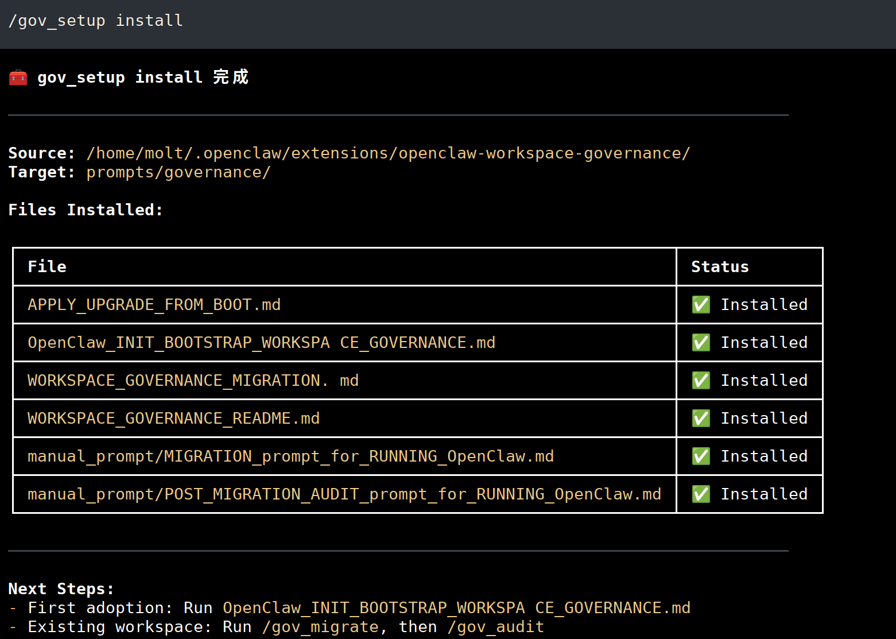
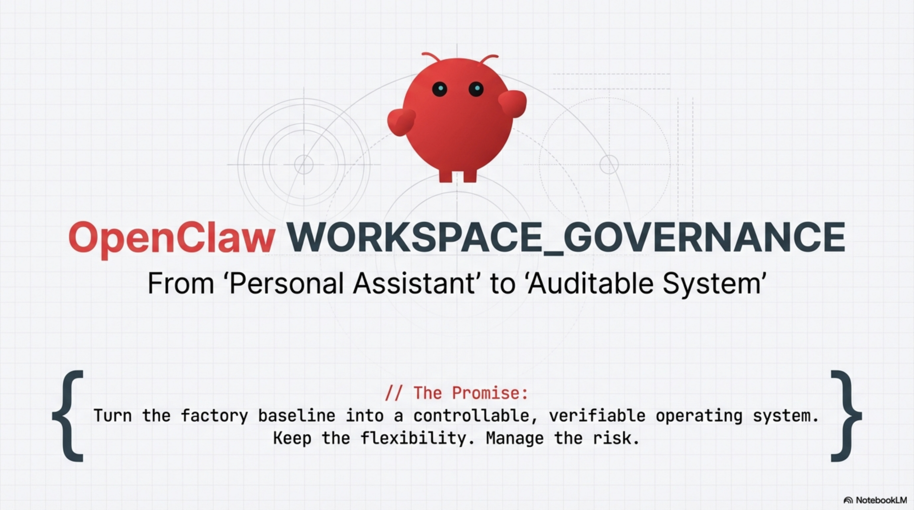
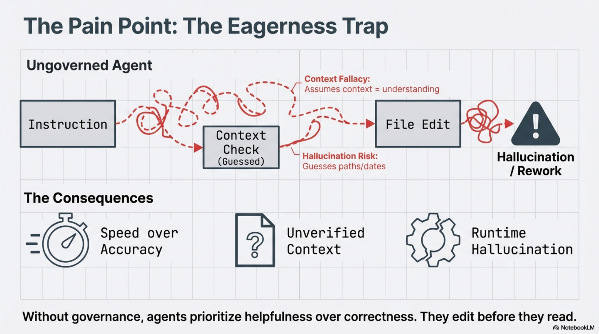
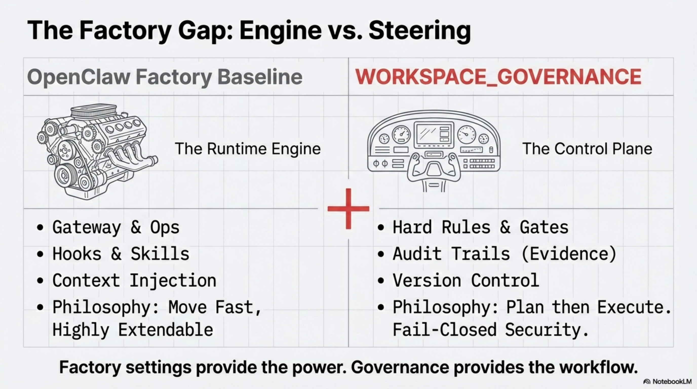
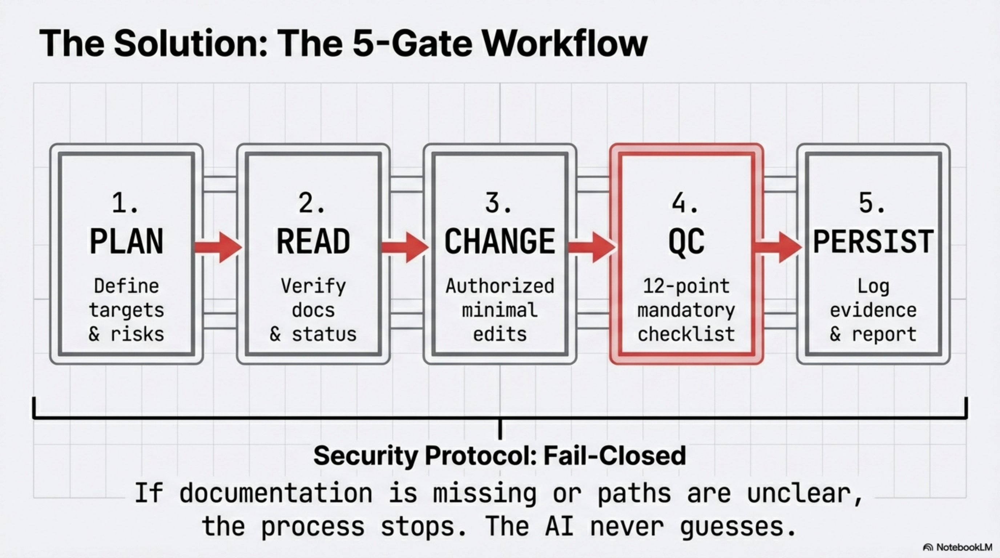
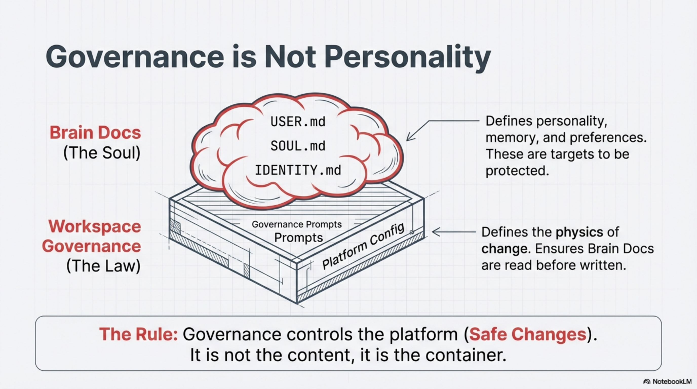
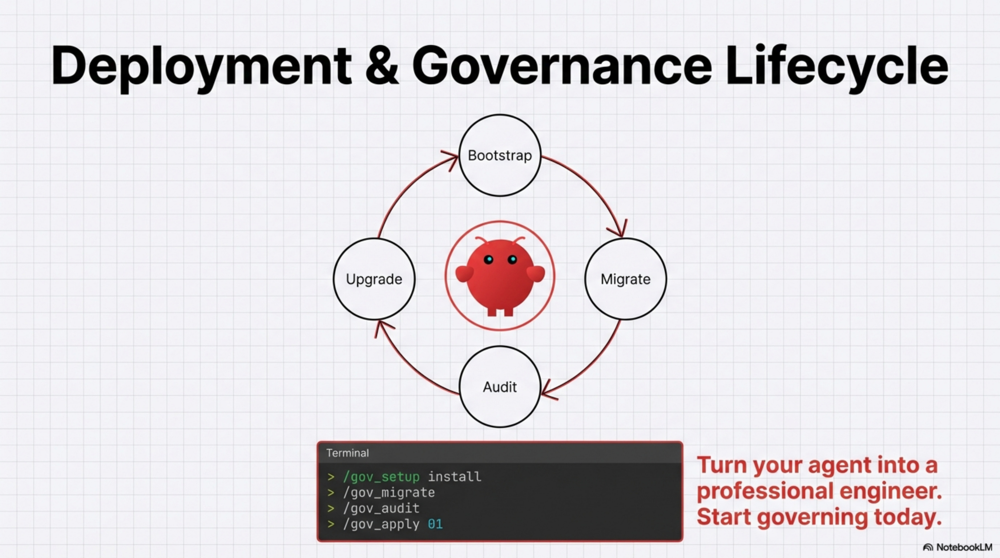

# OpenClaw WORKSPACE_GOVERNANCE

> Turn OpenClaw's factory baseline into a controllable, verifiable, and traceable operating system for long-running workspaces.
> Keep flexibility, but put high-risk actions behind a fixed workflow.

[繁體中文版](./README.zh-HK.md)

[](https://docs.openclaw.ai/) [](#installation-options) [](#first-deployment)

ClawHub installer page:
- https://clawhub.ai/Adamchanadam/openclaw-workspace-governance-installer

---

## Start Here (30 Seconds)

Choose your entry path first:
1. New to this plugin: install plugin, then run `gov_setup install`
2. Already using this plugin: update plugin, then run `gov_setup upgrade -> gov_migrate -> gov_audit`
3. Need to change OpenClaw platform config: use `gov_platform_change` (not direct patch)

Minimal command path:

```text
openclaw plugins install @adamchanadam/openclaw-workspace-governance@latest
/gov_setup install
/gov_audit
```

---

## What Is OpenClaw WORKSPACE_GOVERNANCE

OpenClaw WORKSPACE_GOVERNANCE is a governance layer for OpenClaw workspaces.

It defines a fixed lifecycle for high-risk tasks:
1. Bootstrap: establish baseline governance for first-time setup
2. Migration: align running workspaces to current governance rules
3. Audit: validate consistency with fixed checks
4. Apply: use approved BOOT proposals in a controlled way

This project is delivered in two channels:
1. Plugin package (`@adamchanadam/openclaw-workspace-governance`) as the runtime core
2. ClawHub installer as a beginner-friendly entry

---

## Who This Is For

1. Individual OpenClaw users who want stable daily operation
2. Teams running long-lived workspaces and needing traceable changes
3. Beginners who want guided command paths instead of ad-hoc prompt editing

---

## Why People Use It

For many users, the main problem is not "lack of features". It is "loss of control over time".

Common pain points:
1. The agent edits too early before reading rules and evidence
2. Similar mistakes repeat across sessions
3. Upgrades and fixes are hard to trace and harder to roll back

What this solution adds:
1. A fixed order: `PLAN -> READ -> CHANGE -> QC -> PERSIST`
2. Verification gates for system/date/version claims
3. Run-report evidence for review, handover, and rollback
4. BOOT read-only proposals with human approval before apply

### Positioning and Boundaries

If you want the full "why" behind this project:
1. Positioning doc (EN): [`VALUE_POSITIONING_AND_FACTORY_GAP.en.md`](./VALUE_POSITIONING_AND_FACTORY_GAP.en.md)
2. Full operations handbook (EN): [`WORKSPACE_GOVERNANCE_README.en.md`](./WORKSPACE_GOVERNANCE_README.en.md)

---

## Visual Guide

Overview infographic:


Setup reference screen:



Step pages:








---

## Core Workflow (Most Important)

Any write/update/save action must run through 5 gates:
1. `PLAN`: define goal, scope, risks, and target files
2. `READ`: read governance docs and target files first
3. `CHANGE`: apply minimal authorized edits only
4. `QC`: run fixed checks (12/12)
5. `PERSIST`: keep run report evidence

Fail-Closed rules:
1. Missing evidence or ambiguous path -> stop
2. Any required QC fail -> do not claim completion

Runtime mode routing:
1. Mode A: conversation only (no write, no system-truth claims)
2. Mode B: verified answers (no write)
3. Mode C: any write/update/save (full 5 gates mandatory)

---

## Which Command Should I Use?

| Task goal | Use this command | In-scope targets | Do not use for |
|---|---|---|---|
| First-time governance asset deployment | `/gov_setup install` | `<workspace-root>/prompts/governance/` | Editing platform config directly |
| Upgrade existing governance assets | `/gov_setup upgrade` | `<workspace-root>/prompts/governance/` | Platform control-plane patching |
| Apply governance alignment updates | `/gov_migrate` | Workspace governance files | BOOT proposal apply |
| Verify consistency (read-only) | `/gov_audit` | Governance evidence and checks | Writing new changes |
| Apply approved BOOT proposal | `/gov_apply <NN>` | Approved BOOT item only | Ad-hoc unapproved edits |
| Change OpenClaw platform control plane safely | `/gov_platform_change` | `~/.openclaw/openclaw.json`, `~/.openclaw/extensions/` | Brain Docs and normal workspace docs |

`gov_platform_change` is not for Brain Docs (`USER.md`, `IDENTITY.md`, `TOOLS.md`, `SOUL.md`, `MEMORY.md`, `HEARTBEAT.md`, `memory/*.md`).

---

## Reliability Contract (Short)

1. OpenClaw system claims must verify local skills and official docs: `https://docs.openclaw.ai`
2. Version-sensitive claims must also verify official releases: `https://github.com/openclaw/openclaw/releases`
3. Date/time claims must verify runtime current time first and answer with explicit dates
4. Brain Docs read-only asks must read exact target files first
5. Brain Docs writes must include run-report evidence: `FILES_READ` + `TARGET_FILES_TO_CHANGE`
6. Platform config changes must route via `gov_platform_change` with backup/validate/rollback evidence
7. Runtime hard gate is enabled by default:
   - `before_prompt_build`: injects Mode C reminder for write-intent tasks
   - `before_tool_call`: blocks write-capable tool calls when PLAN/READ evidence is missing
   - read-only shell/testing commands are allowed and should not be blocked
   - if blocked, provide explicit evidence tokens in governance output: `WG_PLAN_GATE_OK` and `WG_READ_GATE_OK`
   - `agent_end`: warns when write runs miss required evidence fields

---

## Installation Options

### Option A (Recommended): Direct Plugin Install

First-time install:

```text
openclaw plugins install @adamchanadam/openclaw-workspace-governance@latest
openclaw plugins enable openclaw-workspace-governance
openclaw skills list --eligible
```

Already installed users (upgrade path):

```text
openclaw plugins update openclaw-workspace-governance
openclaw gateway restart
```

### Option B: Install from ClawHub

```text
clawhub inspect Adamchanadam/OpenClaw-WORKSPACE-GOVERNANCE/clawhub/openclaw-workspace-governance-installer
clawhub install Adamchanadam/OpenClaw-WORKSPACE-GOVERNANCE/clawhub/openclaw-workspace-governance-installer
```

---

## First Deployment

After plugin installation, deploy governance assets to workspace:

```text
/gov_setup install
```

If slash is unavailable:

```text
/skill gov_setup install
```

Important:
- `openclaw plugins install ...` only installs plugin files to extensions
- Governance prompt assets are deployed to workspace by `gov_setup install` / `gov_setup upgrade`

---

## Upgrade Flow (Existing Users)

1. Update plugin from host shell:

```text
openclaw plugins update openclaw-workspace-governance
openclaw gateway restart
```

2. In OpenClaw chat:

```text
/gov_setup upgrade
/gov_migrate
/gov_audit
```

`gov_setup` modes:

```text
/gov_setup install   # first deployment
/gov_setup upgrade   # upgrade existing assets
/gov_setup check     # read-only status check
```

---

## Three Usage Scenarios

1. New OpenClaw / new workspace:
   - `gov_setup install` -> bootstrap prompt -> `gov_audit`
2. Running workspace, first governance adoption:
   - `gov_setup install` -> bootstrap/migration path -> `gov_audit`
3. Governance already installed:
   - `gov_setup upgrade` -> `gov_migrate` -> `gov_audit`
   - if BOOT gives numbered proposals: `gov_apply <NN>` then `gov_audit`

---

## Beginner UAT: 5-Minute Verification (No Slash)

If slash routing is unstable, send this natural-language request:

```text
Please use gov_setup in check mode (read-only; do not modify files).
Please return:
1) workspace root
2) install status (NOT_INSTALLED / PARTIAL / READY)
3) next action
```

Decision map:
1. `NOT_INSTALLED` -> run `gov_setup install`
2. `PARTIAL` -> run `gov_setup upgrade`
3. `READY` -> run `gov_migrate` then `gov_audit`

---

## FAQ

### Q1. Is this replacing OpenClaw?
No. It is a governance layer on top of OpenClaw runtime.

### Q2. I am not technical. Can I still use it?
Yes. Start with `gov_setup check` and follow next-step guidance.

### Q3. Why avoid direct config patching?
Direct platform edits are fragile in long-running systems. Governance flow keeps backup + validation + rollback evidence.

### Q4. When should I use `gov_apply <NN>`?
Only after BOOT outputs numbered proposals and you approve one item.

### Q5. Can `gov_platform_change` edit Brain Docs?
No. Brain Docs are not platform control-plane targets.

### Q6. Plugin installed, but no governance files in workspace?
Run `gov_setup install` (or `gov_setup upgrade` for existing deployments).

### Q7. What should I run after plugin update?
`gov_setup upgrade` -> `gov_migrate` -> `gov_audit`.

### Q8. If slash is unstable, can I use `/skill ...` permanently?
Yes: `/skill gov_setup ...`, `/skill gov_migrate`, `/skill gov_audit`, `/skill gov_apply <NN>`, `/skill gov_platform_change`.

### Q9. What happens when AI makes mistakes?
Mistakes are recorded in run reports; repeated patterns can be escalated via BOOT proposals and applied in a controlled loop.

### Q10. Where are full deep-dive docs?
See the links below.

### Q11. Do I need a separate `/gov_code_task` command for coding work?
No. Coding/file-change requests in natural language are expected to route to Mode C automatically (`PLAN -> READ -> CHANGE -> QC -> PERSIST`).  
Use `gov_platform_change` only for OpenClaw platform control-plane targets (`~/.openclaw/openclaw.json`, `~/.openclaw/extensions/`).

### Q12. Can I disable runtime hard gate hooks?
Yes, but not recommended. Set plugin config `runtimeGateEnabled: false`.  
Default is enabled.

### Q13. I got: `Blocked by WORKSPACE_GOVERNANCE runtime gate...` What should I do?
1. Confirm this is a write task (not read-only diagnostics).
2. Output PLAN + READ evidence first, then retry the write step.
3. Include `WG_PLAN_GATE_OK` and `WG_READ_GATE_OK` in the governance response.
4. If your task is only read/test commands, keep it read-only and rerun.

---

## Deep Docs

1. Operations handbook (EN): [`WORKSPACE_GOVERNANCE_README.en.md`](./WORKSPACE_GOVERNANCE_README.en.md)
2. Operations handbook (繁中): [`WORKSPACE_GOVERNANCE_README.md`](./WORKSPACE_GOVERNANCE_README.md)
3. Positioning (EN): [`VALUE_POSITIONING_AND_FACTORY_GAP.en.md`](./VALUE_POSITIONING_AND_FACTORY_GAP.en.md)
4. Positioning (繁中): [`VALUE_POSITIONING_AND_FACTORY_GAP.md`](./VALUE_POSITIONING_AND_FACTORY_GAP.md)

---

## Official References

- https://docs.openclaw.ai/tools/skills
- https://docs.openclaw.ai/tools/clawhub
- https://docs.openclaw.ai/plugins
- https://docs.openclaw.ai/cli/plugins
- https://docs.openclaw.ai/cli/skills
- https://github.com/openclaw/openclaw/releases
