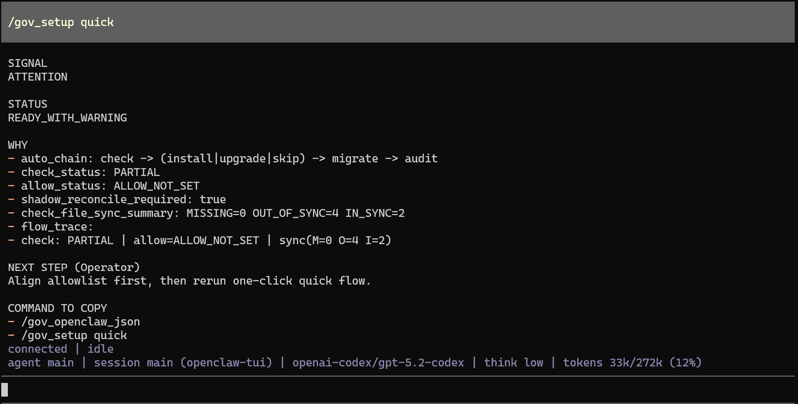

# OpenClaw WORKSPACE_GOVERNANCE

> Keep OpenClaw fast for daily work, but remove the high-cost failures: unclear changes, risky upgrades, and hard recovery.
> WORKSPACE_GOVERNANCE provides a stable operating model for long-running OpenClaw workspaces.

[繁體中文版](./README.zh-HK.md)

[](https://docs.openclaw.ai/) [](#install) [](#quick-start)

ClawHub installer page:
- https://clawhub.ai/Adamchanadam/openclaw-workspace-governance-installer

---

## 📋 Release Notes Board (Latest 3)

| Version | Published (UTC) | Key Changes | Practical Impact |
| --- | --- | --- | --- |
| `v0.1.53` | 2026-02-25 | `/gov_help` redesigned with ASCII art banner and complete 9-command catalog; README command ordering aligned; section heading emojis; ROOT SPRAWL regression fix (temp workspace chain tests); regression 103/103 | Users see full command menu at a glance with branded banner; README navigation faster with emoji headings; all product surfaces show consistent command ordering |
| `v0.1.52` | 2026-02-24 | Detection logic hardening: `gov_uninstall` now detects all 8 `_control/` file references in brain docs (previously only 3); release pipeline adds `PLUGIN_VERSION` constant alignment gate; refactored brain-doc scanning; regression expanded to 100/100 | Uninstall check/cleanup now catches previously-missed governance residue (e.g. `_control/ACTIVE_GUARDS.md` references); future version misalignment prevented by machine gate |
| `v0.1.51` | 2026-02-24 | Hotfix: aligned `PLUGIN_VERSION` constant in runtime — v0.1.50 shipped with stale `0.1.49` in branded output headers | Branded output headers now correctly show `v0.1.51`; no functional change |

Source: GitHub Releases (`Adamchanadam/OpenClaw-WORKSPACE-GOVERNANCE`)

---

## 🎯 Hero

If you run OpenClaw every day, the biggest risk is usually not model capability. The real risk is operational drift: you cannot quickly tell what changed, what to run next, and whether upgrade actions are safe. WORKSPACE_GOVERNANCE turns that uncertainty into a repeatable path.

[Install](#install) | [Quick Start](#quick-start)

## 💡 Why This Matters

Without governance, common pain accumulates quickly:
1. Changes happen before verification — mistakes spread across multiple files before anyone notices.
2. After a plugin update, you still do not know the next correct command or whether the update is complete.
3. When something goes wrong, there is no clear record of what changed or how to roll back safely.
4. Team handovers lose context — the next person cannot tell what was done, what passed, or what still needs checking.

What you get immediately:
1. Every change follows a fixed safety flow: plan first, read evidence, make the change, verify, then persist.
2. One command to get started: `/gov_setup quick` handles check, install/upgrade, migration, and audit automatically.
3. Platform config changes come with automatic backup, validation, and rollback — no more risky manual edits.
4. Run reports and audit evidence make handovers and team accountability straightforward.

## ✅ Feature Maturity (No-Misleading Contract)

GA (production-ready):
1. `/gov_help` — see all commands and recommended entry points at a glance
2. `/gov_setup quick|check|install|upgrade` — deploy, upgrade, or verify governance in one step
3. `/gov_migrate` — align workspace behavior to the latest governance rules after install or upgrade
4. `/gov_audit` — verify 12 integrity checks and catch drift before declaring completion
5. `/gov_uninstall quick|check|uninstall` — clean removal with backup and restore evidence
6. `/gov_openclaw_json` — safely edit platform config (`openclaw.json`) with backup, validation, and rollback
7. `/gov_brain_audit` — review and harden Brain Docs quality with preview-first approval and rollback
8. `/gov_boot_audit` — scan for recurring issues and generate upgrade proposals (read-only diagnostic)

Experimental:
1. `/gov_apply <NN>` — apply a single BOOT upgrade proposal with explicit human approval (controlled testing only, covered by automated regression).
2. After applying, always close with `/gov_migrate` and `/gov_audit`.

## 🖼️ Visual Walkthrough (ref_doc)





<a id="install"></a>
## 🚀 60-Second Start

### Fastest Operator Entry (Recommended)
In OpenClaw TUI:
```text
/gov_help
/gov_setup quick
```
`/gov_setup quick` auto-runs:
`check -> (install|upgrade|skip) -> migrate -> audit`
and returns one clear next step when blocked.

### Shared Allowlist Quick Fix
Use this only when a command reports `Error: not in allowlist`.

```text
openclaw config get plugins.allow
openclaw configure
# In plugins.allow, append openclaw-workspace-governance and keep all existing trusted IDs.
openclaw plugins enable openclaw-workspace-governance
openclaw gateway restart
```
Keep your existing trusted IDs when editing the allowlist array.

### New Install Path (Copy-Paste)
1. In host terminal:
```text
openclaw plugins install @adamchanadam/openclaw-workspace-governance@latest
openclaw gateway restart
```
2. Trust model check (required):
Some OpenClaw builds do not auto-append new plugins into `plugins.allow` during install.
If `openclaw plugins info openclaw-workspace-governance` shows `Error: not in allowlist`, run **Shared Allowlist Quick Fix** first.
3. In OpenClaw TUI chat:
```text
/gov_setup quick
```
4. If the reply says trust/allowlist is not ready (for example `plugins.allow is empty` or asks to align `openclaw.json`), run:
```text
/gov_openclaw_json
/gov_setup quick
```
5. For strict/manual chain (or if operator requests step-by-step), continue:
```text
/gov_setup install
prompts/governance/OpenClaw_INIT_BOOTSTRAP_WORKSPACE_GOVERNANCE.md
# if this was an already-active workspace before first governance install:
/gov_migrate
/gov_audit
```

### Existing Install Upgrade Path (Copy-Paste)
1. In host terminal:
```text
openclaw plugins update openclaw-workspace-governance
openclaw gateway restart
```
2. If plugin becomes disabled with `Error: not in allowlist`, run **Shared Allowlist Quick Fix** first.
3. In OpenClaw TUI chat:
```text
/gov_setup quick
```
4. If the reply says trust/allowlist is not ready, run:
```text
/gov_openclaw_json
/gov_setup quick
```
5. For strict/manual chain (or if operator requests step-by-step), continue:
```text
/gov_setup upgrade
/gov_migrate
/gov_audit
```

### Clean Uninstall Path (Copy-Paste)
Do not uninstall plugin package first. Run workspace cleanup first.

1. Ensure plugin is allowed and loaded (otherwise `/gov_uninstall` cannot run):
```text
openclaw plugins info openclaw-workspace-governance
```
If it shows `Error: not in allowlist`, run **Shared Allowlist Quick Fix** first.
2. In OpenClaw TUI chat:
```text
/gov_uninstall quick
# optional strict verification:
/gov_uninstall check
```
Expected:
- Quick run: `PASS` or `CLEAN`
- Optional strict verify after quick: `CLEAN`

3. Then remove plugin package:
```text
openclaw plugins disable openclaw-workspace-governance
openclaw plugins uninstall openclaw-workspace-governance
openclaw gateway restart
```
The uninstall runner creates backup at `archive/_gov_uninstall_backup_<ts>/...` and run report `_runs/gov_uninstall_<ts>.md`.
If Brain Docs autofix backups exist (`archive/_brain_docs_autofix_<ts>/...`), `/gov_uninstall` will report and restore them with explicit strategy evidence.

If you already uninstalled plugin package first:
1. Reinstall plugin package to re-enable `/gov_uninstall`
2. Run `/gov_uninstall check` -> `/gov_uninstall uninstall` -> `/gov_uninstall check`
3. Then disable/uninstall package again if needed

<a id="quick-start"></a>
## 🧭 Command Chooser

| If your goal is... | Run this first | Then run | Detailed user value |
| --- | --- | --- | --- |
| List all governance commands in one shot | `/gov_help` | choose one quick/manual entry | Gives users a zero-memory command menu in-session |
| One-click governance deployment/upgrade/audit | `/gov_setup quick` | follow returned next step only if blocked | Runs check/install-or-upgrade/migrate/audit automatically with deterministic evidence |
| Avoid wrong first steps before any change (manual) | `/gov_setup check` | follow returned next action | Converts uncertainty into a concrete action path, so new users do not branch into wrong install/upgrade sequences |
| First governance deployment in this workspace | `/gov_setup install` | `/gov_migrate` -> `/gov_audit` | Installs governance package files, then deterministically reconciles missing baseline `_control` files during migration |
| Upgrade existing governance workspace | `/gov_setup upgrade` | `/gov_migrate` -> `/gov_audit` | Updates package files, aligns workspace policy, and confirms readiness after change |
| One-click workspace cleanup before package removal | `/gov_uninstall quick` | optional `/gov_uninstall check` | Cleans governance artifacts with backup+restore evidence while reducing operator step count |
| Clear platform trust warning before governance deployment | `/gov_openclaw_json` | `/gov_setup check` | Prevents setup from failing later due to trust misalignment and gives operators one deterministic trust-fix route |
| Safely change OpenClaw control-plane config | `/gov_openclaw_json` | `/gov_audit` | Replaces risky direct editing with backup/validate/rollback evidence for recoverable platform operations |
| Improve Brain Docs quality with minimal risk | `/gov_brain_audit` | approve findings -> `/gov_audit` | Detects high-risk wording, preserves persona intent, and only applies approved patches with rollback support |
| Scan for recurring issues and get upgrade proposals | `/gov_boot_audit` | review proposals -> `/gov_apply <NN>` (Experimental) | Read-only scan identifies repeat problems and generates numbered proposals you can review before deciding to apply |
| Apply one BOOT proposal item (Experimental) | `/gov_apply <NN>` | `/gov_migrate` -> `/gov_audit` | Executes only one human-approved item in controlled UAT; do not treat as unattended GA automation |

## 🧠 Core Capability: `/gov_brain_audit` for Brain Docs Performance

`/gov_brain_audit` is not only a wording checker. It improves the operating quality of the OpenClaw agent by making Brain Docs more consistent, evidence-driven, and less self-contradictory.

Practical optimization effects:
1. Reduces "act first, verify later" wording that can trigger unstable write behavior.
2. Reduces unsupported certainty statements that create false-complete responses.
3. Improves consistency between run-report evidence expectations and Brain Docs guidance.
4. Keeps persona direction while applying minimal, reviewable changes.

Important:
`F001`, `F003`, etc. are dynamic finding IDs produced by your current preview result.
They are examples, not fixed codes. Always copy IDs from the latest preview output.

Execution pattern:
```text
/gov_brain_audit
/gov_brain_audit APPROVE: <PASTE_IDS_FROM_PREVIEW>
/gov_brain_audit ROLLBACK
```

## ⚙️ How Your Requests Are Handled

Governance automatically adapts to what you are asking for:

1. Questions and planning (no file changes)
   You ask for strategy, explanation, or planning. The AI responds with advice only — no files are touched.

2. Verified answers (no file changes)
   You ask about versions, system status, or dates. The AI verifies official sources first, then responds with evidence.

3. File changes (full governance protection)
   You ask to write, update, or save files. The AI follows the full safety flow: plan first, read evidence, make the minimum change, verify quality, then persist with a run report. Close with `/gov_migrate` and `/gov_audit` when needed.

## 🔒 Security Default

1. Governance tools only activate when you explicitly request them (via `/gov_*` or `/skill gov_*`). They never run on their own.
2. This protects against unintended triggering — if you are just chatting or using regular OpenClaw features, governance stays inactive.
3. Your normal OpenClaw workflow is unaffected. Governance adds protection without changing how you already use OpenClaw.

## ❓ FAQ (Decision-Oriented, New-User Focus)

1. I do not use slash commands. What is the safest first message to AI?
Copy-paste this natural-language request:
```text
Please run governance readiness check for this workspace (read-only), then tell me exactly what to run next.
```
If slash fallback is needed: `/gov_setup quick`

2. I ran official commands like `openclaw onboard` or `openclaw configure`, then governance looks blocked. What should I ask AI to do?
Copy-paste:
```text
I just ran official OpenClaw setup/config commands. Please re-check governance readiness, align trust allowlist in openclaw.json if needed, then tell me the exact next step.
```
If slash fallback is needed:
```text
/gov_openclaw_json
/gov_setup quick
```

3. I installed plugin, but workspace governance files are still missing. What should I ask?
Copy-paste:
```text
Please check governance status for this workspace and deploy missing governance files safely, then run audit.
```
If slash fallback is needed:
```text
/gov_setup check
/gov_setup install
/gov_migrate
/gov_audit
```

4. I already updated plugin, but behavior still looks old. What should I ask AI to do?
Copy-paste:
```text
Please run governance upgrade flow for this workspace: check, upgrade, migrate, then audit.
```
If slash fallback is needed:
```text
/gov_setup check
/gov_setup upgrade
/gov_migrate
/gov_audit
```

5. I got `Blocked by WORKSPACE_GOVERNANCE runtime gate...`. Is this a crash?
Usually no. Ask AI to provide missing evidence first:
```text
Please output PLAN and READ evidence for this write task, include WG_PLAN_GATE_OK and WG_READ_GATE_OK, then continue.
```
Official `openclaw ...` system commands are allow-by-default and should not be blocked by this runtime gate.

6. I only want to edit `openclaw.json`, not workspace docs. What should I type?
Copy-paste:
```text
Please modify only OpenClaw control-plane config (openclaw.json) with backup and validation, then report result.
```
If slash fallback is needed:
```text
/gov_openclaw_json
/gov_audit
```

7. Slash routing is unstable in my session. Can I stay natural-language only?
Yes. Use requests like:
```text
Use gov_setup in check mode, return status and next action only.
```
or:
```text
Run full governance upgrade flow for this workspace and show each step result.
```

8. I am giving a coding task in natural language. How do I avoid governance blocks?
Start the task with:
```text
Before changing files, show PLAN and READ evidence, then perform minimal change and finish with QC evidence.
```

9. How do I ask AI to optimize Brain Docs quality, not just rewrite text?
Copy-paste:
```text
Run gov_brain_audit in preview mode, show high-risk findings with rationale, then wait for my approval before applying any patch.
```
Approval and rollback fallback:
`<PASTE_IDS_FROM_PREVIEW>` means IDs from your current preview output (for example `F002,F005`).
```text
/gov_brain_audit APPROVE: <PASTE_IDS_FROM_PREVIEW>
/gov_brain_audit ROLLBACK
```

10. How do teams standardize handover after natural-language tasks?
Use one closeout request at the end:
```text
Please finish this task with governance closeout: migrate if needed, run audit, and summarize evidence for handover.
```

## 📚 Deep Docs Links

1. Operations Handbook (EN): [`WORKSPACE_GOVERNANCE_README.en.md`](./WORKSPACE_GOVERNANCE_README.en.md)
2. Positioning and Value Narrative (EN): [`VALUE_POSITIONING_AND_FACTORY_GAP.en.md`](./VALUE_POSITIONING_AND_FACTORY_GAP.en.md)
3. 中文操作手冊: [`WORKSPACE_GOVERNANCE_README.md`](./WORKSPACE_GOVERNANCE_README.md)
4. 中文定位文件: [`VALUE_POSITIONING_AND_FACTORY_GAP.md`](./VALUE_POSITIONING_AND_FACTORY_GAP.md)

Official references:
1. https://docs.openclaw.ai/tools/skills
2. https://docs.openclaw.ai/tools/clawhub
3. https://docs.openclaw.ai/plugins
4. https://docs.openclaw.ai/cli/plugins
5. https://docs.openclaw.ai/cli/skills
6. https://github.com/openclaw/openclaw/releases
