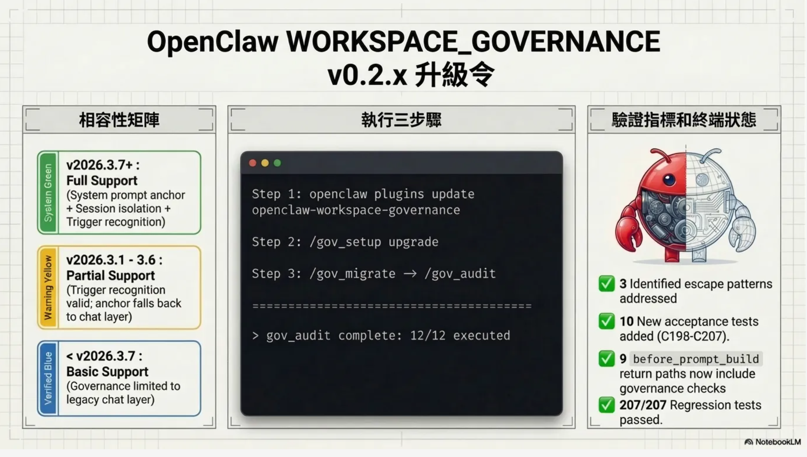
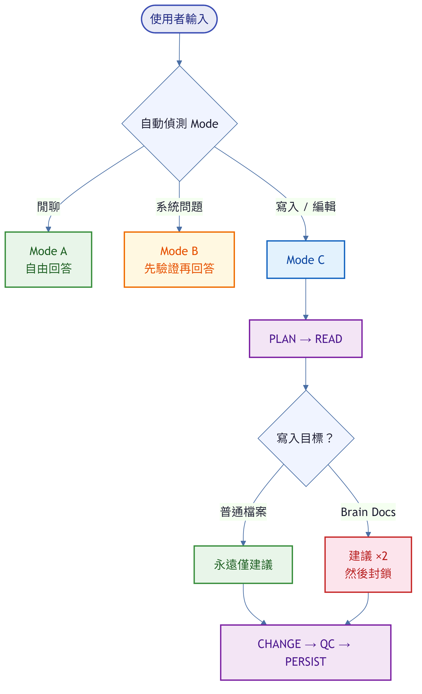

# OpenClaw WORKSPACE_GOVERNANCE

> OpenClaw AI agent 收到指令便立即回應——這正是它受歡迎的原因，也帶來實際操作隱患：寫入動作往往在讀取現有內容之前已發生，版本、路徑等 system-truth 問題直接以訓練資料作答而不查驗權威來源，執行出錯後亦沒有記錄可循。
> WORKSPACE_GOVERNANCE 補上原廠設定欠缺的治理層：寫入操作需先有計劃與讀取證據，每次變更均產生可追溯的 run report——即使在自動化的 cron 和 heartbeat 執行中，治理規則同樣保持有效。

[English Version](./README.md)

[](https://docs.openclaw.ai/) [](#install) [](#quick-start)

> **OpenClaw 版本相容性：** 針對 **OpenClaw v2026.3.7+** 最佳化（完整支援 `prependSystemContext` 常駐錨點、`sessionId` 閘門隔離、`trigger` 偵測）。可向下相容舊版本——治理 hook 仍會觸發，但無條件系統提示錨點功能需執行環境 v2026.3.7+。

ClawHub 安裝頁：
- https://clawhub.ai/Adamchanadam/openclaw-workspace-governance-installer

---

## 🎬 影片介紹

> **先看再讀** — 2 分鐘了解 Workspace Governance 做什麼、為什麼重要。

[](https://youtu.be/zIXT8MiL4WY)

▶️ [觀看：Discipline Master for OpenClaw（Workspace Governance Plugin）](https://youtu.be/zIXT8MiL4WY)

---

## 📋 Release Notes 最新 3 版重點報告板

| 版本 | 發佈時間（UTC） | 關鍵變更 | 對使用者的直接影響 |
| --- | --- | --- | --- |
| `v0.2.3` | 2026-03-13 | **純文檔修訂**：ClawHub 安裝頁面重寫以提高清晰度——移除技術性 gate 行為段落及 slash routing fallback 段落；聚焦於快速入門、指令列表及適用對象。 | ClawHub 頁面更簡潔；移除了觸發 ClawHub 安全掃描器誤報的內容。 |
| `v0.2.2` | 2026-03-13 | **純文檔修訂**：簡化 ClawHub 安裝頁面——`/gov_setup quick` 為唯一推薦入口；移除快速入門中的 `/gov_help` 及手動鏈步驟。 | ClawHub 安裝頁面與 GitHub README 對齊，更簡潔清晰。 |
| `v0.2.0` | 2026-03-13 | **治理 Hook 韌性修復**（OpenClaw v2026.3.7+ 繞過缺口修復）：治理錨點透過 `prependSystemContext` 每回合強制注入系統提示空間，不受 AGENTS.md bootstrap 狀態或 cron `--light-context` 模式影響；cron/heartbeat 觸發時加入自動化提示；以 `sessionId` 作為閘門狀態鍵，確保 `/new` 和 `/reset` 後正確隔離；5 個新驗收測試（C198–C207，共 197→207/207）。完整功能需 OpenClaw v2026.3.7+。 | AI agent 現在每回合必定收到 Mode A/B/C 治理錨點——即使在跳過 bootstrap 注入的 light-context cron/heartbeat 執行中亦然。`/new` 和 `/reset` 後閘門狀態正確重置。 |

來源：GitHub Releases（`Adamchanadam/OpenClaw-WORKSPACE-GOVERNANCE`）

---

## 🆙 v0.2.0 升級一圖覽

> 為何今次升級重要——一圖說清楚。

**升級原因：逃逸漏洞問題 + v0.2.0 修復方案**


**升級方法：相容矩陣 + 三步執行指令**



---

## 🎯 Hero

如果你每天使用 OpenClaw，最大風險通常不是模型能力不足，而是操作漂移：你很難快速知道改了什麼、下一步該跑哪條指令、升級動作是否安全。WORKSPACE_GOVERNANCE 的作用，就是把這種不確定感轉成可重覆執行的流程。

[Install](#install) | [Quick Start](#quick-start)

## 💡 Why This Matters

沒有治理機制時，常見痛點會快速累積：
1. 還未核實就先改檔——錯誤在被發現前已擴散到多個檔案。
2. plugin 更新完成後，你仍不知道下一步該跑什麼、更新是否完整。
3. 出事時，缺乏清晰記錄可查什麼被改過、如何安全回退。
4. 團隊交接時缺少脈絡——接手人無法得知已做過什麼、什麼通過了驗證、還有什麼待處理。

你會立即得到：
1. 寫入操作均遵循固定安全流程：先規劃、再讀取證據、做最小改動、驗證、最後留存記錄。
2. 一條指令就能啟動：`/gov_setup quick` 會自動完成 check、install/upgrade、migrate、audit。
3. 平台設定改動自帶備份、驗證與回退。
4. run report 與 audit 證據讓團隊交接與責任歸屬變得簡單。

## ✅ 功能成熟度（不誤導聲明）

GA（正式可落地）：
1. `/gov_help` — 一次列出全部指令與建議入口
2. `/gov_setup quick|check|install|upgrade` — 一步完成治理部署、升級或驗證
3. `/gov_migrate` — install 或 upgrade 後，將工作區行為對齊最新治理規則
4. `/gov_audit` — 驗證 12 項完整性核對，在宣稱完成前捕捉漂移
5. `/gov_uninstall quick|check|uninstall` — 安全清理，含備份與回復證據
6. `/gov_openclaw_json` — 安全編輯平台設定（`openclaw.json`），含備份、驗證與回退
7. `/gov_brain_audit` — 預覽優先、批准後套用、可回退的 Brain Docs 品質修補
8. `/gov_boot_audit` — 掃描重覆問題並生成升級提案（只讀診斷）

Experimental（實驗性）：
1. `/gov_apply <NN>` — 以人工明確批准的方式套用單一 BOOT 升級提案（僅限受控測試，已納入自動化回歸驗證）。
2. 套用後，務必以 `/gov_migrate` 與 `/gov_audit` 收尾。

## ✅ 已驗證場景

本插件隨版本發佈包含自動化回歸測試套件，覆蓋完整操作員生命周期。以下是每次發佈所驗收的場景摘要：

| 場景 | 驗收內容 |
|---|---|
| **工作區安裝與升級** | 全新安裝、從舊版升級、版本偵測、已是最新版時自動略過 |
| **內容保護** | 現有 Brain Docs、`openclaw.json` 及自訂規則在安裝／升級期間受到保護 |
| **遷移準確性** | 所有治理規則與標記正確套用；衝突與部分狀態均能偵測並回報 |
| **審核完整性** | 所有 12 項完整性核對均執行；漂移、缺失標記及設定不符均能捕捉 |
| **安全設定編輯** | `openclaw.json` 編輯流程：備份 → 驗證 → 套用 → 確認；無效編輯拒絕並回退 |
| **Brain Docs 保護** | 對 Brain Docs（AGENTS.md、SOUL.md 等）的高風險寫入，寫前提示警告；可按需回退 |
| **故障恢復** | 設定損毀、備份失敗、遷移中斷均設有容錯處理機制 |
| **完整操作員生命周期** | 端到端：安裝 → 遷移 → 審核 → 編輯 → 重新審核 → 卸載並留存清理證據 |

## 🖼️ Visual Walkthrough（ref_doc）


<a id="install"></a>
## 🚀 60-Second Start

### 最快入口（建議）
在 OpenClaw TUI 直接輸入：
```text
/gov_setup quick
```
`/gov_setup quick` 會自動跑：
`check -> (install|upgrade|skip) -> migrate -> audit`
若中途受阻，會直接回傳單一步下一步指令。

### 共用 Allowlist 快速修復
只在出現 `Error: not in allowlist` 時使用。

```text
openclaw config get plugins.allow
openclaw configure
# 在 plugins.allow 追加 openclaw-workspace-governance，並保留所有原有 trusted IDs。
openclaw plugins enable openclaw-workspace-governance
openclaw gateway restart
```
編輯 allowlist 陣列時，請保留你原有的 trusted IDs。

### 新裝路徑（可直接照抄）
1. 主機終端先執行：
```text
openclaw plugins install @adamchanadam/openclaw-workspace-governance@latest
openclaw gateway restart
```
2. 信任模型檢查（必要）：
部分 OpenClaw 版本在 install 時，不會自動把新 plugin 加入 `plugins.allow`。
如果 `openclaw plugins info openclaw-workspace-governance` 顯示 `Error: not in allowlist`，請先執行上面的「共用 Allowlist 快速修復」。
3. OpenClaw TUI 對話中執行：
```text
/gov_setup quick
```
4. 若回覆顯示信任清單未就緒（例如出現 `plugins.allow is empty`，或提示要先對齊 `openclaw.json`），執行：
```text
/gov_openclaw_json
/gov_setup quick
```

### 已安裝升級路徑（可直接照抄）
1. 主機終端先執行：
```text
openclaw plugins update openclaw-workspace-governance
openclaw gateway restart
```
2. 若 plugin 顯示 `Error: not in allowlist`，請先執行上面的「共用 Allowlist 快速修復」。
3. OpenClaw TUI 對話中執行：
```text
/gov_setup quick
```
4. 若回覆顯示信任清單未就緒，執行：
```text
/gov_openclaw_json
/gov_setup quick
```

### 正式清理卸載路徑（可直接照抄）
不要先刪 plugin 套件，請先做 workspace 清理。

1. 先確保 plugin 已允許且可載入（否則 `/gov_uninstall` 無法執行）：
```text
openclaw plugins info openclaw-workspace-governance
```
若顯示 `Error: not in allowlist`，先執行上面的「共用 Allowlist 快速修復」。
2. 在 OpenClaw TUI 對話中執行：
```text
/gov_uninstall quick
# 如需嚴格驗證可再跑：
/gov_uninstall check
```
預期結果：
- quick：`PASS` 或 `CLEAN`
- 如有再跑 check：應為 `CLEAN`

3. 然後再移除 plugin 套件：
```text
openclaw plugins disable openclaw-workspace-governance
openclaw plugins uninstall openclaw-workspace-governance
openclaw gateway restart
```
卸載 runner 會先備份到 `archive/_gov_uninstall_backup_<ts>/...`，並寫出 run report：`_runs/gov_uninstall_<ts>.md`。
如存在 Brain Docs autofix 備份（`archive/_brain_docs_autofix_<ts>/...`），`/gov_uninstall` 會輸出並執行對應回復策略（含證據欄位）。

若你已經先卸載 plugin 套件：
1. 先重裝 plugin（令 `/gov_uninstall` 可用）
2. 跑 `/gov_uninstall check` -> `/gov_uninstall uninstall` -> `/gov_uninstall check`
3. 需要時再停用/卸載 plugin 套件

<a id="quick-start"></a>
## 🧭 Command Chooser（指令選擇器）

| 你的目標 | 先執行 | 再執行 | 對使用者的具體價值 |
| --- | --- | --- | --- |
| 一次列出全部治理指令 | `/gov_help` | 再選 quick 或手動流程 | 用戶無需先讀文檔或記指令 |
| 一鍵完成治理部署/升級+稽核 | `/gov_setup quick` | 若 blocked 才跟下一步指示 | 自動串 check/install-or-upgrade/migrate/audit，減少操作負擔 |
| 在任何改動前先確認正確路徑（手動） | `/gov_setup check` | 依回覆下一步執行 | 把不確定轉為明確行動，避免新手走錯 install/upgrade 分支 |
| 首次部署治理到工作區 | `/gov_setup install` | `/gov_migrate` -> `/gov_audit` | 先部署治理套件檔，再由 migration 決定性補齊缺失的 `_control` 基線檔 |
| 升級既有治理工作區 | `/gov_setup upgrade` | `/gov_migrate` -> `/gov_audit` | 同步治理檔版本與策略，並在變更後完成驗證 |
| 一鍵清理 workspace 治理殘留 | `/gov_uninstall quick` | 可選再跑 `/gov_uninstall check` | 以最少步驟完成安全清理，保留備份/回復證據 |
| 先清除平台信任警告再進治理流程 | `/gov_openclaw_json` | `/gov_setup check` | 避免後續因信任未對齊而失敗，提供單一路徑完成信任對齊 |
| 安全修改 OpenClaw 平台控制面 | `/gov_openclaw_json` | `/gov_audit` | 以備份/驗證/回退取代高風險直改，讓平台變更可恢復 |
| 低風險優化 Brain Docs 品質 | `/gov_brain_audit` | 批准 findings -> `/gov_audit` | 檢出高風險語句、保留人設方向，僅批准後套用且可回退 |
| 重複被治理閘門封鎖時清除所有閘門 | `/gov_brain_audit force-accept` | 繼續你的任務 | 逃生機制：合法工作被治理閘門封鎖時，一鍵清除所有閘門並留有稽核記錄 |
| 掃描重覆問題並取得升級提案 | `/gov_boot_audit` | 審閱提案 -> `/gov_apply <NN>`（Experimental） | 只讀掃描找出重覆問題並生成編號提案，你可先審閱再決定是否套用 |
| 套用單一 BOOT 提案項目（Experimental） | `/gov_apply <NN>` | `/gov_migrate` -> `/gov_audit` | 只執行單一人手批准項目，適用受控 UAT；不可視為無人值守 GA 自動化 |

## 🧠 核心能力：`/gov_brain_audit` 如何優化 Brain Docs 效能

`/gov_brain_audit` 不只是文字檢查，它會提升 OpenClaw agent 的運作品質，讓 Brain Docs 更一致、可驗證、較少自我矛盾。

實際優化效果：
1. 減少「先行動後核實」語句，降低寫入任務失穩風險。
2. 減少「無證據下過度肯定」語句，降低假完成回覆。
3. 強化 Brain Docs 與 run-report 證據要求的一致性。
4. 以最小差異修補，保留原有 persona 方向。

重要說明：
`F001`、`F003` 等是當次 preview 產生的動態 finding ID。
它們只是示例，不是固定代碼。請以最新 preview 輸出的 IDs 為準。

執行模式：
```text
/gov_brain_audit
/gov_brain_audit APPROVE: <PASTE_IDS_FROM_PREVIEW>
/gov_brain_audit ROLLBACK
```

## ⚙️ 你的請求如何被處理

治理機制會自動適配你的請求類型：

1. 提問與規劃（不改檔案）
   你詢問策略、說明或規劃。AI 只提供建議——不動任何檔案。

2. 需要可驗證的回答（不改檔案）
   你詢問版本、系統狀態或日期。AI 會先查證官方來源，再以證據作答。

3. 改動檔案（完整治理保護）
   你要求寫入、更新或保存檔案。AI 會走完整安全流程：先規劃、讀取證據、做最小改動、驗證品質，最後留存 run report。需要時以 `/gov_migrate` 與 `/gov_audit` 收尾。

### 治理流程總覽

<p align="center">
  
</p>

## ⚡ Runtime Gate 行為（透明公開）

當你要求 AI 寫入或修改檔案時，治理 runtime gate 會自動啟動。以下是完整運作方式：

### 寫入保護流程

| 步驟 | 發生什麼 | 用戶動作 |
|------|----------|---------|
| 一般寫入（skills/、projects/、代碼） | **透明** — 寫入正常執行（治理內部記錄，你不會看到任何東西） | 無需操作——你不會看到任何東西；寫入直接完成 |
| 高風險寫入（治理基礎設施、Brain Docs）第 1-2 次 | **透明** — 寫入正常執行（內部記錄） | 無需操作——AI 在下一輪自動收到輔導回饋 |
| 高風險寫入第 3 次以上無證據 | **硬封鎖** — 寫入被攔截 | AI 自動收到輔導回饋；你也可以說：「請包含你的計劃和已讀檔案」 |
| 同一閘門連續封鎖 3 次以上 | **逃生提示**自動出現在封鎖訊息中 | 使用 `/gov_brain_audit force-accept` 清除所有閘門（含稽核記錄） |
| 執行 `/gov_setup`、`/gov_migrate`、`/gov_audit` 之後 | **建議性提示**（非硬封鎖） | 可選擇性執行 `/gov_brain_audit` 做健康檢查預覽 |

### 風險分類

| 風險層級 | 目標 | Runtime 行為 |
|---------|------|-------------|
| **高風險** | Brain Docs（`AGENTS.md`、`SOUL.md`、`USER.md`、`IDENTITY.md`、`TOOLS.md`、`MEMORY.md`、`HEARTBEAT.md`）、`openclaw.json`、`_control/*`、`prompts/governance/*` | 第 1-2 次透明（AI 下一輪收到輔導），**第 3 次起硬封鎖** |
| **一般** | 其他所有檔案（`skills/`、`projects/`、`_runs/`、原始碼、設定、文檔等） | **永遠透明**（不會硬封鎖，治理內部記錄） |

所有寫入（無論風險層級）在內部都遵循完整的 Mode C 治理流程：PLAN→READ→CHANGE→QC→PERSIST。風險層級只決定 runtime gate 是否能硬封鎖寫入嘗試。

### 逃生艙

如果你在同一治理閘門被封鎖 3 次以上且無法繼續：
```text
/gov_brain_audit force-accept
```
此指令會清除當前 session 的所有治理閘門。稽核記錄會寫入 `_runs/`。治理保護降低——請謹慎操作。

### 治理指令自動繞過

所有治理寫入指令（`/gov_setup install`、`/gov_migrate`、`/gov_apply` 等）會自動繞過寫入閘門 8 分鐘。執行治理指令時不需要提供 PLAN/READ 證據。

### 系統指令讀寫分離

Cron 及 heartbeat 指令依讀/寫意圖分類：

| 指令 | 分類 | Mode C |
|------|------|--------|
| `openclaw cron list/ls/show/status/run/runs` | 唯讀 | 繞過（無治理閘門） |
| `openclaw cron add/update/remove/delete/pause/resume` | 寫入 | 必須 — PLAN→READ→CHANGE→QC→PERSIST |
| `openclaw cron`（裸指令，無子命令） | 唯讀 | 繞過 |
| `openclaw gateway heartbeat` 配置變更 | 寫入 | 必須 |

修改排程任務前，請先閱讀官方文檔：https://docs.openclaw.ai/automation/cron-jobs
修改心跳配置前，請先閱讀官方文檔：https://docs.openclaw.ai/gateway/heartbeat

### Brain Audit 時序

- 每輪重置：當提示間隔超過 30 秒時，blockedWrites 計數器重置
- 建議性回饋：無證據寫入後，AI 在下一輪收到輔導指引——無需用戶操作

### Scanner 容錯度

如果治理掃描器因格式差異而拒絕 LLM 生成的 run reports，可在 `openclaw.json` 中設定 `scannerTolerance`：

| 設定值 | 行為 |
|--------|------|
| `strict` | 僅接受精確機器格式（如 `files_read:`） |
| `tolerant`（預設） | 接受 markdown 標題、項目符號、格式變體 |
| `lenient` | 模糊關鍵字匹配，適用於較低能力的 LLM |

影響範圍：`/gov_audit`、`/gov_brain_audit preview`、`/gov_boot_audit scan`。

## 🔒 安全預設

1. 治理指令（`/gov_*`）只在你明確請求時才啟動。它們不會自行執行。
2. 輕量 runtime 寫入保護閘門始終活躍，但對日常操作完全透明——你在一般使用中不會看到任何提示或封鎖。
3. 你原有的 OpenClaw 工作方式完全不受影響。治理是額外的保護層，不改變你現有的使用方式。

## ❓ FAQ（新手決策導向，10 題）

1. 我平時不會用 slash，第一句最安全怎樣講？
可直接貼這句自然語言：
```text
請先在此工作區做 governance readiness check（只讀），然後只告訴我下一步要跑什麼。
```
若需 slash 備援：`/gov_setup quick`

2. 我剛跑完官方指令（例如 `openclaw onboard` / `openclaw configure`）後，governance 好像被擋，應該怎樣叫 AI？
可直接貼：
```text
我剛執行了官方 OpenClaw 初始化/設定指令。請重新檢查 governance readiness，若有需要請對齊 openclaw.json 的信任 allowlist，然後告訴我精確下一步。
```
若需 slash 備援：
```text
/gov_openclaw_json
/gov_setup quick
```

3. Plugin 已安裝，但工作區仍未見治理檔案，我應該怎樣下指令？
可直接貼：
```text
請檢查這個 workspace 的 governance 狀態，安全部署缺少的治理檔案，最後執行 audit。
```
若需 slash 備援：
```text
/gov_setup check
/gov_setup install
/gov_migrate
/gov_audit
```

4. Plugin 已更新，但行為仍像舊版，應該怎樣叫 AI 跑完整流程？
可直接貼：
```text
請在此工作區執行 governance 升級流程：check、upgrade、migrate、最後 audit。
```
若需 slash 備援：
```text
/gov_setup check
/gov_setup upgrade
/gov_migrate
/gov_audit
```

5. 出現 `Blocked by WORKSPACE_GOVERNANCE runtime gate...`，是不是故障？
通常不是。一般檔案寫入（skills、projects、代碼）永遠是建議性的，不會硬封鎖。硬封鎖只針對高風險治理目標（Brain Docs、`_control/`、治理 prompts、`openclaw.json`）。請要求 AI 包含計劃和已讀檔案：
```text
請包含你的計劃和已讀檔案，然後繼續。
```
如果你被封鎖 3 次以上且無法繼續，使用逃生艙：
```text
/gov_brain_audit force-accept
```
官方 `openclaw ...` 系統指令預設允許，不應被此 runtime gate 誤擋。

6. 我只想改 `openclaw.json`，不想動 workspace 文檔，怎樣講最清楚？
可直接貼：
```text
請只修改 OpenClaw 控制面設定（openclaw.json），要有備份與驗證，完成後回報結果。
```
若需 slash 備援：
```text
/gov_openclaw_json
/gov_audit
```

7. 這個 session 的 slash 路由不穩，我可以全程用自然語言嗎？
可以，直接用：
```text
請用 gov_setup 的 check 模式，回覆 status 與 next action。
```
或：
```text
請在此 workspace 跑完整 governance upgrade flow，並逐步回報每一步結果。
```

8. 我以自然語言下 coding 任務時，如何減少 governance block？
直接用自然語言描述你的任務即可。AI 會在內部遵循治理最佳實踐。例如：
```text
請按需要建立/更新檔案。
```

9. 我想優化 Brain Docs，不只是改字面，應該怎樣下指令？
可直接貼：
```text
請先以 gov_brain_audit 做 preview，列出高風險 findings 與原因；未經我批准不可套用 patch。
```
批准與回退備援：
`<PASTE_IDS_FROM_PREVIEW>` 代表「貼上你當次 preview 的 finding IDs」（例如 `F002,F005`）。
```text
/gov_brain_audit APPROVE: <PASTE_IDS_FROM_PREVIEW>
/gov_brain_audit ROLLBACK
```

10. 團隊在自然語言任務完成後，如何標準化交接？
收尾可直接貼：
```text
請用 governance 收尾此任務：如有需要先 migrate，再做 audit，最後輸出可交接的證據摘要。
```

## 📚 Deep Docs Links

1. Operations 手冊（EN）: [`WORKSPACE_GOVERNANCE_README.en.md`](./WORKSPACE_GOVERNANCE_README.en.md)
2. Positioning 與價值定位（EN）: [`VALUE_POSITIONING_AND_FACTORY_GAP.en.md`](./VALUE_POSITIONING_AND_FACTORY_GAP.en.md)
3. Operations 手冊（繁中）: [`WORKSPACE_GOVERNANCE_README.md`](./WORKSPACE_GOVERNANCE_README.md)
4. Positioning 與價值定位（繁中）: [`VALUE_POSITIONING_AND_FACTORY_GAP.md`](./VALUE_POSITIONING_AND_FACTORY_GAP.md)

官方參考：
1. https://docs.openclaw.ai/tools/skills
2. https://docs.openclaw.ai/tools/clawhub
3. https://docs.openclaw.ai/plugins
4. https://docs.openclaw.ai/cli/plugins
5. https://docs.openclaw.ai/cli/skills
6. https://github.com/openclaw/openclaw/releases

