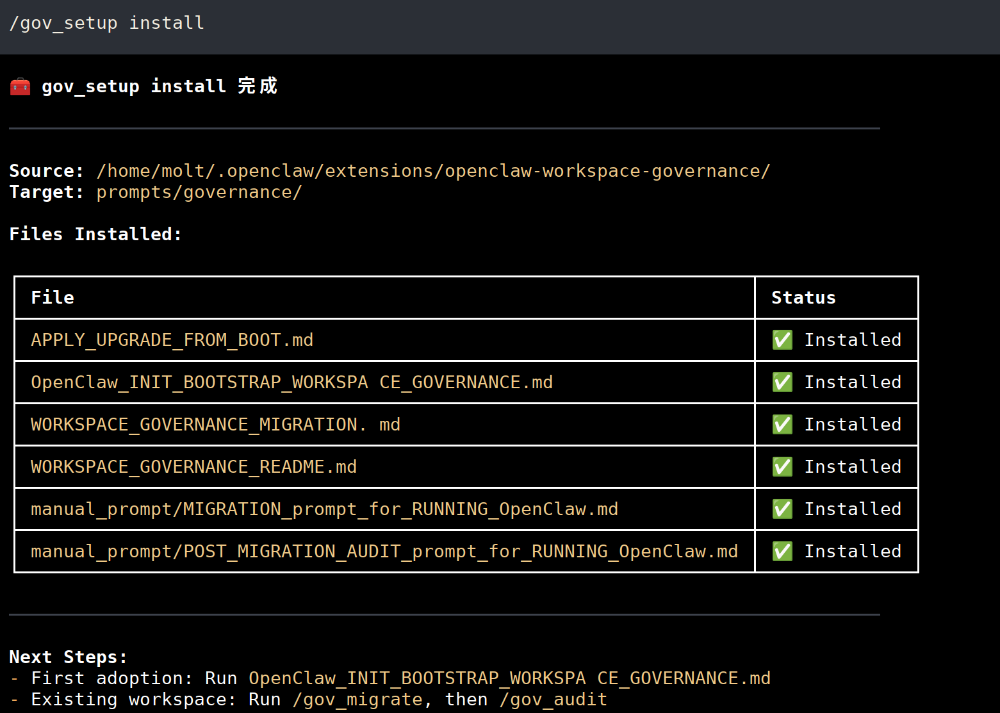
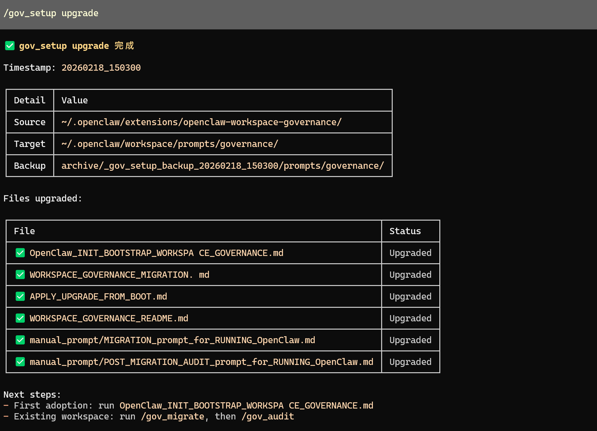
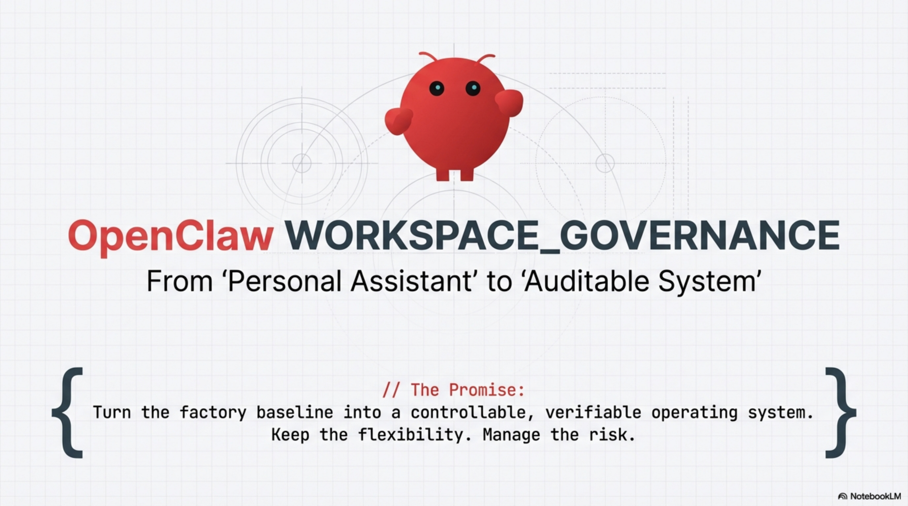
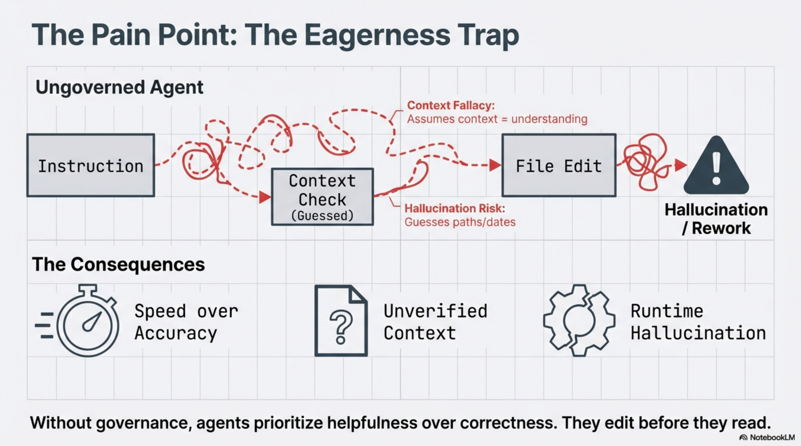
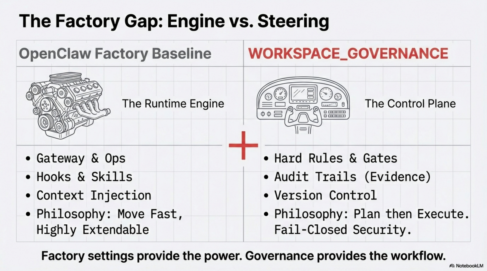
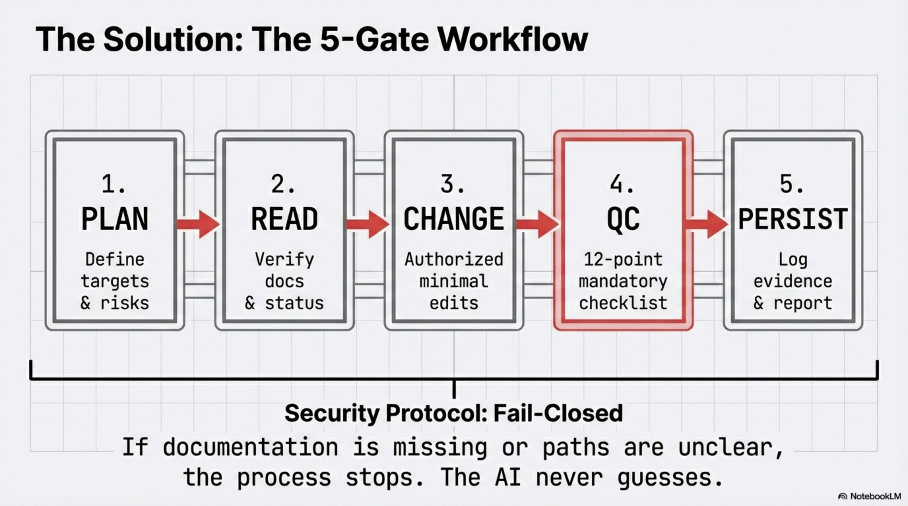
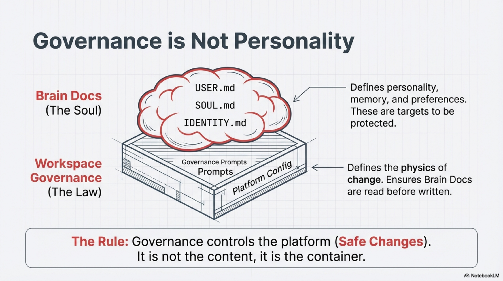
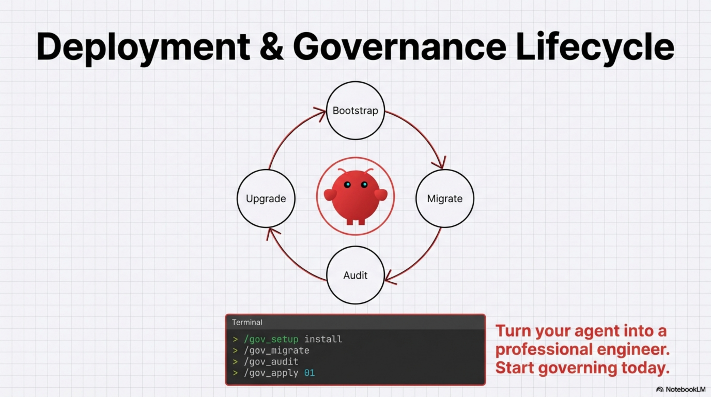

# OpenClaw WORKSPACE_GOVERNANCE

> 讓 OpenClaw 保持日常高效率，同時避開高成本失誤：改動不透明、升級風險高、出錯難回復。
> WORKSPACE_GOVERNANCE 為長期運行的 OpenClaw 工作區提供穩定的操作模型。

[English Version](./README.md)

[](https://docs.openclaw.ai/) [](#install) [](#quick-start)

ClawHub 安裝頁：
- https://clawhub.ai/Adamchanadam/openclaw-workspace-governance-installer

---

## Release Notes 最新 3 版重點報告板

| 版本 | 發佈時間（UTC） | 關鍵變更 | 對使用者的直接影響 |
| --- | --- | --- | --- |
| `v0.1.45` | 2026-02-23 | 新增 deterministic `gov_help` 指令目錄與一鍵流程編排（`/gov_setup quick|auto`、`/gov_uninstall quick|auto`），並把全套生命周期/文檔手冊統一成 quick-first（保留手動備援） | 日常操作改為一鍵優先，仍保留嚴格手動控制，同時降低用戶走錯步驟機率 |
| `v0.1.44` | 2026-02-23 | 完成 uninstall 完整性 root-fix：清理範圍收窄（不再 broad wipe 共用資料夾）、加入 Brain Docs 備份偵測/回復證據欄位、runtime regression 擴展至 33/33 | 在混合工作區下更安全，顯著降低誤刪非治理用戶檔的風險 |
| `v0.1.43` | 2026-02-23 | `gov_audit` 升級為可執行 12 項 QC 判定並加入決定性證據檢查，runtime regression 擴展至 30/30 | 移除模板式假 PASS，audit 結論可追溯 |

來源：GitHub Releases（`Adamchanadam/OpenClaw-WORKSPACE-GOVERNANCE`）

---

## Hero

如果你每天使用 OpenClaw，最大風險通常不是模型能力不足，而是操作漂移：你很難快速知道改了什麼、下一步該跑哪條指令、升級動作是否安全。WORKSPACE_GOVERNANCE 的作用，就是把這種不確定感轉成可重覆執行的流程。

[Install](#install) | [Quick Start](#quick-start)

## Why This Matters

在沒有治理的情況下，使用者痛點會快速累積：
1. 任務未核實就先改檔，錯誤容易擴散到多個檔案。
2. plugin 更新完成後，操作者仍不清楚正確下一步。
3. run 失敗時，團隊難以快速還原改動脈絡與回退路徑。

你會立即得到：
1. 固定生命週期：`PLAN -> READ -> CHANGE -> QC -> PERSIST`。
2. 明確操作順序：一鍵 `gov_setup quick`，或手動 `check -> install/upgrade -> migrate -> audit`。
3. 平台控制面改動具備備份、驗證、回退證據。

## 功能成熟度（不誤導聲明）

GA（正式可落地）：
1. `/gov_help`（一次列全指令）
2. `/gov_setup quick|check|install|upgrade`
3. `/gov_migrate`
4. `/gov_audit`
5. `/gov_openclaw_json`
6. `/gov_brain_audit`
7. `/gov_uninstall quick|check|uninstall`

Experimental（實驗性）：
1. `/gov_apply <NN>` 保留 BOOT 提案受控套用模型，供受控 UAT 使用，並已納入 deterministic runtime regression baseline。
2. 只應在人類明確批准單一 BOOT 提案後使用，完成後必跑 `/gov_migrate` 與 `/gov_audit`。

## Visual Walkthrough（ref_doc）











<a id="install"></a>
## 60-Second Start

### 最快入口（建議）
在 OpenClaw TUI 直接輸入：
```text
/gov_help
/gov_setup quick
```
`/gov_setup quick` 會自動跑：
`check -> (install|upgrade|skip) -> migrate -> audit`
若中途受阻，會直接回傳單一步下一步指令。

### 共用 Allowlist 快速修復
只在出現 `Error: not in allowlist` 時使用。

```text
openclaw config get plugins.allow
openclaw configure
# 在 plugins.allow 追加 openclaw-workspace-governance，並保留所有原有 trusted IDs。
openclaw plugins enable openclaw-workspace-governance
openclaw gateway restart
```
編輯 allowlist 陣列時，請保留你原有的 trusted IDs。

### 新裝路徑（可直接照抄）
1. 主機終端先執行：
```text
openclaw plugins install @adamchanadam/openclaw-workspace-governance@latest
openclaw gateway restart
```
2. 信任模型檢查（必要）：
部分 OpenClaw 版本在 install 時，不會自動把新 plugin 加入 `plugins.allow`。
如果 `openclaw plugins info openclaw-workspace-governance` 顯示 `Error: not in allowlist`，請先執行上面的「共用 Allowlist 快速修復」。
3. OpenClaw TUI 對話中執行：
```text
/gov_setup quick
```
4. 若回覆顯示信任清單未就緒（例如出現 `plugins.allow is empty`，或提示要先對齊 `openclaw.json`），執行：
```text
/gov_openclaw_json
/gov_setup quick
```
5. 若需要嚴格逐步（或操作者要求 step-by-step），再用：
```text
/gov_setup install
prompts/governance/OpenClaw_INIT_BOOTSTRAP_WORKSPACE_GOVERNANCE.md
# 若是已在運作中的既有 workspace 才需要：
/gov_migrate
/gov_audit
```

### 已安裝升級路徑（可直接照抄）
1. 主機終端先執行：
```text
openclaw plugins update openclaw-workspace-governance
openclaw gateway restart
```
2. 若 plugin 顯示 `Error: not in allowlist`，請先執行上面的「共用 Allowlist 快速修復」。
3. OpenClaw TUI 對話中執行：
```text
/gov_setup quick
```
4. 若回覆顯示信任清單未就緒，執行：
```text
/gov_openclaw_json
/gov_setup quick
```
5. 若需要嚴格逐步（或操作者要求 step-by-step），再用：
```text
/gov_setup upgrade
/gov_migrate
/gov_audit
```

### 正式清理卸載路徑（可直接照抄）
不要先刪 plugin 套件，請先做 workspace 清理。

1. 先確保 plugin 已允許且可載入（否則 `/gov_uninstall` 無法執行）：
```text
openclaw plugins info openclaw-workspace-governance
```
若顯示 `Error: not in allowlist`，先執行上面的「共用 Allowlist 快速修復」。
2. 在 OpenClaw TUI 對話中執行：
```text
/gov_uninstall quick
# 如需嚴格驗證可再跑：
/gov_uninstall check
```
預期結果：
- quick：`PASS` 或 `CLEAN`
- 如有再跑 check：應為 `CLEAN`

3. 然後再移除 plugin 套件：
```text
openclaw plugins disable openclaw-workspace-governance
openclaw plugins uninstall openclaw-workspace-governance
openclaw gateway restart
```
卸載 runner 會先備份到 `archive/_gov_uninstall_backup_<ts>/...`，並寫出 run report：`_runs/gov_uninstall_<ts>.md`。
如存在 Brain Docs autofix 備份（`archive/_brain_docs_autofix_<ts>/...`），`/gov_uninstall` 會輸出並執行對應回復策略（含證據欄位）。

若你已經先卸載 plugin 套件：
1. 先重裝 plugin（令 `/gov_uninstall` 可用）
2. 跑 `/gov_uninstall check` -> `/gov_uninstall uninstall` -> `/gov_uninstall check`
3. 需要時再停用/卸載 plugin 套件

<a id="quick-start"></a>
## Command Chooser（指令選擇器）

| 你的目標 | 先執行 | 再執行 | 對使用者的具體價值 |
| --- | --- | --- | --- |
| 一次列出全部治理指令 | `/gov_help` | 再選 quick 或手動流程 | 用戶無需先讀文檔或記指令 |
| 一鍵完成治理部署/升級+稽核 | `/gov_setup quick` | 若 blocked 才跟下一步指示 | 自動串 check/install-or-upgrade/migrate/audit，減少操作負擔 |
| 在任何改動前先確認正確路徑（手動） | `/gov_setup check` | 依回覆下一步執行 | 把不確定轉為明確行動，避免新手走錯 install/upgrade 分支 |
| 先清除平台信任警告再進治理流程 | `/gov_openclaw_json` | `/gov_setup check` | 避免後續因信任未對齊而失敗，提供單一路徑完成信任對齊 |
| 首次部署治理到工作區 | `/gov_setup install` | `/gov_migrate` -> `/gov_audit` | 先部署治理套件檔，再由 migration 決定性補齊缺失的 `_control` 基線檔 |
| 升級既有治理工作區 | `/gov_setup upgrade` | `/gov_migrate` -> `/gov_audit` | 同步治理檔版本與策略，並在變更後完成驗證 |
| 安全修改 OpenClaw 平台控制面 | `/gov_openclaw_json` | `/gov_audit` | 以備份/驗證/回退取代高風險直改，讓平台變更可恢復 |
| 低風險優化 Brain Docs 品質 | `/gov_brain_audit` | 批准 findings -> `/gov_audit` | 檢出高風險語句、保留人設方向，僅批准後套用且可回退 |
| 一鍵清理 workspace 治理殘留 | `/gov_uninstall quick` | 可選再跑 `/gov_uninstall check` | 以最少步驟完成安全清理，保留備份/回復證據 |
| 套用單一 BOOT 提案項目（Experimental） | `/gov_apply <NN>` | `/gov_migrate` -> `/gov_audit` | 只執行單一人手批准項目，適用受控 UAT；不可視為無人值守 GA 自動化 |

## 核心能力：`/gov_brain_audit` 如何優化 Brain Docs 效能

`/gov_brain_audit` 不只是文字檢查，它會提升 OpenClaw agent 的運作品質，讓 Brain Docs 更一致、可驗證、較少自我矛盾。

實際優化效果：
1. 減少「先行動後核實」語句，降低寫入任務失穩風險。
2. 減少「無證據下過度肯定」語句，降低假完成回覆。
3. 強化 Brain Docs 與 run-report 證據要求的一致性。
4. 以最小差異修補，保留原有 persona 方向。

重要說明：
`F001`、`F003` 等是當次 preview 產生的動態 finding ID。
它們只是示例，不是固定代碼。請以最新 preview 輸出的 IDs 為準。

執行模式：
```text
/gov_brain_audit
/gov_brain_audit APPROVE: <PASTE_IDS_FROM_PREVIEW>
/gov_brain_audit ROLLBACK
```

## 3 Scenarios（Mode A/B/C 實際應用）

1. Mode A：純對話請求（不寫入）
適用於策略討論、說明、規劃。只提供建議，不進行檔案寫入。

2. Mode B：需證據回答（不寫入）
適用於版本/系統/日期等敏感問題。先查證來源，再輸出答案。

3. Mode C：寫入/更新/保存任務（完整治理流程）
適用於程式改動、設定修改、文檔更新。必走 `PLAN -> READ -> CHANGE -> QC -> PERSIST`，並在需要時以 `gov_migrate`、`gov_audit` 收尾。

## Tool Exposure Guard（安全預設）

1. 治理 plugin tools 預設 fail-closed：當前回合必須有明確 `/gov_*`（或 `/skill gov_*`）意圖，才會執行治理工具。
2. 這個 root-fix 可在 permissive policy contexts（`default`、`agents.list.main`）下縮小工具觸發面，降低 untrusted input 風險。
3. 這不會取代一般 OpenClaw 使用：若無明確治理指令，治理 plugin tools 不會自動執行。

## FAQ（新手決策導向，10 題）

1. 我平時不會用 slash，第一句最安全怎樣講？
可直接貼這句自然語言：
```text
請先在此工作區做 governance readiness check（只讀），然後只告訴我下一步要跑什麼。
```
若需 slash 備援：`/gov_setup quick`

2. 我剛跑完官方指令（例如 `openclaw onboard` / `openclaw configure`）後，governance 好像被擋，應該怎樣叫 AI？
可直接貼：
```text
我剛執行了官方 OpenClaw 初始化/設定指令。請重新檢查 governance readiness，若有需要請對齊 openclaw.json 的信任 allowlist，然後告訴我精確下一步。
```
若需 slash 備援：
```text
/gov_openclaw_json
/gov_setup quick
```

3. Plugin 已安裝，但工作區仍未見治理檔案，我應該怎樣下指令？
可直接貼：
```text
請檢查這個 workspace 的 governance 狀態，安全部署缺少的治理檔案，最後執行 audit。
```
若需 slash 備援：
```text
/gov_setup check
/gov_setup install
/gov_migrate
/gov_audit
```

4. Plugin 已更新，但行為仍像舊版，應該怎樣叫 AI 跑完整流程？
可直接貼：
```text
請在此工作區執行 governance 升級流程：check、upgrade、migrate、最後 audit。
```
若需 slash 備援：
```text
/gov_setup check
/gov_setup upgrade
/gov_migrate
/gov_audit
```

5. 出現 `Blocked by WORKSPACE_GOVERNANCE runtime gate...`，是不是故障？
通常不是。先要求 AI 補齊證據再重試：
```text
請先輸出此寫入任務的 PLAN 與 READ 證據，包含 WG_PLAN_GATE_OK 與 WG_READ_GATE_OK，然後再繼續。
```
官方 `openclaw ...` 系統指令預設允許，不應被此 runtime gate 誤擋。

6. 我只想改 `openclaw.json`，不想動 workspace 文檔，怎樣講最清楚？
可直接貼：
```text
請只修改 OpenClaw 控制面設定（openclaw.json），要有備份與驗證，完成後回報結果。
```
若需 slash 備援：
```text
/gov_openclaw_json
/gov_audit
```

7. 這個 session 的 slash 路由不穩，我可以全程用自然語言嗎？
可以，直接用：
```text
請用 gov_setup 的 check 模式，回覆 status 與 next action。
```
或：
```text
請在此 workspace 跑完整 governance upgrade flow，並逐步回報每一步結果。
```

8. 我以自然語言下 coding 任務時，如何減少 governance block？
在任務開頭加上：
```text
改檔前先給我 PLAN 與 READ 證據，再做最小改動，最後附 QC 證據。
```

9. 我想優化 Brain Docs，不只是改字面，應該怎樣下指令？
可直接貼：
```text
請先以 gov_brain_audit 做 preview，列出高風險 findings 與原因；未經我批准不可套用 patch。
```
批准與回退備援：
`<PASTE_IDS_FROM_PREVIEW>` 代表「貼上你當次 preview 的 finding IDs」（例如 `F002,F005`）。
```text
/gov_brain_audit APPROVE: <PASTE_IDS_FROM_PREVIEW>
/gov_brain_audit ROLLBACK
```

10. 團隊在自然語言任務完成後，如何標準化交接？
收尾可直接貼：
```text
請用 governance 收尾此任務：如有需要先 migrate，再做 audit，最後輸出可交接的證據摘要。
```

## Deep Docs Links

1. Operations 手冊（EN）: [`WORKSPACE_GOVERNANCE_README.en.md`](./WORKSPACE_GOVERNANCE_README.en.md)
2. Positioning 與價值定位（EN）: [`VALUE_POSITIONING_AND_FACTORY_GAP.en.md`](./VALUE_POSITIONING_AND_FACTORY_GAP.en.md)
3. Operations 手冊（繁中）: [`WORKSPACE_GOVERNANCE_README.md`](./WORKSPACE_GOVERNANCE_README.md)
4. Positioning 與價值定位（繁中）: [`VALUE_POSITIONING_AND_FACTORY_GAP.md`](./VALUE_POSITIONING_AND_FACTORY_GAP.md)

官方參考：
1. https://docs.openclaw.ai/tools/skills
2. https://docs.openclaw.ai/tools/clawhub
3. https://docs.openclaw.ai/plugins
4. https://docs.openclaw.ai/cli/plugins
5. https://docs.openclaw.ai/cli/skills
6. https://github.com/openclaw/openclaw/releases

